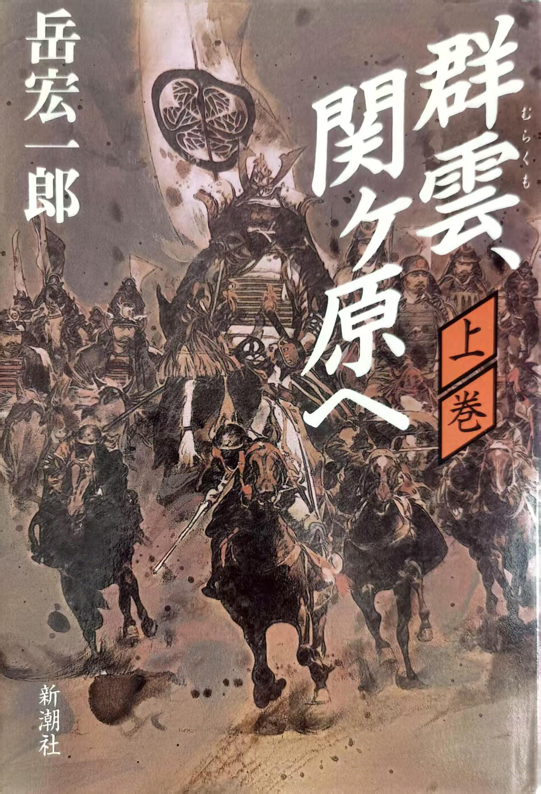

--- 
title: "群云，关原"
author: "【日】岳宏一郎"
date: "2025-03-11"
site: bookdown::bookdown_site
documentclass: book
link-citations: true
bibliography:
- book.bib
- packages.bib
description: |
  日本作家岳宏一郎写的日本战国历史小说。
github-repo: 日本作家岳宏一郎写的日本战国历史小说。
---

# {-}
{width=100%}

<!--chapter:end:index.Rmd-->

# (PART\*) 上卷 {-}

# 第一章 足音 {-}

蒲生秀行被没收大领·会津，并接到转封至下野·宇都宫的命令，是在庆长三年（1598年）1月7日。

会津领地的总石高^[石高：指领地的粮食产量，是衡量大名经济实力的重要指标。蒲生秀行的领地从九十二万石削减至十八万石，意味着其势力大幅削弱。]为九十二万石，而宇都宫仅十八万石。除了织田信雄、丹羽长重等少数几位不幸的诸侯外，自丰臣政权成立以来，受到如此严厉削封的大名，只有这位刚满十六岁的少年。

转封命令正式颁布的那天，伏见^[伏见：位于京都南部的政治中心，德川家康在此设有宅邸，是当时重要的权力据点。]的德川宅邸终日笼罩在匆忙喧嚣的氛围中。

访客的数量多到惊人。

蒲生家的留守官员自不必说，与力大名^[与力大名：指依附于德川家康或其他大名的次级领主，通常负责协助主家管理领地或军事事务。]如关一政、田丸直昌等人，也都各自派出了重臣前来。

然而，家康谁也没见。即使不见面，他也明白对方的来意。太阁的铁锤^[太阁的铁锤：指丰臣秀吉的严厉惩罚或政治打压。此处指秀吉对蒲生秀行的削封命令。]已经落下，此时自己再出面调解也无济于事。更何况，他心中丝毫没有想要调解或示好的念头。

每当报出访客的名字时，家康都露出一副无奈的表情。
那种心情，就像好不容易找到的安全藏身之处，突然被敌人追赶的落难武士们蜂拥而入一般。

实际上，家康并没有为秀行出面调解的立场。相反，需要调解的反而是他自己。家康深知自己在蒲生问题上欺骗了秀吉，背叛了他的信任。太阁的铁锤没有落到自己头上，这让他感到不可思议。

蒲生家的纷争并非始于今日。三年前，秀行的父亲蒲生氏乡在京都病逝后仅三个月，太阁就以“会津知行目录”^[会津知行目录：指会津领地的收入与分配记录。秀吉以此为借口，试图削弱蒲生家的势力。]存在不实为由，试图从这位少年手中没收大领，并将其迁至近江日野的二万石领地。

在追责秀行时，秀吉还不忘强调“会津是控制奥羽二州^[奥羽二州：指日本东北地区的奥州（陆奥）与羽州（出羽），会津是控制这一地区的战略要地。]的关键要地”。

他声称，一个未成年的孩子根本无法胜任奥羽镇守的重任。但这只是借口。控制奥羽诸将其实是次要的。会津的领主被赋予了一项更为紧迫、关乎政权存亡的使命。

那就是一旦发生紧急情况，会津的大名必须从背后刺穿家康。然而，对一个十三岁的少年抱有这种期待，本身就是不切实际的要求。太阁的真正目的，不过是想要一把新的钥匙罢了。家康在心底冷笑：“什么奥羽不奥羽的。”

然而，这场贬谪剧却意外地受到了阻挠。

首先，前田利家行动了起来。他在蒲生氏乡临终时接受了遗命，承诺确保秀行顺利继承领地。为此，利家四处奔走。他的次子能登侍从利政娶了氏乡的女儿为正室。蒲生家的兴衰直接关系到前田家的势力消长，因此此事对利家而言至关重要。

利家以脾气暴躁著称，但这次他展现出的细致手腕却令人刮目相看。他不仅以抗议的姿态停止出仕，还让妻子阿松前往北政所宁宁^[北政所宁宁：丰臣秀吉的正室，在丰臣政权中拥有重要影响力。]处传话，表达了不满。

“利家殿下对您的决定感到烦恼，甚至考虑让鹤千代（秀行）出家。”北政所宁宁迅速表达了深切的同情。

太阁的糟糠之妻深知丈夫剩下的日子不多了，也预见到丈夫去世后，政权将不得不以秀次为中心，形成一个由有力诸侯组成的松散联合体。这对她来说已经足够了。如果下一任首脑是秀次，她仍能像以往一样行使强大的影响力。此外，粉碎石田三成策划的这次转封事件，不仅符合与三成不和的义弟浅野长政的利益，也符合侄子小早川秀秋的利益。宁宁在说服丈夫时，准确地抓住了他的痛处。

“秀赖的未来，您打算托付给谁呢？这样激怒利家殿下真的好吗？”

推动阻止转封的不仅是利家和宁宁。曾是蒲生氏乡侧室的三条殿，以及大奥的女官长孝藏主，也试图让独裁者回忆起已故氏乡为政权的诞生和维持所付出的巨大努力。孝藏主的父亲是曾侍奉蒲生家前代家主的川副胜重。
这简直是一场重臣与妻妾的联合抗议。

然而，秀吉对反对的声音充耳不闻。他不得不如此，因为他其实背负着一个紧迫的问题。

在氏乡去世两天后，确切地说是文禄四年（1595年）2月9日，太阁出于愚蠢的感伤，向蒲生家的重臣们发送了这样一封信：

“关于将会津交给鹤千代一事，我将把江户大纳言（德川家康）的女儿嫁给他。大约在4月5日左右送到你们那里，请各位尽心辅佐。”

仔细想想，这简直是荒谬的提议。如果这桩婚事真的实现，那么原本应该从背后刺穿德川的钥匙，可能会突然刺向丰臣的侧腹。

所谓的“检地不正”只是借口。秀吉无论如何都必须尽快将这位少年从会津驱逐出去。

太阁的朱印状在得到五位奉行的签名后，被送到了丰臣家的正式政厅——聚乐第。太阁是退位后的关白^[关白：日本古代官职，相当于摄政，秀次是秀吉的侄子，曾被任命为关白。]称号。独裁者的意志要成为法令，即使只是形式上的，也需要关白秀次的签署。

然而，关白拒绝签署。

家康对此感到极为震惊。关白并没有特别需要庇护蒲生的理由。家康隐约觉得，关白可能是被利家和北政所说服了。

这位“装饰品”通过自己唯一被允许的政治行为——“签署”，在其二十八年的生命中，唯一一次反抗了叔父的意志。

转封计划完全搁浅。可怜的秀吉进退两难。秀吉、家康和利家之间多次进行了试图平息事态的讨论。正是在这个时候，家康提出将自己的三女振姬嫁给秀行，并亲自担任少年的监护人和后见人。反正失败了也没什么损失。

秀吉突然咯咯笑了起来。家康也跟着笑了。除了笑，他们别无他法来掩饰尴尬。家康的提议实在是太过随意了，简直像是在说：“不如干脆把会津给我吧。”

三人中，利家的笑声最为响亮，带着一种刺耳的、令人不快的意味。显然，利家并不欢迎这桩婚事。如果利家反对，事情可能会变得非常麻烦。

不过，家康并非不能理解利家的心情。通过这桩婚事，自己这个拥有二百五十五万石的大名，几乎可以半掌控九十二万石的领地。利家觉得这不划算，一点也不奇怪。

而且，家康心想，利家是个有十九个孩子的福气人，肯定有不少适龄的女儿。即使其中一个代替自己的三女成为新娘，利家也不会有作为新娘父亲的悲哀吧。

短暂的沉默后，秀吉再次咯咯笑了起来，然后像是放弃般地说道：“好吧，我答应内府（家康）的请求。”

家康几乎想掐自己的脸颊。他几乎想问：“殿下，您的脑子还好吗？”从关白拒绝签署到今年夏天，太阁一族的言行完全出乎他的预料。局势变得诡异起来。悲剧被避免了，京都和大阪弥漫着婚礼特有的喜庆却又微妙的氛围。

然而，秀吉并没有忘记“装饰品”的反抗。7月8日，这位老人突然剥夺了侄子关白和左大臣的官职，并将其流放到高野山。
石田三成揭露的杀生关白的罪状多得惊人。

从正亲町上皇去世后不顾忌丧期食用鹤肉，到在不该奏乐的时候招来检校讲述《平家物语》，再到在灵场狩猎，甚至似乎将正室及其继子同时作为享乐工具，这些都被弹劾为关白不应有的行为。甚至还有一项令人难以置信的指控：杀害孕妇并检查其内脏和胎儿。

同月15日，秀吉命令在高野山青岩寺屏居的秀次切腹。青岩寺是为大政所祈福而建立的剃发寺。秀次正是在叔父为家族准备的菩提寺中，结束了他二十八年的生命。

家康在江户得知了这一消息。

他一点也不惊讶。如果说一点也不惊讶本身就是一种惊讶的话，那确实如此。

家康此时回想起长久手之战，当时他狠狠击败了试图入侵三河的秀次。他心想，自己在十一年前的那个夏天，就已经预见到会有这么一天。

从这个意义上说，秀吉似乎是想通过谋杀血亲这种令人厌恶的行为，来抹去自己被家康击败的最耻辱的记忆。无论如何，秀吉借此机会，为儿子夺回了早先让给不成器的侄子的天下。

时代的潮流发生了巨大变化。

秀吉借此事件，开始清除亲秀次派的势力。讽刺的是，被针对的大名全都是亲德川派。

细川忠兴因为将女儿嫁给关白的重臣，并借用了百枚黄金（一千两），差点失去了丹后十一万石的领地。宁宁的侄子浅野幸长因涉嫌与关白共谋反叛太阁，被流放到能登。这显然是对宁宁的报复，因为她曾唆使关白拒绝签署。

“奥羽二州”的领主自然也难逃被清除的命运。

陆奥的伊达政宗因频繁出入聚乐第而受到指责，差点再次被削减本已所剩无几的家禄。出羽二十四万石的最上义光因为将女儿嫁给关白做侧室，在京都被软禁。

翌年庆长元年（1596年），家康的三女振姬如约嫁给了秀行。这桩婚事带有一种为了封住对关白谋杀的批评而特意让德川得利的气息。

家康欣然接受了这一安排。关东背后广阔的沃野被委托给了他的监护。这简直是再划算不过的交易了。

另一方面，利家得到的“封口费”也相当可观。前田家获得了越中新川郡十万石，并一次性将关白的四十名弓众纳入家臣。前田家的军备因此得到了显著增强。

德川和前田通过蒲生家成为了亲戚，但太阁所期望的善导却毫无成果。

麻烦在于蒲生家的家臣团是由各家族的残余组成的。有六角氏和北条氏的遗臣，也有曾侍奉泷川一益和柴田胜家的人。他们对家康的干预感到不满，热衷于权力斗争。甚至因为“进入我的领地却没有打招呼”这种小事，就会引发内乱。每次听到重臣们内斗的消息，家康都不得不提心吊胆。

太阁的担忧完全应验了。秀行根本不是奥羽镇守的料。重臣们的争斗背后，隐约可见治部少辅三成的身影，但也没有确凿的证据证明他在幕后操纵。

然后在庆长三年（1598年）新春，仕置奉行蒲生四郎兵卫在伏见杀害了同职的绵利八右卫门。这事件为将蒲生从会津驱逐提供了正当的借口。三成迅速将事件政治化。家康已经无能为力了。如果再挣扎，这次铁锤可能会落到自己头上。

“能保住十八万石已经是赚了。”家康不得不这样安慰自己。

<!--chapter:end:01.Rmd-->

# 第二章 孽缘 {-}

问题在于太阁要让谁来接任秀行的位置。

这把从背后刺穿德川的新钥匙，或许是前田利家，也可能是太阁钟爱的清洲城主福岛正则。甚至有人提议将真田昌幸从信州上田迁来。

若让昌幸这样的人来，恐怕会极其棘手。与昌幸类似，冈崎的田中吉政、筑后柳河的立花宗茂等，也都是家康不愿为邻的对手。品评这些候选人倒是颇有趣味。家康的心情并非单纯——新的邻居若是无能将领自然最好，但作为深知会津领主原本任务的他，若对方太过无能，又仿佛显得自己被轻视，难免不快。

家康的脑海中接连浮现出那些不友好的武将面孔，又一一将其抹去。下一刻，他突然皱紧了眉头——他想起了一位身形纤细如少年般的越后大名。这念头实在不吉利，家康慌忙将其逐出思绪。

直到1月8日，家康通过密报得知，那位纤细身躯的主人，正是新任会津领主的最有力候选人。

“谁报来的消息？”

家康语气阴沉。井伊直政低下头，报出一个疑似侍奉丰臣家内廷的女官名字。

“那便错不了。”

家康断言道。这斩钉截铁的回答并非因他记得那女官的名字，而是他最恐惧的事态终于成真了。

秀吉意图将上杉景胜迁往会津，并非初次。早在小田原征伐^[小田原征伐：1590年丰臣秀吉攻灭北条氏的战役，标志日本战国时代终结。]的前一年，他便对近臣提过“会津当托付于上杉”。

蓦地，家康想起了一段真假难辨的传闻——据说上杉景胜曾有这般轶事：

上洛^[上洛：指地方大名前往京都觐见天皇或将军，象征臣服。]途中渡富士川时，景胜所乘的渡船因载人过多险些倾覆。暴怒的景胜挥动手中的青竹，刹那间，船上所有上杉家武士，无论将卒，皆争先恐后跳入河中。然而家康始终不信这故事，认为太过刻意。可即便如此，每当听到“上杉”之名，他仍会条件反射般想起此事。

家康初次知晓上杉谦信有个名叫“显景喜平次”的侄子，是在为三河一向一揆^[一向一揆：指佛教一向宗信徒发动的武装叛乱，三河一向一揆曾让德川家康陷入苦战。]焦头烂额的永禄七年（1564年）。越后的一场事件引起了他的兴趣。

当年七月，谦信命属将宇佐美定满诛杀了上田庄坂户城主长尾政景。政景既是他的堂弟，也是其妹仙桃院的丈夫。

据说政景被处死的原因，一是他暗中与武田信玄勾结，二是谦信嫉妒越后众望所归的稳健现实主义者政景。

这听起来很有道理。家康对从未谋面的越后武将的生死并不感兴趣，但他对政景死后，年仅十岁的少年被迅速作为人质带到春日山城的事感到莫名在意。

家康自己曾在骏河度过了十二年的人质生活，因此他对少年的境遇感同身受。他甚至想为少年加油打气：“坚持下去！”

家康再次听到谦信侄子的消息是在天正五年（1577年）。
这一年，信长率领柴田、丹羽、泷川、前田等诸将五万大军，在加贺的凑川与上杉军交战，遭遇了前所未有的惨败。战死者千余人，溺死于凑川者不计其数。信长率先脱离战线，一路逃到近江的长浜。

据说上杉军的先锋正是谦信的侄子，此时已改名为景胜。

家康对这种突如其来的感伤感到无奈。当然，他也希望同盟军能取得胜利。但当对手是立下赫赫战功的景胜时，情况就不同了。

翌年天正六年（1578年）正月，家康在极度紧张中迎来了新年。前一年冬天，凯旋越后的谦信向麾下八十一名将领发布了大动员令，计划于三月出击关东。此时，谦信的领地已扩展到越后、佐渡、越中、上野、加贺、飞驒、能登、庄内八国，总石高超过二百五十万石。这与信长的实力不相上下。

然而到了三月，“军神”谦信既未出现在关东，也未出现在近畿。事实上，他在出阵前三日于厕所中结束了四十九年的生命。死因是脑卒中。

消息十天后便传到了三河。谦信的死亡毫无秘密可言，这与他的宿敌武田信玄“死后三年秘不发丧”的遗言形成了鲜明对比。

谦信的梦想未能完成。在家康看来，谦信并无统一天下的器量。要成为天下人，他似乎缺少了某种关键的东西。谦信本质上是个好战的武将。但军神已死，再讨论他的能力已无意义。家康难得地感伤起来，心想“未完成”或许是神明温柔的慰藉。无论如何，与谦信侄子在战场上交锋的机会已远去，家康觉得这是件好事。

谦信一生未娶，自然没有亲生子女，取而代之的是两名养子：妹妹的儿子景胜，以及作为越相同盟人质从北条家送来的三郎氏秀。谦信似乎更偏爱北条氏康的七子，而非血缘更近的景胜。

北条氏康是个难缠的对手。谦信在就任关东管领的那年，曾率十一万大军包围小田原城，但最终未能攻下。这位名将对此屈辱耿耿于怀，就像少年在华丽衣服上沾了污渍般难以释怀。但有时，人不仅会怀念荣耀，也会怀念挫折。

谦信将关东管领的名号“景虎”和景胜的妹妹赐予敌将之子三郎，而景胜则得到了谦信成为越后国主时的官位“弹正少弼”。
谦信死后，两人立即展开了家督之争。

形势对景胜极为不利。即使是支持景胜的家康也这么认为。三郎的长兄氏政是大北条家的当主，妹妹是武田胜赖的正室。抛开血缘关系不谈，北条和武田不太可能错过在越后扶植势力的良机。事实上，两家的行动非常迅速。先是武田军二万余，稍后是三郎的另一位兄长氏照率领的北条军一万八千，相继逼近越后国境。

然而，甲斐与相模的意图并不完全一致。景胜没有放过这一点。他似乎继承了叔父那种敏锐的嗅觉，能够洞察敌人的弱点和矛盾。景胜向进军至川中岛的胜赖献上上野一国和黄金五千枚（五万两），请求和解。

“真是果断！”

家康由衷感叹。他对景胜迅速控制叔父金库的举动，以及献上一国的决断感到惊叹。

胜负已定。

武田胜赖毫不犹豫地撤回了甲斐。这无疑是背叛，但家康似乎能理解胜赖的心情。

如果三郎继承了谦信的帝国，北条的领地将一举膨胀至十五国，而武田仅剩骏河、甲斐、信浓三国。若真如此，胜赖可能会被妻子的兄长颐指气使，一生在马背上度过。

氏照愤怒不已。稍有不慎，他可能会被上杉和武田夹击。于是，他抛弃了弟弟。

翌年三月，三郎在鲛尾城自尽。景胜的妹妹也随夫殉死。

此前，前关东管领上杉宪政带着三郎之子道满拜访春日山城，请求和解，但景胜未予准许。

宪政与道满在归途中被景胜的心腹桐泽某杀害。据说是“一时疏忽”所致。但从未有传闻称景胜惩罚了这位粗心的部下。家康对景胜的无情既佩服又警惕。就这样，越后一国归于景胜之手。新国主迎娶了胜赖的妹妹菊姬，进一步巩固了甲越同盟。这一系列操作可谓精彩至极。

家康此时意识到，有必要修正自己对景胜的认识。看来，谦信的侄子并非他想象中那般天真。

天正十年（1582年），武田氏灭亡。

此役中，信长动员了织田、德川、北条合计十六万余兵力。大规模动员之所以成为可能，是因为甲相同盟的瓦解。激怒北条氏政成了武田氏的致命伤。信长在占领甲斐后，立即将矛头转向越后。信浓的森长可等人窥伺国境，北陆的柴田胜家、佐佐成政、前田利家则进攻上杉在越中的据点鱼津城。

“这次他完蛋了吧。”

家康随信长凯旋安土时如此想着。公平地说，上杉的胜算万中无一。唯一的活路是向信长俯首称臣。但景胜并未派出投降的使者。真是个愚蠢的家伙。家康对这位鲁莽的年轻武将嗤之以鼻。然而，家康的预测再次落空。

六月二日，信长在京都本能寺迎来了他应有的死亡^[本能寺之变：1582年，明智光秀发动叛乱，织田信长在本能寺自尽。]，其帝国瞬间崩溃。窥伺越后的将领们仓皇逃回。

家康对景胜的强运感到一丝恐惧。武田灭亡了，但上杉幸存了下来。胜赖在抛弃北条、与上杉结盟后的四年，似乎只为保全妹夫而活。更令人不安的是，仿佛上天有意让景胜活下来，以便在未来完成某种惊天动地的事业。

信长死后一个月，七月三日，家康从浜松出发，目标直指甲信。信长的宿将们因分配武田遗领而被一揆^[一揆：指农民或地方势力发动的武装叛乱。]杀害或逃亡。甲斐与信浓两国仿佛在说“先到先得”，毫无防备地摆在家康面前。

然而，事情并未按计划发展。

甲信已有先客——北条与上杉。三人如同在火灾现场抢劫的盗贼般狭路相逢。

北条军在千曲川两岸布阵，兵力多达四万余。与之相比，驻扎在海津的上杉军显得可怜兮兮，兵力不足一万。尽管景胜挺过了继承人之乱，但越后已千疮百孔。能动员一万兵力已属不易。

对峙无休止地持续着。最终，家康率先撤军。若只有北条，他或许有办法应对，但上杉的介入让局势变得难以预料。家康觉得，过度刺激越后的年轻国主并非明智之举。毕竟，上杉是个极其执着的家族，曾与武田信玄进行了二十年毫无利益可言的苦战。他可不想让这位二十八岁的好战青年成为第二个信玄。

德川撤军后，或许是警惕德川与上杉结盟，北条也在几次小冲突后开始南下。结果，德川与北条两军竟被区区一万上杉军逼退。返回浜松途中，家康多次长叹，仿佛多年的好意被无情回绝。

当然，家康明白景胜无需为自己的好意负责，但他心中仍有一种说不出的异样感。

他几乎祈祷军神让景胜活下来，并非为了让他与德川同归于尽，而是为了某种更高的使命。

远征的结果令人极为不满，虽然勉强得到了甲斐，但信浓的局势却一团糟。德川的统治范围仅限于南信浓的一小部分。
从这一年起，家康与景胜开始互相牵制。

信长死后，上杉的地位急剧上升，羽柴秀吉通过越中的须田满亲频频向上杉示好，而柴田胜家则试图通过前将军足利义昭拉拢上杉。两位野心家此时表现出的谦卑态度，甚至让人感到“谁能拉拢上杉，谁就能得天下”的氛围。

选择哪一方？

家康密切关注着局势的发展。他对这位似乎拥有某种奇妙预知能力的越后青年会做出何种判断充满兴趣。

景胜选择了伸向自己的两条臂膀中明显较弱的那一条——柴田胜家。

“柴田会灭亡吧。”

那一瞬间，家康自然而然地这样想。

那位身材瘦弱、讨伐了明智光秀的秀吉，即将击败织田家重臣之首、号称“割瓶柴田^[割瓶柴田：柴田胜家的绰号，意为“勇猛的柴田”]”的胜家，粉碎全副武装的泷川一益军团，并让与柴田亲近的信长遗子信孝没落。尽管秀吉如何做到这一点尚不明确，但家康还是接受了这个令人难以接受的未来。

原因很简单——景胜选择了秀吉。仅此一点就足够了。

天正十一年（1583年），贱岳之战^[贱岳之战：1583年，羽柴秀吉与柴田胜家在近江贱岳展开决战，秀吉获胜，奠定了其统一日本的基础。]以秀吉的压倒性胜利告终。在此期间，家康全力蚕食信浓。北信浓的川中岛四郡已纳入上杉的版图，但大国信浓仍有诸多豪族割据，归属未定。

最终，家康的这次出兵阻碍了青年（景胜）的夙愿。景胜因信浓局势的牵制，最终未能向越中出兵。

事实上，这一年三月，秀吉曾向上杉送出一封誓书：

“若您亲临越中，能登与越后两国皆可献上。”

秀吉意图通过让上杉牵制佐佐成政，从背后威胁柴田胜家。家康对两人之间的密约一无所知，但这并非无关紧要。青年错失了恢复谦信帝国一部分的千载难逢的机会。日后得知此事，家康做好了被猛烈报复的准备。

翌年天正十二年（1584年），德川与织田信雄的联军在尾张长久手与秀吉交战。对峙持续了数月，期间家康频频回顾后方，担忧秀吉究竟向上杉承诺了什么。

然而，此役中秀吉并未对家康做任何具体承诺。他只是强烈希望与上杉结盟，并写道：“天下之安危，亦由诸公之决断。”从某种角度来看，这种刺激青年自尊心的话语并不多见。
上杉军侵入信浓，接连攻陷德川方的城池。每当战报传来，家康都感到自己正在承受前一年的报复。景胜的严谨态度令人厌烦，家康不得不在次年再次收到对方郑重其事的“回礼”。

同年八月，家康的宿将率七千余兵马，意气风发地向信州上田城进发。他们的任务是讨伐拒绝交出上野·沼田城的真田昌幸。真田只是三万八千石的小大名，按理说两三天就能解决战斗。

然而，战斗仅一天便分出胜负。真田背后有上杉的支持。
德川方战死一千三百人，堪称惨败。赶来救援的上杉兵从神川上游突袭，将德川兵杀得片甲不留。

真田背后是上杉，而上杉背后则是秀吉。若战事拖延，德川将不得不在上方与信州两线展开毫无胜算的消耗战。家康下令全军撤退。

天正十四年（1586年），家康终于上洛并向秀吉臣服。名义上成为政权的“客将”^[客将：名义上归属某势力但保持独立性的武将，此处指家康臣服秀吉后的尴尬地位。]，地位虽暧昧不明，但家康对这把还算舒适的椅子并无不满。

他不仅没有不满，反而感到安心——终于不必再担忧越后方向的暗箭。

自抵达京都，家康连日接受诸侯的礼节性拜访。但能引起他兴趣的大名寥寥无几。他唯一想见之人，唯上杉景胜而已。
景胜完美契合了家康的所有兴趣点：他不仅是谦信的侄子，更是家康敬爱的武田信玄的女婿，仿佛从墓石中复活的宿敌。每当想象与景胜会面的场景，家康便感到身体微微发热。他暗自期待那一刻——庄严、戏剧性，仿佛时间会如白光般闪耀。

天正十六年（1588年）三月，家康再度上洛。

尽管听闻谦信的侄子是个魁梧之人，但眼前这位青年身形纤细如少年，毫无庄重的相遇方式完全颠覆了家康的想象。

唯一未令他失望的，是景胜太阳穴处泛着的一抹冷青色——唯有此处透露出将士兵逼入死地的君主之冷酷。

下一瞬间，家康听到青年端正跪坐，用清亮而略显高亢的声音说道：

“在下上杉景胜。虽为晚辈，还请多多指教。”

“需要指教的，恐怕是这边才对。”

家康勉强回应道。

那一整天，家康反复回想起景胜的眼神。他心想：“当年武田胜赖将妹妹嫁给景胜时，他或许也是这样的眼神。”

景胜一行于五月七日上洛，下榻六条的本国寺。无人知晓他们为何错过朝廷盛大的行幸仪式。

秀吉对远道而来的客人极为慷慨。五月二十六日，景胜与年长两岁的西国大名毛利辉元一同晋升从三位^[从三位：日本古代官职等级，相当于正三品。]，并任参议之职。

“快追上我了啊。”

家康当时如此暗想。

六月，景胜在近江国内获封一万石，作为在京期间的俸禄。七月，他被赐予京都一条戻桥的宅邸；八月，其执政直江兼续晋升从五位下山城守，并获赐丰臣姓氏。关白秀吉对兼续极为赏识，甚至称其“堪任日本宰相”。每次上杉的答礼使都匆忙赶往聚乐第。

“他们是不是谢错了人？”

家康忍不住如此吐槽。

秀吉极力优待上杉，只因德川这个碍眼的大名存在。家康心想：“既然上杉能轻易得利，我至少也该分一杯羹。”

八月底，景胜一行踏上归国之途。此后，家康常在京都和大坂与景胜相遇。

在丰臣政权中，德川的立场极其微妙。与家康交好的大名寥寥无几，他们备受监视且屡遭打压。只要说家康坏话，便能讨得关白欢心。不少大名迎合秀吉，将家康视为癣疥般的存在。

唯独景胜始终恪守礼仪，偶尔甚至流露出些许善意。

家康多次想开口：“真想听听令尊的往事。”

但每次话到嘴边又咽了回去。

令他莫名畏缩的，正是景胜的这份礼节——越后国主是否通过严守序列与长幼之序，婉拒了自己的接近？然而景胜也并未亲近前田利家。他对扩张势力毫无兴趣，但寡言的青年却在诸侯中颇有人望。以大老^[大老：丰臣政权中最高级别的重臣，负责辅佐关白处理政务。]宇喜多秀家为首，石田三成、增田长盛、大谷吉继等秀吉的亲信武将，都是热心的上杉党。就连细川幽斋、黑田如水等历经沧桑的老将，也对上杉格外敬重。

德川家中也有不少景胜的崇拜者。与菊姫有姻亲关系的武田遗臣支持上杉尚可理解，但连本应与上杉正面交锋的先锋大将本多忠胜、鸟居元忠都赞美景胜的武功，实在令人头疼。

甚至连家康的次子结城秀康也深受影响。这位早年被秀吉收为养子的德川二公子，仅仅因为在路上与景胜打过招呼，便如少女般脸红心跳。

文禄元年（1592年）六月二日，景胜率五千兵马渡海前往朝鲜。原本秀吉计划亲自出征，但因家康与前田利家极力劝阻而作罢。无奈之下，秀吉选择景胜作为自己的代表。

家康表面上对未被选为代表满腹牢骚，内心却暗自窃喜——没有谁比他更庆幸上杉抽中了这根“下下签”。

他立即写信给出羽的最上义光：

“出羽与我们都侥幸逃过此劫。待归国后，一同放鹰狩猎，真不知是梦是醒，令人欣喜。”

这场无谋的战争刚刚开始，预计将持续五到六年。家康心想：“最好能拖得更久。至少这段时间可以高枕无忧。”然而，他的安眠仅持续了一年。翌年九月，秀吉匆匆召回景胜，将这位丰臣家的守护神唤回日本。与小西行长、加藤清正等消耗品般的武将相比，待遇天差地别。

与家康相反，秀吉似乎离了上杉便难以安眠。

景胜在朝鲜期间，甚至邀请了常陆国主佐竹义宣举办连歌^[连歌：日本传统诗歌形式，多人合作创作，通常以五七五句式交替进行。]会。

景胜吟道：

“归国之时，霞光满天。”

直江兼续则回应：

“雪中鹰鸣，春山远望。”

“真是悠闲啊。”家康忍不住讽刺道。在他眼中，上杉主从仿佛专为吟诗远渡异国，又悠然归来，全然不见刀光剑影。

此后，景胜常与家康并列签署重要法令。秀吉授予“大老”称号的重臣包括家康、利家、宇喜多秀家、毛利辉元、小早川隆景与蒲生氏乡六人，景胜紧随其后。虽无正式头衔，但待遇已与大老无异。

庆长元年（1596年），景胜任中纳言，家康晋升内大臣。此后，景胜被称为“越后中纳言”，家康则被称为“内府”。翌年，景胜接替急逝的小早川隆景，正式成为大老。

“终于追上来了。”

家康感慨道。

即便位列庙堂，景胜的生活依旧如常。

他节制饮食，禁绝女色，只爱着并不美丽的正室甲府御寮人（菊姬）。因此，夫妇二人未有子嗣。重臣们忧心忡忡，屡次劝他纳侧室，但景胜拒绝，甚至说道：

“若无子嗣，让兼续的孩子继承上杉家也未尝不可。”

家康既感安心，又深觉失望。上杉家未开枝散叶固然是好事，但他的好奇心远胜担忧——毕竟，继承谦信与信玄血脉的孩子，定是值得一看的奇观。

景胜不爱女色，却嗜书如命，尤其偏爱老庄之学。这种远离逸乐、沉迷典籍的作风，正是谦信之侄的风范。

家康既感安心又深觉失望——虽乐见上杉血脉断绝，却好奇谦信与信玄的后裔会是何等人物。  

“那人究竟以何为乐？”家康始终不解。反观自身行迹，这种困惑愈发强烈。  

这位年轻十岁的同僚，是重大威胁、永恒谜题与微妙诱惑的集合体。家康终其一生，未能参透越后之主的真意。  

<!--chapter:end:02.Rmd-->

# 第三章 佐竹冠者 {-}

新会津领主的任命直到九日仍未敲定。太阁（秀吉）如此失策实属罕见。家康感到，秀吉在拔出传家宝刀时虽显得英姿飒爽，但面对上杉的顽强抵抗，如今却进退两难。

家康的心情极为微妙。他既谴责太阁的软弱，又暗自期待上杉的进一步抵抗。

舆论对上杉颇为同情。此次领地调整对上杉极为不公。上杉领包括越后一国七郡、佐渡一国三郡、出羽庄内三郡、信浓川中岛四郡，总计十七郡，公称石高为九十一万石。但这只是为逃避赋役而虚报的数字。

越后与佐渡的金山以年产天正大判^[天正大判：丰臣秀吉时期铸造的大型金币，一枚价值六十石米。]二千枚而闻名，占全国总产金量的六成。一枚天正大判相当于六十石米，仅此一项便带来十二万石的额外收入。

此外，上杉领拥有酒田、直江津、柏崎等日本海沿岸的良港。这些港口的入港税年收入高达六万贯。

若属实，上杉的实际收入应略超一百一十万石。

然而，会津既无金山，也无良港。
要让景胜点头，必须大幅加封。家康盘算着：“低于一百四十万石，他绝不会同意。”只有当加封超过一百四十万石时，这位“越后中纳言”才可能同意改称“会津中纳言”，并露出连家臣都难得一见的笑容。

九日夜晚，移封问题有了新进展。上杉终于屈服于太阁的压力。交出越后的代价是加封至一百二十万石。

“真是意外啊。”家康如此感慨。上杉仅三天便妥协，且似乎对如此程度的加封感到满意，这令他颇感意外。然而，当他得知新会津领包括佐渡与庄内三郡时，这份惊讶迅速消散——上杉并未放弃金山与良港。

上杉宅邸因增封的祝贺而宾客盈门。

“不会吧……”家康强压下涌到喉头的话。他正被一个不妙的想象困扰：自己的次子是否也跑去祝贺了？

随后传来的消息更令他恼火。佐竹义宣不仅献上太刀与马匹作为贺礼，还送来了五十挺铁炮^[铁炮：即火绳枪，战国时代的重要武器，五十挺已属贵重礼物]。这位常陆的年轻国主似乎认为，仅靠太刀与马匹不足以表达自己的喜悦。

“五十挺铁炮已算过分，但就算他送来五百挺，我也不会惊讶。”家康如此想道。

德川与佐竹的关系向来不甚融洽。可以说，佐竹义宣是卡在家康喉咙里的一根小刺。

天正十八年（1590年）的领地调整中，家康本应获得武藏、相模、上总、下总、上野、常陆六国。正是基于这一承诺，他才同意此次调整。然而，秀吉在最后一刻将常陆替换为伊豆，导致家康损失了四十万石。家康感觉自己被耍了。

尽管如此，家康并未高声抗议。短短八年内，德川领地的扩张速度连他自己都感到心惊。

天正十年（1582年），德川领仅有三河与远江五十六万石；信长横死那年，增至一百三十八万石；关东领地调整后，更扩展至二百四十余万石，甚至超过了秀吉的领地。家康心想：“贪得无厌恐遭天谴。”正是这种谨慎心态，让他默默忍受了欺骗。

不久后，家康听到一则奇怪的消息：秀吉匆忙将常陆从调整名单中剔除，是因为佐竹义宣坚决拒绝成为德川的附庸大名。虽然无法核实真伪，但家康下意识地相信了这一点。

因拒绝依附德川，佐竹成为秀吉的宠儿。义宣无论做什么都不会被追究，可谓为所欲为。这种印象在义宣策划“南方三十三馆”^[南方三十三馆：指常陆国南部三十三座豪族据点，佐竹义宣通过血腥手段镇压反抗者。]事件后更加深刻。

义宣将拒绝臣服的鹿岛、行方两郡豪族（通称“南方三十三馆”）诱至居城太田，一举谋杀了十五人。虽然一两人被暗杀并不罕见，但一次性杀害十五人却是前所未闻。

与石田三成结盟后，义宣的势力稳步扩张。文禄年间（1592-1596年），佐竹领扩展至下野与陆奥的一部分，公称石高五十四万石，实际收入则超过八十万石。

四年前，义宣终于成为拥有附庸大名的一方之主。除了成功将弟弟送入磐城平的岩城氏并继承十二万石领地外，相马氏、江户崎氏等太平洋沿岸的诸多大名也纷纷归附于他。

家康不仅未能将义宣收为附庸，反而稍有不慎便可能被对方反制。义宣极为傲慢，即便在城中与家康相遇，也只是随意抬手打个招呼便匆匆离去。

有时他会故作恭敬地说：“哎呀，这不是德川大人吗？”但脸上总带着轻蔑的笑容。然而，家康无论受到何种对待都未曾动怒。家臣们对主人的反常软弱感到疑惑——若说佐竹的傲慢异常，家康的宽容也未免过度。

为了与佐竹修好，家康甚至愿意像当年对秀吉那样，匍匐在邻国年轻国主的脚下，甚至为其整理草履。这种卑微姿态并非毫无缘由——家康迫切希望与佐竹建立友好关系，以解决一个既尴尬又迫切的问题。

佐竹家的远祖是八幡太郎源义家的弟弟新罗三郎源义光。而德川家自称源氏，始祖为义光之侄的末子义季。尽管无法与佐竹本家相比，但好歹也算源氏一脉。

家康对这份家谱颇为自豪，毕竟花费了不少代价。三十二年前，二十五岁的家康以每年三百贯银和一匹骏马为条件，从前关白近卫前久手中购得这份家谱。

他并非怀着开创幕府的野心购买源氏姓氏，而是出于对伟大事物的向往。此外，也有“算计”“孤独”等因素，甚至少年时期的创伤性经历也与此有关。

源氏姓氏为家康带来了巨大利益，他成为源氏武士们的希望。若前久能守口如瓶，这本该是个完美的结局。然而，这位共犯者口风不紧，尤其在礼物中断后更是如此。尽管如此，家康仍坚持使用源氏姓氏。毕竟，事到如今已无法以“一时兴起”搪塞过去。

家康并不清楚上野国德川乡的义季是否真实存在，他甚至想借佐竹家的家谱一观。因此，每次与义宣见面，家康都感到尴尬。他总觉得青年看穿了自己的把戏，那意味深长的微笑似乎印证了这一点。

义宣与景胜关系极好，甚至令人羡慕。义宣的父亲义重（现隐居太田城）及其先代义昭，都与上杉谦信交情甚笃。

曾有这样一个故事：

上杉宪政最初想将家名与关东管领^[关东管领：室町时代关东地区的最高行政职务，象征对关东的统治权。]之职让予佐竹，但义昭拒绝了。他说：“四百年的家名不可舍弃，但若只让渡管领之职，我可以接受。”

最终，宪政将家谱让给了越后的长尾景虎（谦信）。佐竹的拒绝让谦信得以继承关东管领之职。然而，义昭及其子义重（谦信为数不多的真友之一）从未对新任关领表示不满。正是这种周到的态度，使两家关系更加深厚。

会津与常陆相邻。此次移封无疑为两家的友好历史增添了光辉一页，仿佛越后被随意提起，安置在常陆之旁。

家康意识到，问题不仅在于上杉。无论策划者是秀吉还是三成，其真正目的似乎是让两家联合。

“义宣一定很高兴吧。”家康的思绪再次回到此处。他仿佛看到青年意气风发的面容——从此可以毫无后顾之忧地与源氏僭称者（家康）对抗。

五十挺铁炮的贺礼实在微不足道。家康想象着这个虚拟敌国的广阔版图：从太平洋沿岸的常陆、磐城，横跨陆奥、出羽，直至日本海的佐渡。两家的总石高约二百五十万石，恰好与德川的封禄相当。

上杉是意外的恶缘，佐竹则是三十年来难以启齿的耻辱。如今，恶缘与耻辱联合，局势将变得极为棘手。

“必须与那独眼的武将（伊达政宗）^[伊达政宗：陆奥国大名，人称“独眼龙”，是牵制上杉的重要力量。]更加亲近。”家康心想。新上杉领的背后是伊达领，丰臣政权的大名配置正是这种精心安排的结果。

他必须利用政宗从背后牵制上杉。至少在太阁（秀吉）去世前，这是唯一的对策——而秀吉的死期，仅剩七个月。

<!--chapter:end:03.Rmd-->

# 第四章 狂气之人 {-}

与家康相同，位列大老次席的前田权大纳言利家，也对上杉的增封毫无欣喜之意。

利家对"上杉"二字毫无美好回忆。若截取他六十年人生的任何片段，浮现的净是不堪回首的记忆。

天正三年（1575年）八月，利家作为柴田胜家麾下将校被编入北陆军。此后十年壮年时光，他都在与战国最强军团（上杉）的厮杀中度过。每战必败，从未攻入越后，反倒是年年遭人侵攻。

最令利家等越前将士沮丧的，是与上杉暗中勾结的一向宗徒之战。杀戮永无止境，仿佛大地会无止尽地涌出敌人。天正四年五月，利家俘虏袭击府中的千余名信徒，尽数处以极刑。被斩首者尚属幸运，多数人则被投入滚烫大锅煎杀示众。虽说是效仿主君信长的做法，但终究难以心安。更糟糕的是，随着年岁增长，这种愧疚愈发强烈——每当想到死后会被阎王传唤，与那些被煎杀的信徒对质，利家便意气消沉，自知毫无胜算。

最终，利家选择弃佛从神。能登一宫的气多神社、菅原的北野神社、加贺的白山比咩神社乃至京都的吉田神社，自此年年接受他丰厚的供奉。这种极具现实主义的灵魂救赎之道，后来成为困扰相同问题的大名们效仿的典范。

谦信暴毙后，与僧侣的斗争仍在继续。若说谦信擅长操控僧众，景胜的操盘术亦不逊叔父。天正十年（1582年），应景胜之请，本愿寺教如^[本愿寺教如：本愿寺第十一代门主，领导一向宗势力与战国大名对抗。]亲赴越中指导一揆。

上杉夹击计划始终难有进展。信长在世时尚能维持局面，精神支柱的猝死却瞬间逆转攻守之势。攻陷鱼津城的越前众狼狈逃回领地，颜面尽失。稍有不慎，反有被夹击之虞。

事实上，上杉的触手已伸向利家的领地能登。不知用了何等甜言蜜语，景胜竟成功联合天平寺僧众与能登守护旧臣。

天平寺乃真言宗古刹，而利家正是真言宗大檀越（主要供养者）。这记耳光打得实在响亮。为免被逐出能登，利家焚毁历史悠久的五十八坊，斩杀僧侣一千六百六十人。

"这都是你造的杀孽。"

即便此刻，佛敌仍不忘将大屠杀的罪责转嫁给邻国年轻大名。利家愈发憎恶上杉，更觉其卑劣——有本事别唆使僧侣，亲自出来决斗！归根结底，那是个为求胜利不惜拆人篱笆、拔人盆栽的家伙。利家对这位年龄相差如父子的邻国武将，给出了这般评价。

即便丰臣政权建立，这份敌意仍未消解。或许这正是秀吉刻意离间前田与上杉的必然结果。

贱岳之战后，秀吉与利家的关系看似极为融洽，至少在外人眼中如此。甚至有人称他们“君臣之义，朋友之情”。

但这份亲密只是表象。秀吉从未放松对利家的警惕，尤其对前田与上杉的接近深怀戒心——若两家结盟，北陆将瞬间染上反秀吉的色彩。

本能寺之变两年后，秀吉在给丹羽长秀的信中写道：

“切勿信任前田利家。将他安置在能登正是为了你。此人不过是防御上杉的一道木栅，只要你能守住越前，前田任其与上杉消耗即可。即便加贺爆发一揆，也全权交予利家处理。”

何等冷酷之言。秀吉晚年将秀赖托付给利家，不过是因为眼下找不到更合适的辅政人选。此人自私至此。

滑稽的是，利家竟被秀吉煽动。他本非厌恶争斗之人。年轻时利家便爱标新立异，装扮怪异，堪称“狂气”。传说当年家中武士远远望见他的枪队，便慌忙避让，生怕惹上麻烦。

利家视景胜为真正仇敌。五年后的重阳节贺仪上，两家争夺献礼次序。尴尬的是，双方主从几乎同时进入等候间。按惯例，先到者先献。奏者番寺西筑后左右为难。

上杉方抢占先机。直江兼续持太刀上前道：“上杉家乃关东管领之系。”言下之意，与前田之辈同列实属耻辱。这位执政似乎“恰好”忘记了主君曾在继承人之乱中借机诛杀前关东管领宪政的旧事。

“被摆了一道。”利家暗叹。上杉世代承袭越后守护职，而前田前身不过是尾张荒子二千贯的小豪族，门第悬殊本无需搬出关东管领之名。

救场的竟是持刀侍卫村井长赖（丰后）。他凛然道：“上杉家所言固然有理。但主君（秀吉）昔日亦是微末之身，凭战功平定天下；我家筑前守（利家）亦以枪尖搏得三州太守之位，现官至少将。若上杉门第当真如此尊贵，今日贺仪之争岂非多余？”

寺西被这番道理折服，先接过了前田家的太刀。

归邸后，利家心情大悦。据《亚相公御夜话》记载，他将长頼召入内室，连斟三杯酒，抚弄着浓密胡须笑道：“世人称我‘筑前守’，全赖这髯公之功啊！”

上杉因炫耀祖荫遭了现世报。不过此时，利家也“恰好”忘记了自己这个荒子小豪族后裔，其实冒称是菅原道真子孙一事———健忘的岂止兼续一人。

翌年天正十八年（1590年）北条讨伐中，利家被任命为北国军大将，麾下将领包括上杉景胜、真田昌幸、丹羽长重、木村常陆介等。

“终于压过上杉一头。”利家对秀吉的识人之明由衷叹服。北国军连克松井田城、钵形城。钵形城与岩槻城、八王子城并称北条分国统治三大据点，此战颇为艰苦。多次劝降后，北条氏邦开城投降。利家与景胜优待降兵，将其编入先锋。

战报送至小田原，秀吉却未予褒奖，反而送来一封古怪文书——他对利家“温吞”的攻城手段极度不满。利家愕然：这分明是秀吉最擅长的战法！正是靠“不嗜杀戮”的伪善，此人才得了天下。

北国军急攻八王子城，一日即破，但强攻导致己方损失惨重，尤以前田队为甚。利家将三千余首级送往小田原，其中混有平民头颅，他却毫不在意——首级数量关乎战后封赏，多多益善。

“关白该满意了吧。”利家如是想，心中却莫名烦躁。

相较之下，上杉送来的首级不足一百五十。得知此事，利家涌起一股不快——仇敌的寡欲完全出乎意料。秀吉依旧未予褒奖，只传来更古怪的评语：

「前田送来的首级多半是乡民百姓的吧。毕竟八王子城怎可能藏有三千武士？上杉的首级虽少，但景胜定是精选良品呈上。」
利家闻言脸色忽青忽红。看来秀吉不仅擅识活人，对死者的眼力也毒辣得很。

这份责难持续月余未消。利家表面恭顺，内心怨气满溢。尤其当共同行动的上杉因“沉稳风度”受褒奖，获赐马标^[马标：战国大名军阵标识，象征权威。]后，他的郁结更甚。

“为何独我受罚？”利家百思不解。或许是对旧主遗族过于同情，触怒了篡夺主家的秀吉？又或许，秀吉已无需将他视为友人了？

唯一明确的是——但凡牵扯上杉，绝无好事。

前田与上杉的关系大抵如此。

但加贺大纳言反对上杉移封会津，另有更深层的原因。自天正十四年（1586年）景胜率四千将士上洛以来，上杉领地持续扩张。当年秀吉赐予归国客卿的“伴手礼”，竟是需四千人方能搬运的厚礼——命其镇抚佐渡一国十五万石。

三年后，上杉攻打出羽东禅寺筑前，将幕后黑手最上义光逐出庄内三郡。这分明是非法侵占，秀吉却含糊裁定予以承认。严禁私斗的秀吉本人，对伊达政宗强收会津，对上杉却格外宽容。仿佛终日盘算着如何取悦景胜。

相较之下，前田待遇天差地别。利家名义领有加贺、能登、越中三国，实收仅七十六万五千石。其中完整支配的唯有信长所赐能登，加贺二郡、越中三郡合计五郡，便是秀吉给予的全部。

为这五郡，利家背叛敬若父亲的柴田胜家，献出两女豪姬与菊姬做秀吉的养女，甚至将女儿摩阿姬献给秀吉供他享乐。

他的奉献远不止于此：伏见筑城时提供一万五千名劳工，淀川堤防工程中甚至亲自担土。 

然而，秀吉对利家的殷切愿望视若无睹。 

“划不来啊。”利家心想。

正如“战场不忘算盘”的轶事所示，利家精于算计。这位“狂气之人”竟有如此务实一面。但他并非指责秀吉吝啬——旧友在官位晋升上极为慷慨。秀吉不仅让家康与利家的官位齐头并进，闲谈时也总先称‘大纳言’（利家），再唤‘内府’（家康）。

“比赐一国更令人感激。”利家感动道。这话发自肺腑，但他也无法否认：若真赐一国，会更开心吧。

文禄三年（1594年）四月，秀吉正式访问前田邸。利家趁机展现“孝心”——献上长光太刀、吉光短刀、良马、银网二百匹、白银千枚、白毛线二百斤、絮袍五十领、缎子二十卷。宴席更是骇人：酒宴十三献，每献配多道佳肴。

如第三献：

一膳：寿司、干鲍、汤渍饭、盐烤鱼、和物、腌菜、米饭、鱼糕、福目

二膳：章鱼、蒲烧鳗、鲷鱼、西鲈、逆鳍、海鳗

三膳：乌贼、海蜇、天鹅、鲍鱼、乌鱼子、贝类、鲷鱼

这般豪宴持续十三献，耗费之巨连精于算计的利家都难以估量。

翌年春，秀吉以“回礼”名义宣布加增。颤抖着展开朱印状^[朱印状：盖有将军朱印的官方文书，具法律效力。]的利家，只见寥寥数字：

“今津西浜九百二十八石四升，同引川内三十六石五斗二升。”

利家低声呻吟。

同年，关白秀次遭诛。利家虽悼念这位爽朗青年，但更关心遗领分配——尾张、美浓、伊势合计一百五十万石，足以维系大老体面。近臣频频传来喜讯：秀吉终于要回报多年友情了。

然而这次，利家依旧是被钓起的鱼。三成与增田长盛以“前田若过于强大，恐难制衡。利家大人不仅勇猛无双，性情亦刚烈。若因某事触怒，恐难以压制。”为由劝阻秀吉，秀吉动摇了。

当日，号称“无双豪勇”的利家突然“病重”。精勤著称的他竟无法登城，病势汹汹。

秀吉对老友的“抵抗”束手无策——毕竟是四十年旧交。遂开出秘方“越中新川郡十万石”。药效立竿见影：翌晨，大老已精神抖擞现身伏见城。群臣惊叹太阁神通，暗庆友情复燃。

前田家禄勉强突破八十万石，仍不及德川三分之一，位列五大老第四。利家耐心等待下一次机会。

一旦涉及领地加增，这位急躁的老人竟变得连自己都惊讶的隐忍。棘手的是，年轻时令他心潮澎湃的种种美德——成就伟业的雄心、对深邃之物的向往——正逐渐褪色，唯独对敛财的执着丝毫未减。友情、克己之心、世间名誉，如今皆非紧要。在这位老者眼中，唯有“名”与“利”值得追求。

这固然令人困扰，更糟的是这种狭隘标准竟有某种合理性。利家从不吝以金银回馈他人善意，而收礼者也从未退还——现实印证了他的处世之道。

利家陷入苦战。与佐佐成政等宿敌相比，“衰老”才是更难对付的强敌。

庆长三年（1598年），利家在伏见迎来六十岁元旦。几乎与家康同时得知秀行改封宇都宫后，他立即展开政治运作。
“秀行虽可怜，但为他也须将奥羽丰饶之地纳入前田。”然而奥羽镇守大任终落仇敌（上杉）之手。”当夜，利家卧床不起——这次是真病了。名医曲直濑玄朔诊断为“虫疾（消化系统疾病）”，但他只觉脏腑如有异物淤塞，渴望投身大地涌出的温泉。三个月后，老人踏上旅途。秀吉虽屡屡劝阻，利家却置若罔闻。

四大老中，唯有毛利辉元对上杉移封会津稍显善意。对领有西国八州的辉元而言，谁入驻会津无关痛痒。听闻上杉大幅增禄意味着毛利将让出知行^[知行：指领地收入，衡量大名实力的重要指标。]第二的席位，他仍淡然道：“无妨。”重臣们大失所望。

辉元此刻想到的，是扎根越后的同族——安田顺易。

毛利本姓大江氏。大江广元四子季光迁居相模国毛利庄（今厚木市）后改姓毛利。季光作为执权北条时赖的岳父显赫一时，却因卷入三浦合战^[三浦合战：1247年北条氏与三浦氏的内战，毛利季光因支持三浦氏而遭灭族。]，仅余四子经光（居越后佐桥庄，今柏崎市）幸存，一族几近覆灭。经光将毛利庄与佐桥让予长子基亲，另将安艺国吉田庄赐予庶子时亲。  

越后毛利氏后以地名为姓，分支出安田、北条、水原等诸家。北条氏成长为甲越屈指的大豪族，至高广一代因对抗景胜被除。宗家安田上总介顺易现为刈羽郡安田城主，乃上杉重臣。即便在上杉猛将如云的阵容中，顺易亦以先锋之姿闻名。  

每逢与同族接触，辉元总不禁想象那目光锐利、勇猛有余却略欠谋略的武将形象。这类人物在他身边比比皆是。  

顺易虽擅连歌，文采连直江兼续亦为之侧目，但这些美誉从未传至安艺。辉元听闻的，尽是满脸刀疤、跛足行军等令人不快的传闻。  

每次，辉元既骄傲又羞惭。顺易完全归附上杉，甘为先锋，令他颇感尴尬。“若多些智谋，本可驱策上杉而非被其驱使。”然而，辉元并非毫无慰藉——上杉重臣岛津月下奈昔忠与萨摩岛津氏有亲，他知悉岛津义弘同样郁郁。  

每逢景胜上洛，辉元都期待与顺易会面，却屡屡落空。那人仿佛觉得“该来拜见的应是你们”。听闻上杉移封会津，辉元首先想到这傲慢同族：“上杉若增禄，安田亦能分杯羹吧。”

“岂不美哉？”辉元用缺乏热度的声音重复道。

四大老之末宇喜多秀家此时正转战朝鲜。这位领有备前、美作五十七万石，雄踞濑户内的青年，将在四月后被养父秀吉召回日本。

<!--chapter:end:04.Rmd-->

# 第五章 春雁 {-}

庆长三年（1598年）一月十日，秀吉以太阁朱印状将上杉中纳言景胜从越后迁至会津。

“咔嚓”——仿佛历史的齿轮转动了一格，这一消息令在京诸侯深感震撼。按惯例，景胜应立即登城致谢“得替”（领地调整）之恩，但当日二人并未会面。

秀吉收下了上杉献上的太刀与马匹，却以身体不适为由将正式会面推迟至次日。虽确有不适，但这已是常态。推迟的真正原因另有隐情。

简而言之，秀吉感到愧疚。这位开朗的独裁者鲜少如此，但当日他确实被这种情绪笼罩。
打个比方，就像将无比沉重的包袱巧妙地转嫁他人时的那种心情。

当然，他支付了相应的代价——三十万石的加增，堪比大国的收入。然而，上杉也因此背负了替秀吉搬运重担直至筋疲力尽的宿命。

上杉虽可能将恩赏深藏在隐秘处^[原文为“奥深”]，并迅速抛下这些棘手的包袱，但秀吉对此极为乐观。

上杉与德川天生不合。至于原因，他并未深究——或许是气质迥异，又或是价值观相差太远。“也许因为那个男人（景胜）少年时被越后的风吹过吧。”秀吉如此想道。

上杉定会全力以赴。占据会津之人，因地缘条件注定与德川一战——秀吉迫切希望如此。

“有没有什么鼓舞人心的话，能让他疲惫时想起，重燃斗志？我必须在明日会面前找到。”秀吉暗忖。

然而一夜过去，他仍未想出合适的“恳切之辞”。对这位曾以巧舌如簧令诸侯起舞的操纵者而言，实属罕见。最终，他决定简略了事：

“此次领地调整，听闻有士人不服。但会津乃奥羽关键，除上杉外，余实难想到能担此重任之人。望卿妥善说服家臣。”

虽非完美，但也算得体。秀吉踏着轻快步履走向御座所。

景胜既未携暖炉，也未铺坐垫。这位被秀吉从二百余诸侯中选出、用以挫败家康狼子野心的小个子武将，只是静静地将手按在洁净的‘丰’字纹榻榻米上。两种意外的感慨攫住了秀吉——一是对上杉景胜诸多武功传说的怀疑，二是对得遇良才继承者的谦信油然而生的嫉妒。

“那么，上杉中纳啊——”

秀吉拉高声调。“中纳”是他称呼“中纳言”的口头禅，这般称呼虽失却了官职的庄重，却让这个“令外官”^[日本古代律令制外的官职，此处指中纳言虽为高阶官职，但非传统律令体系内的职位。]在他眼中焕发出奇异光彩。

“关于此次领地调整……”

秀吉即刻切入正题。所幸，预先演练多次的台词未出差错。但说到“会津乃奥羽要冲”时，老人忽然厌烦了继续——这说辞太过虚伪。

他简略道：“给您添麻烦了。”语气近乎愠怒，实则暗自松了口气。此刻，秀吉竟感到一种奇妙的满足，仿佛终于寻到了苦思两日的话语。

整场会面，秀吉几乎都在致歉。他解释不得不剥夺上杉两百年祖地，坦言增禄未尽如人意：“若可能，余愿削无用大名之封以补‘中纳’。”

太阁全然忘却，过度加封总会引发新的猜忌。对此人而言，每一瞬皆为真实——尽管真实仅存一瞬。这般幸福的体质，他拥有得实在过分了。

秀吉为取悦上杉竭尽全力。他免去景胜三年上洛参勤的义务^["上洛"指地方大名前往京都觐见将军或太阁，"参勤"则是江户时代大名定期前往江户侍奉将军的制度。免除这些义务是极大的优待。]，允许其招募蒲生氏乡的遗臣，甚至还准许本庄繁长重新归附上杉家。

繁长是与兼续齐名的上杉重臣。若说兼续是文臣代表，繁长则是以“鬼神”之号闻名的武将。然而，这位武略非凡的老将有个坏毛病——厌恶被人摸头。只要手伸向他的脑袋，他便浑身炸毛，恨不得一口咬上去。

繁长从不挑对手。天正十八年（1590年），他因秀吉强行在庄内三郡检地而暴怒。"我的土地，为何要让秀吉检地？"他始终无法理解。

"鬼神"煽动一揆，公然反抗权力者。秀吉命景胜驱逐这位猛将，作为对冒犯的报复。

繁长便是这样的武将。但秀吉选择了宽恕。这日的他，似乎下定决心：但凡上杉所求，无论何事皆即刻应允。

盛大的宴会结束后，景胜心情愉悦地归邸。紧随其后送达的太阁朱印状，却写满猜疑之辞：

“移封会津之际，家中武士乃至杂役，须一人不落悉数带走。滞留者格杀勿论。唯持有、耕作田岛之百姓，一概不得带走。”

这是兵农分离的完美体现。但秀吉写下“一人不落”，显然另有深意——若允许家臣滞留，景胜随时可煽动旧领一揆，越后难免沦为上杉属国。秀吉虽迟却终察觉此点，急忙敲下钉子。至于多次致歉剥夺祖地之事，早已抛诸脑后。

新任会津领主罕见地与心腹执政开起玩笑：

“兼续。”

“在。”

“我对殿下的健忘尤为钦佩。”

“……是。”

“意外的是酒量。传闻他酒力不佳，看来是假话。”

“或许吧。”

“他酒量甚佳，且醒酒极快。至少比我快得多。”景胜晃了晃手中的朱印状。

“殿下今夜已充分证明了这一点。”

兼续露出一副被呛到的表情。

景胜又在伏见滞留数月，静待积雪消融。一月间，兼续率先前往会津，随后石田三成及其能干的文官团队大举南下。移封确是浩大工程，但无论多繁杂，也难以想象这会难倒两位时代顶尖的智者。若他们束手无策，自己去了也是徒劳。这便是所谓的“碍事却无解”。

永禄三年（1560年），桶狭间之战爆发的那一年，或许正是能吏的幸运年。

被太阁盛赞为“堪任日本宰相”的兼续，与令太阁感叹“我死后足以窥视天下”的三成，皆于三十八年前降生。

二人关系极佳，甚至堪称完美。不仅同年出生，成长环境也颇为相似。

兼续之父樋口兼丰是连家禄都无记载的薪炭吏，三成之父正继则是埋没于近江乡野的落魄武士，家境同样贫寒。三成幼时被寄养于观音寺，不仅为求学，更因家中无力抚养。

二人共享不幸的少年时代、旺盛的求知欲与奇妙的正义感，但资质截然不同。

若三成是能干的官僚，兼续则是文人政治家。然而，资质差异并未妨碍友情。

二人分别代表丰臣与上杉参与诸多交涉。这种关系自天正十年（1582年）两家首次接触以来一直延续，未来亦当如此。

兼续称三成为“治少（治部少辅的简称）”。虽直呼官名不算失礼，但他觉得对‘绝代奇才’未免过于随意。

兼续深知，政权引以为傲的诸多政策——如检地、刀狩——皆出自友人那怪异的头脑。

三成亦如此。他高声唤“城州（兼续的官名）”，又急忙补上“大人”以示尊重。

兼续和三成先后进入了会津。

问题堆积如山。必须从蒲生那里接收城池和土地，迁移上杉的家臣团，还要将越前迁移来的堀、村上、沟口等家族安置在已经空无一人的越后。迁移工作原则上要同时进行。一旦某个环节出错，可能会导致无法预料的后果。

然而，三成丝毫没有退缩。三成在九州征伐中担任了“御扶持方渡し奉行”（负责军需物资调配的官职），在朝鲜战役中则担任了“船奉行”（负责船只管理的官职）。后勤是他的专长，当让他负责这些幕后工作时，他展现出了非凡的才能。

在商讨的会议上，三成高兴地搓着双手，“那么，我们从哪里开始下手呢？”

他这样说道。语气中带着一种仿佛在舔嘴唇般的兴奋。

同一天，三成要求移交主城和所有支城。借用他自己的话来说，三成首先从蒲生下手了。

他不仅挥舞着鞭子，也没有忘记给予甜头。三成连日来提出了许多简洁的建议。有的命令是安排传马和宿驿的便利，有的则是关于未缴纳年贡的处理。城池的移交似乎从二月中旬就开始了。三成将验收的各个城池逐一交给兼续，兼续又将其逐一交给被任命为助理的安田顺易等人，这位毛利辉元的同族与岩井信能和大石元纲从此被称为会津三奉行。岩井是信州高井郡岩井的城将，大石是前管领·上杉宪政的旧臣。

关于将谁安置在哪个城池，景胜的指示已经到达。景胜要求将甘粕景继安置在抑制伊达的白石城，将兼续的弟弟大国实赖安置在通往越后的出口南山城，而兼续本人则要进入与最上领地相邻的长井郡的米泽城。指示书中还提到，不仅希望兼续负责长井郡，还希望他能统筹伊达、信夫两郡的城将工作。

长井一郡的石高（粮食产量）是十七万石余，但三郡合计则超过三十万石。这就像是得到了三十万石一样。

三成听到这个消息时，咳嗽了一声，说道：“真是受不了啊。”这句话听起来既像是在说“这真是再好不过的事情”，又像是在感叹自己领地的贫瘠。作为近江佐和山城主，三成的领地官方记录是十九万四千石。

在家臣团迁移的同时，兼续还推动了与他关系密切的诸多寺庙的迁移。以祭祀谦信的林泉寺为首，不少寺院在这个时候迁移到了会津。上田庄的弘长寺被安排在了郊外的石垣六轩下，常庆寺则落户在城南地区。

迎接主君的亲属到新领地也是一项费心费力的工作。其中，兼续在仙桃院的接送工作上花费了最多的心思。

仙桃院不仅是景胜的母亲，更是将他推上历史舞台的恩人。兼续曾是她的侍童，由于这位老妇人的推荐，他才得以侍奉景胜，并幸运地继承了名门直江家。

超过一百顶轿子和护卫的武者后面，是运送书籍的大量驮马队伍。工人们对书籍的精心照料，若是让老妇人看到，恐怕会感到不悦。

兼续带回了许多从朝鲜获得的书籍。每当他攻占一座城池，首先就会让人搜索书库。从这个意义上来说，家康的讽刺“像是专门去吟诗唱歌一样”也不无道理。兼续确实是为了书籍远渡重洋。

兼续带回来的书籍中，有许多是世界上独一无二的珍本。比如宋版的《东汉书》和《西汉书》各六十卷，以及《春秋左氏传》二十九卷。

这些引进的书籍对江户时代儒学的发展做出了巨大贡献。不仅林罗山和金地院崇传成为了兼续藏书的热情读者，甚至连家康也提出了借阅的请求。

城池的验收工作进展顺利，但上杉家臣的迁移却并不如预期般顺利。秀吉曾下令“一个不剩地全部带走”，但仅凭一张朱印状并不能轻易解决上杉家在越后根深蒂固的影响力。各种摩擦和问题接踵而至。

有传闻说，越后蒲原郡的土豪们大举涌向春日山城，对新领主堀氏破口大骂，甚至有人喊出“滚出去”之类的话。还有鱼沼郡的庄屋因无法随行前往会津而悲叹自杀的传闻。

三成和兼续不得不在适当的时候采取了妥协措施。他们不得不这样做。尽管这对太阁（秀吉）来说实在是难以交代，但柿崎、丸田、宇佐美、加地等上杉家的谱代武将最终留在了越后。

在这片混乱之中，发生了一起名为三宝寺胜藏的武士杀害家仆的事件。死者的家属立即向兼续提出了控诉，甚至提出了“让死者复活”的强硬要求。

兼续召见了胜藏，并听取了事情的经过，但胜藏无法很好地解释为什么自己会突然斩杀家仆。似乎只能认为，胜藏在迁移过程中情绪焦躁，因一些琐碎的言语冲突而失控。

兼续向死者家属提供了二十枚白银，希望至少能帮助他们支付葬礼的费用。然而，家属第二天、第三天依然前来，坚持要求“让死者复活”。这场控诉持续了三天。

“我明白了。”兼续说道，语气中带着一丝愤怒。“既然你们无论如何都不肯接受劝告，那我也没有办法。我就替你们把你们重要的儿子叫回来吧。”

兼续当场写了一封信给阎魔大王：

>“尽管尚未得到您的许可，但仍冒昧上书启禀。三宝寺胜藏的家仆因意外之事不幸身亡。其亲属悲痛万分，恳请将其唤回。因此，我立即派遣三人前往迎接，恳请将死者归还。”
>

>直江山城守兼续  
>庆长三年二月  
>阎魔王  
>冥官御披露 

 

兼续将这封“信”交给了死者家属，并无奈地下令将胜藏斩首。骚动仿佛谎言般瞬间平息。三月二十九日，会津震动。伊达政宗突然袭击了福岛。到了四月，与新入驻越后的堀氏之间又因租税问题发生了纠纷。堀秀治提出，希望上杉家在离开越后时收取的半藏米^[当年收成的一半]能够归还。然而，兼续当即拒绝了这一要求。

在领地更替时，离开的一方收取半藏米是惯例。蒲生秀行也曾这样做过。堀氏未能从北庄带来半藏米，只能说是他们的疏忽。

这场纠纷最终不了了之，但堀氏并未忘记这次的遭遇。无论是伊达的焚掠，还是这两起争端，都成为两年后大乱的导火索。

恰在此时，中央政权也发生了变故。宁宁的侄子小早川秀秋触怒了太阁（丰臣秀吉），失去了筑前五十二万余石的领地。

消息传到会津时，三成瞬间露出了极为震惊的表情。但这份震惊并未持续太久，他低声笑道：“殿下还真是果断啊。”这笑声中毫无同情，反而带着一丝恶意。

“哎呀，幸好来了会津。要是在伏见，恐怕又会有人说治部少（三成）是幕后黑手了。”三成毫不掩饰地说道。

然而，兼续完全不相信朋友的话。他认为，作为太阁身边处理政务的三成，不可能不参与如此重大事件的商议。甚至，三成可能比太阁更早知晓太阁打算从妻子的侄子手中收回筑前的计划。兼续心想，一个不熟悉主人心思的人是无法胜任官房长一职的。如果是三成，知晓一切也毫不奇怪。

当晚，三成罕见地喝醉了。这位能吏像着了魔一般，滔滔不绝地讲述着自己负责规划并参与复兴的博多城有多么美好。“只要与高丽的战争结束，博多一定会成为超越堺的日本第一贸易港。但金吾（秀秋）根本意识不到这一点，也想不出任何促进繁荣的措施。把博多交给那种无能又轻率的年轻人，本身就是个错误。现在这样正好，现在这样……”

三成似乎对筑前充满了眷恋。几天后，三成启程前往越后，准备处理堀氏的问题。会津的工作终于接近尾声。

这段时光可谓收获颇丰。在会津的两个多月里，三成成功招揽了十七名蒲生家的浪人。新招募的人中不乏蒲生乡舍、北川平左卫门等将才。甚至有人传言，乡舍得到了高达一万五千石的俸禄。当然，兼续也不甘示弱。他成功招揽了冈野左内等四十余人。这些令诸侯垂涎的将才，就这样被石田和上杉两家收入麾下。

上杉景胜于三月三日登上伏见城，拜见了太阁（丰臣秀吉）。此行的目的是辞行。然而，这次告别却显得极为平淡无奇。太阁的心思早已被即将到来的醍醐赏花活动占据。据近臣透露，殿下对三月十五日的花见迫不及待，自二月八日起已多次前往三宝院进行实地考察。这次花见似乎将成为太阁在世时最后的奢华之举。

正因如此，会面时间极为短暂。

“到了会津，首先要修路。在小河上架桥，在大河上设渡口。领民们一定会很高兴。”

这是太阁唯一的正式指示。接着，他又以随意的语气说道：
“去赏花吧。不去看看可不行。还有十多天呢。”

“可是，会津的雪已经融化了。”

“你无论如何都要回去吗？”

“如果殿下允许的话。”

“总不能说会津的事务比赏花更重要吧。”

太阁的语气中带着一丝怒意。

景胜干脆利落地起身告辞。当那个瘦小的背影消失时，秀吉突然产生了一种强烈的冲动，想要将他叫回来。虽然叫回来也无济于事，但惜别之情强烈得连他自己都感到慌乱。

“他就这样回去了。”秀吉心想。“就像背对鲜花一样，他就这样回去了。”

秀吉突然皱起眉头。此时，他正努力回忆兼续所作的一首汉诗。据说这首诗深受诸侯喜爱，甚至有人特意将其装裱展示。
经过一番苦思冥想，太阁终于想了起来。不过，他只记起了七绝的后两句：

***春雁似吾吾似雁，洛阳城里背花归***^[书中原文：春雁吾に似たり、吾雁に似たり，洛陽城裏、花に背いて帰る]

“真是好诗啊。”秀吉心想。诗中描绘了一个从繁华绚丽的都城回归水墨画般世界的男人的心情，那份清冽的抒情深深打动了秀吉。

三月六日，景胜离开了京都。正如那背对鲜花的春雁一般，他向北归去了。

<!--chapter:end:05.Rmd-->

# 第六章 飨宴 {-}

两个月后的五月五日，太阁病倒了。事情发生在端午节的庆祝宴会刚刚结束，诸大名刚刚离城之后。

这并不是这位独裁者第一次抱怨身体不适。自文禄二年（1593年）秀赖出生以来，不知为何，他的咳嗽一直无法停止。太阁命令在朝的诸侯们将腌制的虎肉送到日本，并频繁食用虎头和虎肝，但没有任何证据表明这些做法对他的体力恢复有所帮助。翌年四月，太阁失禁了。这是一次严重的失态。再之后的八月，他甚至一度陷入昏迷。

每一次这样的状况都让人心动荡。庆长二年十月二十七日，太阁感到手脚剧痛，甚至无法行走。当时他正在大津的大名京极高次的府邸中，彻夜未眠。

医生们的诊断意见不一。有人认为他患的是劳咳（肺结核），也有人说是哮喘或肾虚。

这次突然发病，最尴尬的莫过于侧室京极殿了。因为高次是她的亲弟弟，而那天正式的御成仪式（太阁的到访）正是出于她强烈的愿望，希望为弟弟的履历增添光彩。京极殿感到羞愧难当，仿佛弟弟的府邸不幸成为发病地点是某种无法挽回的失礼行为。

秀吉本是个对任何事情都大大咧咧的男人，但在疾病方面却异常谨慎。自文禄四年以来，疼痛以精确的七个月间隔三次侵袭他。秀吉对此感到极为困扰。这次的敌人似乎既无法用舌尖的舞蹈来驱散，也无法用刀剑彻底斩除。

“真想看看樱花啊。”秀吉突然毫无来由地这样想着。

秀吉喜欢樱花。正如他创作的众多和歌所展现的那样，像他这样一生都对樱花充满向往的男人实属罕见。

每当花季临近，秀吉总是坐立不安。对他而言，烂漫盛开的樱花是完美的美的象征，也是无常最纯粹的表现。正因为它完美，无常在那一刻化为了永恒。

每次看到樱花，秀吉都会想到死亡。虽然无法清楚地解释是经过怎样的思考迷宫才得出这样的结论，但这两者在他心中已经密不可分。“在花海中死去”的幻想深深吸引着秀吉。

醍醐的赏樱活动正是这样被策划出来的。
正如武将们会在生前举行“逆修”（为自己预先举办佛事）一样，秀吉也打算在满开的樱花下完成这一仪式。三月十五日这个日子，被这位老权力者暗中赋予了这样的意义。

准备工作匆忙展开。从河内、大和、近江、山城四国中挑选了七百棵名樱，移植到醍醐寺。在此期间，秀吉频繁造访醍醐寺，不厌其烦地命令增建和改建殿舍，扩展寺院范围，并修缮山路。二月十六日，他甚至将三宝院的山号改为“深雪山”。就这样，秀吉迎来了赏樱的盛宴。

一行人在清晨离开伏见城。随行女眷的轿列顺序依次为：首位是北政所（宁宁），次位是二之丸殿（淀君），第三位是松之丸殿（京极龙子），第四位是三之丸殿（织田氏），第五位是加贺殿（摩阿姬），第六位是前田利家之妻·芳春院（阿松）。

女眷队伍后方，跟着三千余名侍女、秀吉近臣以及京都诸大名。抵达醍醐寺三宝院时，秀吉在此稍作歇息——这是为了让妻妾们更衣。换上崭新华服的女子们个个明艳动人。

秀吉在三宝院改换徒步，牵着秀赖的手向稽山行去。每当穿过被樱花覆盖得密不透光的山道，女眷们便发出惊叹的呼声，随行大名们也赞叹不绝。秀吉沉醉于樱花的极致之美与纯粹之中。这种美带着病态的不祥气息，仿佛那些烂漫盛放的樱树下埋藏着无数腐烂的尸体。妖异的幻想与淫靡的美感如影随形。

这日，秀吉即兴创作了三首和歌。他并非为他人而作，而是试图在纸上凝固生死交融的瞬间，为自己镇魂。

其一：

*更名深雪山兮*
*埋骨樱下终显名*

其二：

*深雪山归途暮色沉*
*花影渐逝何时忘*

其三：

*恋慕今朝花满枝*
*春光几度看不尽*

歌作的成果却与创作者的雄心大相径庭，三首都算不上佳作。
"回到伏见后，定要写出更象样的辞世歌。"秀吉暗忖。他必须在精神尚未被肉体痛苦击垮前完成此事。

辞世歌绝非临终前的随意吟咏。这是濒死之人对生的思索、对死的领悟，是坦诚的告白与自我发现的箴言。当人的一生被浓缩为三十一音时，便能超越时空向四方辉耀。

"定要作出惊世绝唱！"秀吉怀着焦灼想道。正如曾子所言"人之将死，其言也善"，他渴望创作出这般境界的歌。

若真能成就此歌，或许就能超越死亡、战胜死亡。如此说来，这将成为自己最后的决战。

秀吉挥毫写下无数草稿又揉碎丢弃。"梦""露""浪速"^[“浪速”指的是大阪]等词句在纸间飘浮。他执意要将这三个意象融入三十一音。当三者终于交织成篇时，秀吉才从苦战中解脱：

***露落露消如我身***

***浪速往事梦中梦***

虽对"浪速"一词尚存犹疑——这恐会令人误解大阪荣华终成幻梦——但为赋予"万事皆空"的深意，终究保留了"事も"的表述。

尽管带着几分感伤，但能将"一切皆如梦"的意境完整表达出来，已让秀吉感到满足。他将辞世歌誊写在短册上，命孝藏主^[秀吉之妻宁宁身边的侍女]妥善保管。其实他恨不得向所有人炫耀，但这次必须忍耐。接着，秀吉开始整顿侧室事务——这自然是出于身后事的考虑。他将前田利家之女摩阿姬遣散，给予丰厚遣散费后，将她许配给权大纳言万里小路充房。令秀吉意外的是，摩阿并未表现出太多抗拒，顺从地接受了安排。这深深刺痛了秀吉，但他还是强忍了下来。至少此时，他仍有足够的力量斩断执念。

赏樱一个月后的四月十二日，秀吉再次造访醍醐。此时的醍醐已焕然一新。这天，他看到的是一片生机勃勃、充满活力的初夏景象。秀吉感到窒息。无论是如涂釉般鲜嫩的黄绿色新叶，还是愈发强烈的阳光，乃至三宝院那宛如翻卷人唇的重檐塔顶，仿佛都在拒绝他的存在。就连开山圣宝精心设计的伽蓝布局，在他眼中也显得格外庄重肃穆。

秀吉阴沉着脸踏上归途。在这广阔的寺院中，他的表情比任何蒙尘的佛像都要阴郁猜疑。他以死者的身份参加了赏樱宴，却以生者的身份目睹了醍醐的新绿。

本以为已经割舍的对生的执念，在这一天重新回到了他的身边。就这样，秀吉迎来了五月五日的发病。

 
被抬入内室的秀吉不断抱怨胃痛。这是他第一次感到胃部不适。
诊脉的侍医曲直濑玄朔初步诊断为痢病。事实上，症状与典型的痢病完全吻合：剧烈腹泻、呕吐，与南蛮医生所称的赤痢无异。
玄朔调配了药剂，但胃痛却毫无缓解的迹象。

紧急准备的轿子载着百余名武士奔向十二公里外的京都，去请施药院、竹田法印、通仙院等当代名医。就这样，太阁病倒的消息在当夜传遍了京阪地区。

深夜，诸侯们再次陆续登城。京极高次、伊达政宗、最上义光、藤堂高虎、池田辉政、福岛正则等驻京大名悉数到场。据说德川家康带着三子秀忠最先赶到。

太阁的近臣们忙于平息骚动。这是理所当然的应对——独裁者的死很可能直接导致政权的崩溃。

但奇怪的是，秀吉似乎很享受这场骚动。向来喜欢热闹的他，或许将深夜的探视视为忠诚的证明。每当通报大名姓名时，他都作势要起身前往大广间，让近臣们颇为无奈。

世情骤然动荡。家康的家臣户田左门——多年后因奇缘将爱女嫁给兼续长子的那个人——当夜在日记中写道：

"伏见城下，骚动不已。"

然而，仅仅卧床数日，秀吉便起身了。他那出人意料的恢复力让这场骚动显得可笑。病人显得颇为得意。

月转星移。六月二日，病魔再次来袭。秀吉突然无法进食，连流质食物都难以下咽，这种情况持续了十五天。太阁瘦得只剩皮包骨。在被称为嘉祥日的六月十六日，前述的户田左门再次成为历史的幸运记录者。

这天，京都和大阪有供奉十六个点心祈求疫病退散的习俗。秀吉似乎格外喜爱这个源自嵯峨朝的典雅仪式。在离世仅剩两个月的这天，他仍无法抗拒亲手将包裹精美的点心交给丰臣家行政官的诱惑。

奉秀吉之命，浅野长政、增田长盛、长束正家、前田玄以、大谷吉继、小出吉政、片桐且元、富田将监等人陆续登城。
在预定时刻，太阁与虚岁六岁的秀赖一同现身大书院。他呼唤着熟悉的近臣姓名，将点心放入上前者的手中。

当叫到富田将监时，太阁突然哽咽：

"若能等到秀赖十五岁，授予他精兵，在一旁看着他如今天这般受诸大名侍奉，该是何等欣慰。这本是太阁的夙愿，奈何如今病重，命数将尽。余对此无能为力。"

太阁说着流下泪来。奉行们全都伏地痛哭。

当夜，左门再次提笔写道：
"因此，近臣们含泪退下。这泪水引发了意想不到的波澜——因为不知书院内情的人误以为太阁殿下已经驾崩，纷纷奔走相告。结果伏见与京都之间的道路上，信使往来穿梭，场面一片混乱。"

<!--chapter:end:06.Rmd-->

# 第七章 邂逅 {-}

三成未能出席嘉祥仪式，因为当天他正在九州的博多。三成处理完会津与越后移封的所有事务后，于五月五日返回伏见。而就在这一天，仿佛等待他的归来一般，太阁病倒了。

三成一边呵斥慌乱的同僚，一边着手收拾局面。他在伏见城各门部署武装卫兵，向大坂城的宁宁和淀君通报权力者突然病倒的消息，并将前来探病的家康及其他诸侯礼貌地拒之门外——这一切都是三成的手笔。

半夜，病情稍缓的秀吉反复劝道：
"今晚回府休息吧。"

但三成始终未离开病榻。

然而最先打起瞌睡的是三成，发出最响亮鼾声的也是他。与其说是看护病人，倒像是专程留在病房扰乱安眠的。

"真是个聒噪的家伙。"

秀吉苦笑。岂止聒噪，这位刚结束长途跋涉的臣子浑身散发着浓重的汗臭。但病人忍耐着鼾声与异味——他既不觉得三成在自己病倒当日归来是奇迹，也不认为是巧合。倘若自己六日发病，三成定会六日归来；若在七日，也必是七日返程。
秀吉对此深信不疑。这个名叫三成的文官，在他心中占据着如此特殊的位置。

凝视着蜷缩在榻旁酣睡的瘦小中年男子，病人忆起了相遇的不可思议。人与人的邂逅本只是偶然，为何竟能如此宿命？秀吉的思绪飘向二十四年前那个夏日。

那是天正二年（1574年），秀吉三十九岁时的事。这位出身卑微的武将前一年刚从主君信长手中获封北近江三郡十二万石领地。
那天，秀吉只带了少数随从外出鹰猎。猎物如何并不重要，他真正想要的是人才。当时，秀吉麾下仅有五十余名家臣。他迫切渴望优秀家臣，不仅是为了尽快凑齐与十二万石领地相称的阵容，更是为了下一步的飞跃。最快捷的方法是从领内发掘地侍或浅井旧臣。秀吉的放鹰之举正隐藏着这样的意图。

一行人行至横山城山麓时，秀吉突然感到极度口渴。只见右手边有座气派的乡间寺庙。新领主毫不客气地闯入寺内，朝里面喊道：

"喂，有人吗？"

跑出来的是个十四五岁的寺小姓，后脑勺突出得不太协调，骨架纤细得宛如女子。给人的印象是，本该滋养肌肉和骨骼的营养全被后脑勺吸收并储存了起来。

"我是筑前守。"秀吉报上去年获封的官名。"请给我一杯茶。"

少年很快捧来一个大茶碗，走路的样子仿佛随时会向后摔倒。

茶是温的，秀吉一饮而尽。

"好茶！再来一杯。"

少年端来的第二杯茶比第一杯稍热，茶碗也小了些。无论是水温还是分量，都无可挑剔。

口渴缓解后，秀吉随口道谢，却又急忙咽了回去。此时他才恍然大悟，意识到寺小姓的算计。若非如此，少年脸上那一闪而过的微妙表情便无法解释——那表情既似哀求，又似狡黠。

秀吉试探着又要了一碗。小姓微微一笑，秀吉不禁打了个寒战。如果直觉没错，第三碗茶应该烫得能烧坏舌头，茶碗也该小得能握在掌心。少年缓步走来，一切正如所料。

"真是刁钻的待客之道。"秀吉心想。"幸好没喝两碗就走。否则，这少年一定会对这位不识货的新领主大失所望。"

"这位小姓……"秀吉问道。"你叫什么名字？"

"小人是领内石田村石田正继的次子，名叫佐吉。"

少年仿佛等待已久，用歌唱般的语调答道。秀吉当即将他带回了长浜城。

与三成同期被发掘的乡士和浅井旧臣不在少数。增田长盛、宫部继润、藤堂高虎等人，以及福原长尧、寺泽广高、片桐且元、胁坂安治等年轻武士，大多是在这长浜时期加入羽柴家的。

近江出身的武将们与擅长勇战的尾张人截然不同。他们普遍精于计算，若遇到擅长算数的人，十之八九是近江出身。而三成的才能更是远超湖畔诸人^[近江国位于琵琶湖西岸，琵琶湖是日本最大的淡水湖]。

据说是在羽柴军转战伯耆、播磨期间的事。那年，秀吉新获播磨一国六十万石领地，为犒赏将士，决定给每人加封。唯独三成婉拒了五百石的新封赏。

"不过，"面对主人疑惑的神情，三成说道，"能否准许我征收宇治川与淀川沿岸芦苇和荻草的税赋？"这提议完全出乎秀吉意料。在他眼中，芦苇不过是湖畔一景。

"那种东西能收税？"

"我认为可以。"

三成侃侃而谈：芦苇编的帘子是京都夏日不可或缺之物，荻草则是极受欢迎的屋顶材料。

"那能收多少？一千石左右？"

三成微微一笑，那笑容略带挑衅。

"若蒙准许，"他挺起单薄的胸膛，"我愿承担相当于一万石的军役。"

秀吉猛地坐直了身子。即便是在年轻时当过乞丐、向来精明的秀吉面前，三成的提议也展现出令人不得不正视的魄力。
"有趣！"秀吉拍膝道，"但不可过分扰民。"

虽予批准，秀吉仍半信半疑。若真能征得万石税赋，京都屋檐下悬挂的帘子至少得有数十倍于此的市场规模。世上岂有这等荒唐事？

此后每逢上洛，三成便从秀吉身边消失。据半是嫉妒的传言，这位宠臣沿河数十村张贴告示，划分河滩地，规定各村税额，并严禁在秋季前收割荻草芦苇。

头一年，三成的政策恶评如潮。但第二年，非议竟奇迹般消失了。再无人争先恐后闯入河滩收割未熟的荻草。乡民们以微薄的税赋换来了高达人身两倍的优质芦苇，获利丰厚。

不久，秀吉下令进攻波多野。出征丹波的羽柴军中，有一支三百人队伍装备精良、马具考究。领头的三成意气风发。虽骑术欠佳，秀吉的目光却频频流连于此。

他深感仅靠年贡已显陈旧，商业收益的潜力与魅力令人耳目一新。那些只会为敌人首级眼红的武士们，此刻显得索然无味。
不过这段轶事在时间上略有出入。作为中国方面军司令官的秀吉，未必有权对淀川芦苇征税。或许这是稍晚些时候的事。

三成对人性欲望极为宽容——不，他深谙如何巧妙利用之道。这与传统武家气质大相径庭。

有这样一则轶事：某年大雨冲垮河内堤，秀吉亲临京桥口，大小名倾巢而出抢险。但土袋赶制不及，雨势愈猛，眼看大阪全域将成泽国。

单骑赶到的三成急令打开京桥口米仓，将数千袋米尽数投入决口。

"太浪费了。"秀吉心想。但若堤坝溃决，米袋终将泡水。他也不好公然指责。

翌日雨停。善后措施尽显三成风格：他召集附近百姓宣布："凡献上结实土袋者，可得湿米袋。"

百姓们争先恐后运来土袋，一日内修复完成。河内堤比从前更加坚固。

还有这样一桩趣事：多年后伏见城需掘井，土质松软工程受阻。掘井工不敢下井。三成未加斥责，反将数贯钱撒入井中，宣布"拾者得之"。工人们争先跳入，井瞬间挖成。
诸如此类的故事，总在三成灵光乍现时上演。

每每此时，秀吉都不禁揣测：这家伙脑子里究竟装着什么？利用人性私欲并非坏事，但三成的手法未免太过露骨。
秀吉暗自警惕。他担心三成会利用近臣身份中饱私囊——对私欲如此宽容的文官，做出这等事也不足为奇。

三成身处权力要津，即便无心受贿，机会也俯拾皆是。秀吉不想听到"如果能走通门路，加封也无妨"的说辞，也不愿为些许贿赂而将难得的人才遣返回寺院。

但这份担忧终是多余。

三成从不受贿。这位文官对金钱女色都严于律己，与越后那位寡言的大名（上杉景胜）颇有几分相似。不久传来趣闻：三成不仅不收脏钱，连诸侯作为见面礼的小礼物也一一退回。

这反倒令秀吉忧心忡忡：何必如此不近人情？这样只会让人际关系变得僵硬。

他立即召见文官，责备其不谙世故。

"不必在意，送来的就收下吧。"

秀吉如此劝道，表情略显尴尬。但这番忠告未被采纳。佐和山城主一生与金钱无缘。不过三成常说："奉公人应将主人所赐用尽，若有剩余无异于偷盗。"或许正因如此，他才甘于清贫。家康的侍医板坂卜斋在《庆长年中卜斋记》中写道："佐和山陷落后，未见金银分毫。据闻治部少辅（三成）素无积蓄。"

成功统一天下的秀吉，将昔日支撑羽柴家的猛将与谋士悉数远调。加藤清正获封肥后半国，智将黑田如水得赐丰前中津十八万石，实则形同流放。  
他们的时代已然落幕。取而代之登上舞台的是近江出身的行政官们。精通法治技术的官僚时代已然来临。三成的重要性与日俱增。这位前寺小僧俨然成为政权的头脑兼检察官。秀吉虽自负至极，却不得不承认诸多政绩皆出自这位智囊之手。  

检地、刀狩、乃至以收缴武器铸造大佛殿，秀吉已分不清哪些是三成的创意，哪些是自己的主张。  
三成几乎独揽官房事务。在他面前，被誉为"裁断如流"的增田长盛、被家康赞为"萧何再世"的财务长束正家皆黯然失色。  
连大诸侯也畏惧触怒三成。萨摩大名岛津义弘在致国中书信中写道："江州佐和山城主石田治部少辅乃太阁股肱之臣，其权势无人能及。"  

三成青云直上。挡路者或被弹开，或被斩落。他的强势崛起给人留下傲慢印象。

狷介性格更助长了这种观感。三成无法容忍哪怕轻微的讥讽或玩笑。他将人划分为敌我，毫无中间地带。任何对他不怀好意者皆被视为敌人。 

他甚至执拗到令始终支持丰臣政权的高野山木食上人感叹："治部少辅此人，稍有违逆便成心腹大患。"他太过不成熟，完全缺乏"我若如此说，对方会作何想"的考量。从这个意义上说，这位文官始终是个长不大的孩子。  

以武功为荣的武将们自然厌恶三成，尤以清正为首的尾张系为甚。"独占我们的殿下"——他们如此抱怨。  

诋毁三成的材料俯拾皆是：  

他毫无军功。在这个崇尚个人武勇的时代，这无疑是奇耻大辱。此外，他被认为不懂武士之情。事实上，他刻意与那些粗鄙的亲密关系和同僚意识保持距离。

一旦三成说"不"，任何哀求或人情都无济于事。他揭发不正与怠惰，手段之严苛无人能及。作为检察官面对诸侯时，他那薄唇紧抿，宽阔的额头散发着冰冷光芒。  

最终，秀吉晚年所有阴暗、不快的传闻都被归咎于三成。可怜的他被指为逼死千利休、扳倒关白秀次、无情毒杀蒲生氏乡并夺其子会津领地的元凶。但秀吉对这些杂音充耳不闻。统一政权的维系全赖法规的严格执行。要求徇私才是荒谬。况且，那些针对近臣的非议中伤，本应由他承担。  

秀吉对文官外柔内刚的品格颇为赞赏。多数指责纯属无稽。但三成从不自辩。秀吉愈发重用他，却未为其洗刷冤屈。  
有近臣替自己承担恶评实属幸事。在对明战争带来的七年不满情绪达到顶点前，让这些怨气逐渐流向三成也是上策。  
秀吉从未觉得这是狡猾或无情。毕竟，他是成功统一天下的政治家。  

此刻，长途跋涉归来的三成正半张着嘴酣睡。 

"老了啊。"秀吉暗叹。 

这位近臣看起来远不止三十九岁。后退的发际线与失去光泽的皮肤，分明是五十岁男子的模样。

他理应有过青春年华与壮年岁月。但秀吉无论如何也想不起朝夕相处的近臣二十五岁时的面容。反倒是二十四年前在观音寺邂逅的少年容颜，在他记忆中清晰如昨日。 
那寺小姓仿佛戴上面具般，转瞬成了老人。

"老了啊。"这感慨带着冲击袭来。  

即便在宁宁或淀君脸上发现同样痕迹，秀吉也未必会感到同等痛楚。  

他轻声呻吟。让近臣过早衰老的责任，似乎在自己身上。除了不断驱使他的自己，再无人该为此负责。

权力者何时向近臣传达"那个"决定已不可考。正如具体日期一样，三成为何会放弃这飞黄腾达的良机，其实也令人费解。  
总之，那天三成在居城佐和山给留守的家臣大音新介写了这样一封信。信上日期是五月二十二日。  

"殿下有意赐予我等筑前一国及筑后二郡，合计五十二万余石，欲使我等成为九州之主。然我婉拒了。若受领筑前，便无法继续侍奉殿下左右。殿下似乎也找不到合适人选替代我镇守佐和山，故命我暂且留在身边。"  

三成的辞谢在权力者心中激起复杂情绪。秀吉先是哑然。比起失望或愤怒，最先涌上心头的是难以置信。

五十二万石，仅次于德川、上杉、毛利、前田、伊达、宇喜多、岛津、佐竹，位列诸侯第九的巨封。这个男人竟拒绝了。如此无欲之人存在本身，就是一大惊异。  

接着，秀吉陷入困惑。他决意赐予三成大国——虽以极其傲慢的口吻传达——并非仅为回报佐和山城主二十余年的忠诚。真实动机更为自私：五十二万石足以供养两万精兵。即便自己死后，三成也定会将这些兵力悉数献给秀赖，在德川觊觎天下时与上杉并肩阻挡。秀吉对此寄予厚望。但这一切终成泡影。  

秀吉沉默良久，以严厉目光注视着这位拒绝馈赠的宠臣。他试图以此姿态压抑即将爆发的怒火。但怒火始终未至。此刻占据他内心的情感复杂多样，唯独没有愤怒。"比起任何大国，我更愿留在殿下身边"——三成这句话彻底消解了独裁者的怒火。  

秀吉并未将此视为谄媚或奉承。这句话价值五十二万石。他不得不竭力克制逐渐松弛的表情。甚至开始思考如何让文官再次说出"愿留在殿下身边"。  

"暂且慢慢考虑。在那之前，筑前就作为我的藏入地（直辖领）吧。当然，代官非你莫属。"  

秀吉如是说。太阁以这番话，将筑前一国的潜在领主权授予了三成。  

辞谢大领的结果是加深了君臣情谊。仅凭一句话，他就赢得了太阁更深的信任。 

但三成也因此尝到了某种微妙的愧疚，仿佛成了伪君子。"愿留在殿下身边"这句话毫无虚假，却未必意味着对秀吉的爱。  

三成首先是政治动物。将灵光一现的构想化为法令的快感无可替代，政权舞台上野心家们的权力斗争也令他兴致盎然、全情投入。那里的一切，甚至男人们胸中呼出的污浊气息，都令他陶醉。他从未见过比伏见城更馥郁浓烈的空气。但"想留在政权中枢"未免太过直白。"愿留在殿下身边"这句话，正是这种考量的结果。  

六月一日，石田三成携二十五名文官从大坂启程。此行自然是为从小早川金吾手中接收已成为自己代官领的筑前一国。值得一提的是，三成还带上了两位私交：著名文人斋重鉴，以及受明智光秀青睐的画家海北友松。这位能吏在主流之外的文化圈中颇有人缘。

这段约半月旅程并非毫无慰藉。六月八日，参拜严岛神社的三成目睹平家纳经，为平清盛的精妙笔迹惊叹不已。 

三成一行于六月十六日抵达博多。  

旧识豪商们似乎由衷欢迎他就任代官。三成从神屋宗湛与岛井宗室身上都感受到了这点。  

这两位靠大陆贸易发家的豪商容貌迥异。被秀吉昵称"筑前和尚"的宗湛肤色白皙，溜肩模样活像富贵人家的纨绔子弟。事实上，有传闻称他为安置备前船妓，曾斥资百贯买下一座小岛，将其整个辟为游女墓地。 

若论"和尚"之名，年长一轮的岛井宗室反倒更贴切，浑身散发着仙风道骨。宗室曾向太阁直言对高丽之战的不智，以胆识著称，同时也是对马大名宗义智与清正宿敌小西行长的赞助人。  

二人皆是亲丰臣政权的政商。三成欣然出席他们的茶会，也设小宴相邀。话题始终围绕如何收拾已持续七年的对明战争。可以说，除此之外别无他谈。三成从这两位反战派身上获益良多。  

虽与旧交情谊日深，但关键的领地交接却远非一帆风顺。小早川家重臣们态度消极，每日都有联络失误或重要文件遗失的事故发生。三成非但不怒，反生同情。小早川的新领越前北庄仅十六万石。不论这对风评极差的少年而言是多寡，从五十二万余石骤降至十六万石，意味着家臣团三分之二将失去俸禄。  

三成努力为秀秋旧臣谋职，招揽了曾弥高光等多名武将。虽也试图延揽名将清水景治，但因景治之父宗治在高松城自尽的缘故未能如愿。当然，这一系列动作皆在征得毛利辉元——秀秋宗家——同意后进行。 

六月二十七日，三成赴九州太宰府，命社司兴建堂舍周廊等。因天神社已荒废不堪。这位能吏尽情享受着"新领主"的角色。

然而，这看似悠哉的行程在这一天戛然而止。同日，三成收到一封书信。

"是兄长。"三成心想。仅凭那如本人般耿直的笔迹，他便认出了写信人。石田木工头正澄因弟弟引荐出仕秀吉，逐渐晋升，此时已位居堺奉行要职，俸禄近江内一万五千石。  

"想必消息早已传至……"正澄以此开头，详细记述了六月二日太阁殿下病倒、德川内府似乎开始运作秀秋重返筑前、以及目前伏见盛传三成弹劾秀秋等事。  

发病日期令三成震惊。六月二日，正是他离开大坂的次日。"我自越后归来之日殿下病倒，我离其左右次日殿下再度倒下"——三成只能如此联想。 

虽不知家康运作的具体内容，但此事同样令他忧心。家康不会无的放矢，一旦开始便不会半途而废，这点他心知肚明。  

三成突然有种想大声呼喊的冲动。此刻他想起秀秋重臣们那既消极又热切等待什么发生的矛盾表情——或许幕后主使正是家康本人。  

若此举成功，那老人将赢得秀秋姑母北政所宁宁的极大好感。  

三成从信上抬起头。眼前阳光灿烂的原野与海洋依旧，却已失去先前的魅力。 

七月五日，匆匆完成领地巡视后，三成离开了博多。  

此时，支撑丰臣家的另一支柱正在上州草津温泉享受四年来的首次疗养。利家三月申请温泉疗养，初夏四月获批。不久后，他突然提出引退。 

并非对什么特别不满。若说不满，可谓处处不满，但另一方面，他又深感自己已得应有幸运，此时正是急流勇退之机。利家似乎终于意识到自己才能的极限。  

引退之际，利家竭尽所能。最令他担忧的是自己死后，两个儿子会重蹈蒲生秀行覆辙。但老人成功说服太阁，将八十万石领地大半让与利长和利政。

利家的长子利长同月晋升权中纳言，也是大喜事。这确实值得庆贺。被视为德川继承人的秀忠，以及那位上杉景胜，皆位列同等中纳言。对景胜的芥蒂仍未消散。那位高傲的男子今后将与前田家二代目争夺席次。想到此处，老人不禁对旧友的关照心生感激。  

引退相关手续顺利推进。  

太阁每次见他都说："要隐居了吗？真是令人羡慕啊。"语气确实充满羡慕。

利家理解友人的艳羡，却也不得不品味一种奇妙的失落。他本期待挽留之词。当然，即便被挽留也不会改变主意，但形式上的挽留却是强烈渴望的。他认为那才是最高的褒奖，友人有义务如此表达，而自己也有资格接受。 

但旧友似乎无意满足他这隐秘的愿望。  

带着郁闷心情，利家踏上旅途。诸大名的饯别可谓隆重。佐竹义宣专程送至越前府中，赠刀后返京；家康则遣家臣神谷某送来三十套礼服、两件寝衣、两床被褥，甚至还有鲜鱼。蒲生、浅野两家也送来温泉慰问品。  

利家一行先至金泽，再经越中路前往草津。  

事实上，旅途中有利家一件喜事：在石动城与四子猿千代初次相见。  

七年前，驻守肥前名护屋城的利家与一名唤作千世或阿千的侍女有了关系。怀孕的千世回到金泽，在天守阁下的局中产下一子。但利家并不疼爱这个孩子。 

《三壶记》如此记述这段往事："然北之方（正室）已有众多公子，故不甚疼爱，疏于照料。其母亦如无主野草之种，避日畏风，随月日流转勉强抚养。"  

不久，利家将猿千代托付给越中守山城代前田对马守抚养。对马的正室是利家长女阿幸。对马似乎听闻利家前往草津，便想借此机会让父子相见。  

猿千代已六岁，与秀赖同龄。利家深受感动，一时忘却了长久困扰的忧闷。 

少年羞涩站立的面庞映着野地色彩，染上浓绿。最打动他的是那如磨镜般锐利的眼神。  

"长大了啊。"  

利家将少年揽入怀中，手探入衣内抚摸背腹。猿千代有些胖。"哎呀，已经是中年发福了吗？"  

利家如此打趣道。临别时，老父亲亲手将金箔包裹的小刀佩在少年腰间。据说利家频频回首离去。这是父子首次也是最后一次相见。三年后，猿千代迎娶德川秀忠次女珠姬，并继承长兄之位成为前田家三代藩主利常。  

草津逗留持续一月。五月五日太阁病倒，利家却未动身。对频频劝他上洛的重臣，利家以严厉目光瞪视。  

他何时返回伏见已不可考。从草津一度返回金泽的利家，在此发出增收能登山税的命令。日期是六月二十六日。或许可以认为，他在居城休养至六月底。

<!--chapter:end:07.Rmd-->

# 第八章 秀吉与家康 {-}

三成与利家的缺席，给独留中央政界的家康提供了培植自身势力的绝佳机会。  

该做的事不胜枚举。他早想与那些迫于形势而疏远的诸侯加深交谊，更欲借此良机拉近与秀吉正室北政所（宁宁）的距离。若能赢得她的青睐，便意味着能让那些视宁宁如慈母的武功派将领——尾张清洲城主福岛正则、隈本城主加藤清正等人——转向自己阵营。  

然而家康除对两三位诸侯稍作暗示外，并未采取任何实质行动。轻举妄动只会给卧病的独裁者提供铲除德川的正当理由。一旦秀吉决意暗下杀手，家康根本无力招架。此时驻守伏见的德川军不足两千，这区区兵力已是获准从关东带来的全部护卫。  

家康总是最早抵达病榻前问安，最迟一个告退。说来讽刺，唯有置身病房时他才能感到片刻安心。至少他确信，在这短暂时刻，纵使被极度猜忌折磨的太阁（秀吉）也不至于下达诛灭德川的命令。  

太阁的病情日益恶化。家康暗自欣喜，转瞬又对这种心态涌起强烈的自我厌恶。  

"你这家伙真是卑鄙透顶……"  

他攥紧拳头，狠狠捶向自己隆起的腿甲。  

家康并不厌恶秀吉这个人。说到底他本无憎恶的理由。即便面对世人轻蔑的卑贱出身、暴发户做派、渔色成性，甚至偶尔显露的冷酷无情，他对这位年长五岁的天下人始终怀揣着难以抗拒的倾倒。  

德川家康初次遇见那个奴仆出身、长的像猴子的武将，约是在元龟元年（1570）。当然，秀吉之名或许早在墨俣筑城时便已传至三河，但确切史料记载的首次相遇，当属元龟元年织田信长攻打越前朝仓氏之役。

那年，家康率万余兵卒随信长进军敦贺。然而远征最终惨败——因盟友兼妹夫浅井长政突然叛变投靠朝仓。信长照例逃得飞快，单骑奔回京都。《三河物语》如此记述这段遭遇：

"因越前军势强盛，信长公自觉形势危急，竟未通报便将家康公弃于后阵，趁夜悄然撤兵。家康公浑然不觉，待天明方知织田军已派木下藤吉郎为向导前来传令撤退。"

家康即刻下令撤退。金崎城仅余木下部七百兵卒。据说那位从拿草鞋的仆役发迹的武将，主动请缨担任殿军。但朝仓军足有三万之众，尾随德川军的七百人屡遭巨浪般攻势。每次危急关头，家康都亲率援军折返，甚至亲自持铁炮奋战——若木下部队覆灭，德川军便是下一个追击目标。

两军且战且退，激斗持续至椿峠。当家康在峠顶喘息之际，藤吉郎前来致意：

"哎呀呀，真是感激不尽！"这位织田家代表扯着嗓门喊道："若非贵军相助，我等险些全军覆没。托您的福，藤吉我才算完成了殿军重任。"

"织田大人想必欣慰。"家康回应道，"愿木下大人今日之功，能获相应封赏。"

"但愿如此。"藤吉郎咧嘴笑道，"封赏姑且不论，经此一役，那些讥我足轻出身的同僚总该收敛些。似我这等人，搏命才能换得出头天。哎呀，总之感激之至！"

猿面武将再度施礼离去。他出奇地坦率开朗，带着唯有从社会最底层爬上来、毫无牵挂之人才具备的轻快气质。更奇妙的是，那男人竟在家康周遭留下某种幽微气息，恍若幼时在白墙下晒太阳闻到的、阳光烘烤尘埃的暖香。

此后秀吉的晋升当真令人刮目相看。其势之猛已非"轻快"二字可形容。因讨伐浅井之功，秀吉获封近江长滨十二万石大名，继而升任中国方面军司令官。  

奉命征讨的毛利氏乃西日本最大诸侯，如此破格提拔正意味着——秀吉已被主君认定为织田军团中最具才干、最堪大任之将。那个曾拼命追赶自己背影的男人，如今未及比肩便已疾驰而过。家康对这种势不可挡的晋升，只感到束手无策。此生从未如此刻般自觉渺小。不知不觉间，无论是被编入织田军团、在东海道疲于奔命的自己，还是于北陆与上杉氏死战的柴田胜家，在他眼中都黯然失色。  

数年后，秀吉受封播磨一国，领地扩至七十余万石——近乎家康的两倍。二人地位已彻底逆转。家康对那猿面武将仅存的优越感，只剩"自己并非信长家臣，而是织田家盟友"这般虚无缥缈的名义了。 

天正十年（1582年），二十年的盟友在本能寺殒命。家康本有资格与信长的军团长们逐鹿天下。但他却早早放弃了这场角逐。家康的本质在于笃实，至少在这个时期，这个男人与那种将性命家业赌在一时野心的作风相去甚远。当宿将酒井忠次询问"可有夺取天下之意"时，他给出了极其明确的回答：

"毫无此意，想都未曾想过。"

比起天下，家康更想获得信长的遗领。先吞并邻国，再蚕食更远的领地。通过这样看似遥不可及的踏实经营，逐步向京都逼近。待成功之时，或许自己已然成为天下人。这就是家康所构想的"天下"。

六月十四日，家康还是踏上了讨伐光秀的征途。史载其率领的兵力仅有二千。以二千之众进行复仇之战看似无望，但作为武将，他必须顾及自己的名声和体面。

家康本打算在适当时候撤军。毕竟盟友之死已过去十二日，待德川军抵达京都时，信长的军团长中必已有人成功复仇。

在家康看来，取下光秀首级的很可能是越前的柴田胜家。若柴田被上杉氏牵制，那么正在大坂集结军团准备四国征伐的丹羽长秀或许会取而代之获得这份荣誉。其余两位军团长则完全不足为虑：与德川交好的泷川一益此时尚在上州厩桥；而羽柴秀吉的处境最为绝望——若情报无误，那个猿面武将此刻应该还在备中高松城进行水攻。

从备中到近畿约二百公里。这个时代，大部队的行军速度通常为每日十二公里——征讨岛津时为十三公里，讨伐北条时为十一公里。即便假设秀吉在信长死后立即与毛利议和，他要将两万五千大军调往近畿，至少也要耗费整个六月的时间。

"那家伙的好运到此为止了"，家康如此断言，心中泛起一丝微妙的安心。他虽对柴田胜家并无好感，但内心深处却期盼着由胜家来讨伐光秀。理由只有一个：胜家是迎娶了信长之妹阿市的正统武士，与家康同属一个阶层，共享相同的价值观。比起被那个古怪的暴发户搅乱局面，凡事保守的胜家总让人觉得更为可靠——这种想法纯粹出于现实考量，与个人好恶毫无关系。

六月十四日从冈崎城出发的两千兵马，当日便推进至尾张鸣海。所幸家康无需再向西行进一步——因为早在十三日，光秀便已在山城山崎伏诛。这个消息是由秀吉派来的快马使者传达的。

据报：六月四日与毛利议和后，秀吉于六日下午从冈山出发，十一日清晨便已抵达摄津尼崎。羽柴军仅用七日便完成了冈山至山崎一百八十七公里的急行军，日均行军距离竟达二十七公里。

"这简直是向天借来了翅膀"，家康暗想。哪里是什么好运终结——那个猿面武将的鸿运非但未减，看来还将持续很长一段时间。

翌年天正十一年（1583年），秀吉在贱岳之战大破柴田胜家。待到这时，放眼全日本，能够正面与羽柴氏抗衡的势力已然寥寥无几。家康急忙将信长赐予的茶壶"初花肩冲"作为战胜贺礼相赠。

这"初花"茶壶乃是足利义政珍藏的东山名物，被誉为价值堪比一城一国的天下名器。若结合下文关于纸张的轶事，家康此番慷慨更显耐人寻味——要知道，此人素来吝啬得惊人。某日净手时，一阵风吹走了一张料纸。家康竟本能地追赶起来。那圆胖身躯展现出的执着，只能用"本能"二字形容。目睹此景的小姓们忍俊不禁，家康却不恼不怒，反而训诫道：

"有何可笑？我正是这般点滴积累才取得天下的。"

此话或许扯得有些远了。总之，家康献出了"初花"。这个举动或许暗示着，他开始以极其谦卑的姿态面对秀吉这个男子。

翌天正十二年（1584年）春，家康在尾张长久手与当初获赠初花茶壶的对象兵戎相见。虽打着受信长次男信雄恳求、为义理而战的幌子，实则无人相信这套说辞。虽被迫应战，却毫无胜算——此时秀吉的版图已扩张至以中部为核心的二十余国、六百二十八万石。与这般人物对抗，岂有胜理？

家康的盘算更为现实：他只为生存而战，为抬高身价而战。若欲赢得对手敬意，必先以实力震慑之——这是他从对抗织田家的战争中领悟的宝贵教训。

虽被称作隐忍之人，家康骨子里却倔强不屈。每当面临进退抉择，他总选择前进。与其无所作为而后悔，不如行动后再懊悔——他正是这般人物。

所幸家康初战告捷。在长久手击毙了企图偷袭三河后方的秀吉方将领：美浓大垣城主池田胜入与兼山城主森长可。虽让名义统帅三好秀次（后任关白）逃脱，但两颗敌将首级已足矣。

自此，家康再不给那猿面武将挽回颜面的机会。闻秀吉亲征便立即撤退，怀揣着璀璨夺目、无可替代的胜利辗转各城。他抱定决心：哪怕逃到天涯海角也在所不惜。

这已非寻常合战。没有武士的呐喊，没有铁炮的轰鸣，没有血腥的气息。不妨称之为二人间的马拉松——在这场略显滑稽的耐力赛中，逃亡者赌上家系存续，追逐者押注名誉与天下。

五月一日，秀吉突然撤兵返回大坂。那副拂袖而去的模样，仿佛在说"实在受不了与这种男人纠缠"。虽然两雄的对峙因八月秀吉再度出兵小牧而拖泥带水地持续到当年十一月，但实质性的战事可以说在五月这天就已终结。

那日清晨，家康在小牧山阵地醒来。昨日还被八万敌军填满的乐田一带，此刻已空如蝉蜕。岩崎山、青冢、小口、飞保各处同样人迹全无。空旷的大地上，只有令人目眩的初夏阳光倾泻而下。家康眯起眼睛，等待符合此刻情境的感慨涌上心头——然而喜悦迟迟未至。

这也难怪。他早已在想象中透支了这份迟来的喜悦。正如所有挑战极限之人不得不做的那样，家康唯有依靠这种想象，才能熬过数月来的恐惧与艰辛。与想象中的狂喜相比，现实获得的喜悦实在微不足道。

"真是个可怕的男人。"

家康再度确认了这个认知。比起喜悦，恐惧才是更真切的实感。确实，他斩获了池田与森的首级。但这是否称得上胜利？他始终未能释怀。

家康此生从未经历过如此狼狈的合战。最失算的莫过于信长旧臣们的袖手旁观——这使"讨伐篡夺主家之羽柴"的大义名分，沦为了荒唐的笑柄。德川家的旗本们将失败归咎于不可靠的盟友织田信雄的无能，但在不得人心这点上，家康也毫不逊色。他虽事先将次女督姬许配给小田原的北条氏直，却连北条家都未派一兵一卒支援。此后每当听闻"人望"二字，家康都不免心惊肉跳。

原本设想联合四国的长宗我部、纪州的杂贺、北陆的佐佐成政来围困秀吉的宏伟战略也彻底破产。回过神来，不仅中部以西，就连关东也被上杉、佐竹、真田等势力反包围。对峙期间更痛失伊势一国，浓尾边境诸城也接连陷落。

家康此前的人生可谓征战不断。他曾与织田、今川、朝仓、浅井、武田等强敌交锋。这些敌人虽强，但只要存活就有东山再起的机会——就连武田信玄和织田信长都暗藏这种可乘之机。那不过是暂时的恐惧。但秀吉的可怕截然不同，那是一种会无声无息摧毁生存根基、令人毛骨悚然的畏惧。

然而家康很快从这种窒息感中挣脱出来。虽说是苦涩的胜利，但自己终究没有向畿内如日中天的统一政权屈膝。秀吉霸权根基尚浅，内部本就存在诸多脆弱性——尤其体现在拼凑而成的家臣团上——自己毕竟让那个猿面暴发户吃了大亏。家康决心充分利用这个事实。

他静候秀吉使节的到来。自从直接交锋后，与那个男人结盟已关乎生死存亡。使者屡次造访滨松城，说辞大抵是："不妨上洛游览名胜散心"。措辞虽有变化，"上洛"二字却从不缺席，其中威吓之意也昭然若揭。

家康时而敷衍："承蒙美意，但先主织田在世时我已游遍京都，再无特别想观览之处"；时而怒斥："若秀吉想以武力强逼上洛，我也有玉石俱焚的觉悟！"

唯独上洛一事绝不可行——家康如此坚持。除此之外皆可让步，但前提是不仅要暂缓秀吉的怒火，更要能提升德川家的威望。

家康将次子於义丸作为人质送往大坂。当对方提出要迎娶他的妹妹时，他也唯命是从。婚礼于天正十四年（1586年）五月十四日在滨松城举行。四十五岁的家康迎娶了四十四岁的朝日姬。

虽然两家因此缔结了双重姻亲关系，但家康依然迟迟不肯动身前往大坂。婚礼五个月后，秀吉打出了最后一张王牌——他将生母大政所送往冈崎。名义上是探望朝日姬，实则也是作为人质。

这位从奴仆崛起的武将，以最粗暴的方式将最珍视的至亲抛在政敌面前，将自己置于再无退路的孤独境地。家康仿佛看到想象中的秀吉露出异常悲伤的神情——那是一种侧耳倾听风声般的表情。家康记得，信长偶尔也会露出这样的神情。那或许是唯有天下人才会拥有的悲哀。

家康浑身颤抖起来。这并非出于恐惧，而是感受到了同时代人物秀吉的伟大气度。

"我终究不是那个男人的对手"——这个念头此刻带着奇妙的爽快感涌上心头。

家康立即启程上洛。此刻已别无选择——若再推拒，秀吉必将倾尽所有力量，挟着滔天怒火席卷而来。十月二十六日，一行人抵达大坂。

当夜，宿馆迎来不速之客。秀吉紧握家康的手再三致谢后，突然附耳低语："虽位极人臣、威震天下，但因出身草履取（注：提鞋仆役），诸侯中不乏暗中轻蔑者。望明日会面时，君能体察此节，多加周全。"

秀吉此番微服私访，竟只为这一句嘱托。

家康欣然应允。翌日大坂城正式会面时，他忽然讨要秀吉所穿的阵羽织：

"既已臣服麾下，殿下再无需披甲上阵。"这露骨的奉承令满座哗然。

"家康上洛，辛苦了。"

愉悦的声音从头顶传来。德川殿下竟匍匐在地！惊愕的冲击波在屏息观望的诸侯间扩散。家康早预见到这一刻——臣服本就伴随屈辱。但内心汹涌的失落感仍令他震颤，仿佛失去了某种珍贵之物。

此后家康愈加恭谨，竭力彰显关白威仪。他刻意表现得木讷笨拙——那敏锐的政治嗅觉早已察觉：以才智抗衡关白的锋芒何其危险。有轶事为证：

某日宴后，秀吉临时起意造访德川邸。家康急命茶僧研磨新茶，不料顽皮的年轻侍从偷饮了茶粉。他立即命人重磨，尽管余茶尚足，却觉心意难安。秀吉得知后多次致谢，世人愈发赞誉家康"古往今来第一至诚"。奇怪的是这个秘密为何会传入秀吉耳中，但或许不该深究此事才显风度。

家康虽刻意表现得迟钝古板，但当秀吉因此轻视他时，却会猛然反击。某日秀吉夸口道："老夫在战事上从未失手过。"众大名纷纷称赞其武勇，秀吉也确实有此资历。唯独家康不服。

"莫非忘了小牧·长久手之战！"

回过神时，这话已脱口而出。他龇牙咧嘴的面容格外狰狞。据载家康"身形矮小肥胖，相貌粗陋"，亦有史料称其"肤色黝黑，口吃佝偻"。暴怒使这副尊容更显丑陋。此刻他全然忘却了性命之忧。

秀吉脸色骤变退入内室。余下大名忧心变故，再三劝家康谢罪。他却固执拒绝："其他皆可退让，唯独此事——纵是太阁也绝不退让。"

此刻绝非作态，而是真情流露。他不会咏和歌，不谙茶道，唯一值得骄傲的只有战功。若连这都被否定，真不知今后该以何立身。

不久秀吉重新现身，脸上堆满窘迫的歉意。家康明白自己赌赢了。

自此他常毫不客气地提起长久手。每当此时秀吉便抬不起头。这段苦涩记忆如巨石般压在丰臣政权之上，绝非处决关白秀次就能抹消。可以说关原之败早在长久手时就已注定。

除偶尔争执与表面疏远，二人关系大体融洽。家康就这样不动声色地伴随在权力者身旁度日。

秀吉是个天真之人。虽这天真里藏着老练政治手腕，但其本质确实充满可爱之处。平定小田原北条氏后，秀吉在镰仓游玩时见到源赖朝木像，竟拍着木像肩膀道：

"你与俺都是白手取天下。但你是多田满仲后裔，离王族血统也不远。加上赖义、义家曾任东国守护，深得地方武士敬重。所以即便流放时也有人追随。取天下不算太苦。可俺不同！俺出身卑贱无族谱可考，如此还能取得天下，功劳比你大数倍。不过嘛，说咱俩是'天下挚友'也不为过。"

家康强忍爆笑绷着脸。毕竟他名义上是源氏后裔，在家臣面前必须维持体统。

秀吉也是个充满少年般好奇心的人。某日，他召来丰臣家的船夫们下令道："去给我看看世界的尽头。"

投入巨额黄金后，大船很快建成。男儿们扬帆出海。数月后，他们面色苍白地返航，描述所见世界的尽头："有海水漆黑之处，有碧绿之处，还有如鲜血般赤红之处。"家康永远难忘当时太阁的神情——秀吉脸色骤然发青，眼中闪烁着对神秘的憧憬与深深的敬畏。

秀吉是言语的炼金术师。庆长元年闰七月，大地震袭击近畿，将耗费十年光阴、前年刚落成的方广寺十六丈大佛震倒。太阁的沮丧无以复加。"超越东大寺卢舍那佛的大佛"本应成为他毕生追求宏伟之梦的华美纪念碑。

数日后，秀吉亲临梦想的废墟。不仅家康，众人都以为这次太阁殿下总该无言以对这残局。但这份隐秘期待再次落空。太阁慨叹近来神佛法力衰退，怒斥其不争气。这番话语充满"天下有情无情之物皆不可违逆吾命"的雄浑气魄。此刻秀吉已超越神佛成为绝对存在。诸大名肃然整襟。

虽然秀吉叱责了大佛，但细想来他本不该独受苛责——余震持续数月，京都内外诸多寺庙皆遭损毁。唯有大佛始终保持着顺从的姿态。断臂塌腹的大佛垂首而立，仿佛在虔诚地表示敬畏。

秀吉从不让宫廷众人感到无聊。庆长二年（1597年），他如同红毛碧眼的魔术师般，竟从丝绸礼帽中变出了大象。

当年七月，他将吕宋王进献的大象送入禁中供天皇御览。或许也带有驱散地震战祸的祈愿。当这头满身褶皱的巨兽现身时，获准陪观的公卿们鸦雀无声。在这片凝重的寂静中，那异兽沐浴着盛夏阳光，泰然伫立。窃窃私语的涟漪迅速掠过人群。转瞬间，在场众人不约而同起身，对这世间奇迹发出欢呼。秀吉再也按捺不住，他跃下台阶奔向大象，以极其优雅的姿态向观众频频鞠躬。此刻，大象俨然成为秀吉呈现给世间的奇迹。

而家康则始终扮演着朴素的配角。若将满身金粉的秀吉比作颜料，他便是为衬托金色而涂抹的漆黑画布。与秀吉并肩时，这位江户大老的土气与平庸愈发凸显。丰臣诸将常以此取乐，但太阁鲜少随声附和。当然，比起初上洛时的态度，这些年确实多了几分随意，但对这位首席大名的敬意始终未减。

夜话时有这样的轶闻：太阁曾呵斥近臣："尔等笑甚？家康武略冠绝当世，更坐拥关八州之富，金银积蓄犹胜于吾。尔等觉得可笑之事，恰证明家康之贤明。"

还有这样的传言："吾死后，取天下者非前田，非毛利，亦非上杉——此皆谬断。执天下权柄者，恐唯家康耳。然家康乃重信义之人，届时如何，尚未可知。"

家康暗自欣喜。虽知不过是太阁夜话的闲谈，但得如此人物称赞仍格外愉悦。他高兴政敌依然豁达，更高兴对方能以清明的眼光看待自己。

家康愈发谦恭地侍奉太阁，甚至从中感到喜悦。此刻他已分不清自己的恭谨是演技，还是发自内心的折服——但觉得都无所谓。他完全无法想象自己取代太阁坐上主座的情景。除非秀吉这尊巨人突然从世间消失，否则绝无可能。

然而衰老正悄然逼近。太阁周身散发的光彩骤然消逝。老迈之兆数年前便已显现，关白秀次事件就是明证——再没有什么比将外甥一族赶尽杀绝更能象征太阁的衰老了。秀吉虽以"天下大义"粉饰暴行，家康却全然不信。他承认秀吉确能为大义牺牲至亲，但当初为逼自己上洛送出母亲为人质，与诛灭秀次一族，性质截然不同。

在家康看来，政敌急剧堕落的原因全在于五十八岁所得的幼子。秀吉将大坂城赐予亲子，那态度仿佛在赠送玩具。大坂城乃是令传教士惊叹为"君士坦丁堡以东最大城郭"的巨垒，纵使赠予亲子也断不会令生父无处容身，但太阁却异常谦逊：

"老夫也想要座城池"。

他如此宣言后，便大兴土木。全然不顾民力疲敝。伏见城与京都三本木别邸的修筑工程中，家康等免于渡海的东日本大名皆被征调。

此时朝鲜战事依旧不利，但太阁已不再为此忧心。他完全沉迷于幼子。家康想象着这般景象：天平一端是幼子，另一端是十四万渡海日军。而天平毫不犹豫倾向幼儿——在太阁的秤上，秀赖一人的分量远重于十四万大军。

秀吉甚至不愿让亲子吹到外界的风。六岁的秀赖除两次为叙爵入宫外，从未踏出城门半步。这少年不识大海，是否触碰过泥土都成疑问，只知大坂城、伏见城与京都别邸。

实乃盲目溺爱。

秀吉的人格魅力本源自苦难磨砺。如今他唯独不愿让亲子受苦，家康对此深感兴味。当然，这丝毫未减太阁魅力。

"确实很有太阁风范。"  

家康如是想。无论是从奴仆骤登天下人之位，还是借"扬名三国"之名发动鲁莽侵略，抑或得子后沦为平凡的父亲——诸般行径皆与太阁无比相称。

秀吉此后失政连连。年轻时被幸运之锤频频敲打的太阁，如今正遭失意之锤痛击。丰臣家的声望已跌至谷底。战争夺走了农村渔村的所有青壮劳力，物资短缺引发的物价飞涨令人瞠目。此时，儒学者藤原惺窝曾对滞留日本的高丽学者叹息道："日本民生凋敝，未有甚于此时者。若明军登陆日本，必受百姓夹道欢迎。"这番言论正发生在这一时期。

家康心想，这果然是亲明派的惺窝会说的话。数年前，他曾邀此人至江户讲授《贞观政要》。

一连串失政的结果，人心自然向德川靠拢。家康作为反对远征的理性派代表，又屡次平息太阁怒火，救众多大名于危难，其影响力已不可小觑。

家康忽然萌生一丝希望。他蓦然发现，天下近在咫尺——那原以为遥不可及的至尊之物，如今竟自行向他靠拢。这便是他此刻的感受。

臣服于猿面天下人的岁月，已彻底改变了三河乡下大名的格局。家康再非十六年前那个宣称"无意天下"的男人。他从秀吉身上领悟到政治的激情，以及政治本质上是利益博弈的学问。既然秀吉能做到，他自信也能办到。

家康逐渐转变了姿态。他决不愿与丰臣家同归于尽——关键在于要比秀吉活得更久。只要秀吉一死，这世上便再无人能让他产生莫名的"位阶压迫感"。他畏惧的，唯有秀吉一人而已。

自此之后，阿谀奉承对家康而言已不再难以忍受。侍奉权势者并存活其侧，无论怎样粉饰体面，本质上都是曲意逢迎。在这种关系中，正义永远属于对方。无论对方的言行多么愚蠢，都必须立即赞美，反复证明自己的微不足道，否则便会性命不保。真正的难点在于不露谄媚之态。光是顺从远远不够。家康时而要顽强抵抗，同时又要让对方明白自己何等敬爱秀吉。

处决关白秀次后，太阁急忙向诸大名索要血印誓书。家康浏览着被要求签署的誓书：

"誓对秀赖大人绝无二心，尽忠效诚"——大抵如此内容。

但比起正文，后续条款更令家康心惊肉跳。那里赫然排列着骇人文字：

"上述条款若有违背，甘受神社上卷起请文之严惩：现世必遭白癞黑癞^[白癞黑癞：古代对麻风病的称谓]恶疾缠身，家族武运七代而衰；来世当堕阿鼻地狱，永世不得超生。特立此上卷起请文为证。"

家康感到喉间一阵干渴。若签署此状，自己必将遭受白癞黑癞之罚，武运七代而衰更是棘手。但拒绝签署更是痴人说梦——那样莫说七代，家族当即就会断绝。

"管他呢。"

家康以极其工整的字迹写下：

"羽柴武藏大纳言"

这是首次使用太阁赐予的"羽柴"姓氏，意味着彻底臣服——除此之外，别无他意。

他神情自若地退出大厅。那个喜形于色、仿佛要手舞足蹈的猿面天下人，此刻显得前所未有的愚蠢。

家康反复梦见秀吉之死。

《德川实纪》记载：庆长三年（1598年）正月初二，德川主从参拜京都石清水八幡宫^[石清水八幡宫：位于日本京都，是地位仅次于伊势神宫的神庙]，是为答谢梦见天下自来的初梦吉兆。

太阁倒下了。这一次，梦境似乎终将成为现实。

<!--chapter:end:08.Rmd-->

# 第九章 落日 {-}

七月伊始，各地神社寺庙频繁举行为太阁祈福祛病的法事。初一这天，因北政所宁宁的奏请，宫中内侍所举行了祈求病愈的神乐仪式。醍醐寺三宝院也反复进行着"北斗曼荼罗供"与"圣天沐浴"的祈祷，然而高僧们的诵经终究未能惊醒怠惰神明的午睡。

当日，太阁梦见了旧主。

"沙——"

半梦半醒间，秀吉听到了这样的声响。既似寒风穿林而过，又像某种不可名状的苍白之物自幽冥深处窸窣显现，以诡异的姿态逼近而来。

不知何时，枕畔已立着一名青年。那分明是信长。虽面容模糊，秀吉却毫不怀疑。

"藤吉郎，你也该到死的时候了。过来吧。"

毫无起伏的声音当头罩下。秀吉浑身战栗。重归奴仆身份的天下人，下一秒便如发条人偶般趴伏在衾被上。

"臣已为您报仇雪恨，恳请再宽限些时日。"

"不必。我那些不成器的子孙，实在不堪入目。速来。"

亡灵的手探向他的后颈——那冰冷刺骨的触感让秀吉惨叫惊醒。据《亜相公御夜话》记载，当时他确实被拖出被褥丈余，发出骇人哀嚎满地爬行。

这场噩梦令刚结束温泉疗养归来的前田利家大为快意。

"看来那家伙尚存几分良心。"

这位终生崇敬信长的老者，四处宣扬旧友的丑态。但秀吉并非因良心谴责而噩梦缠身——或许潜藏的对家康的忧虑，才是招来信长亡灵的真相。

噩梦确实发挥了这般效力。它迫使太阁再度意识到应对德川的重要性。

"治部少（石田三成）还未归来吗？"

病榻上频频传出焦躁的质问。若是三成定能献上妙策。最终秀吉选择增田右卫门尉长盛作为谋议对象。

长盛乃秀吉一手栽培的亲信，亦是大和郡山二十万石城主。环顾四周，能暂代三成之职者，唯长盛一人而已。

"失策了。"

秀吉对着长盛，屡屡懊悔自己的失算。

"仅将上杉移封会津，便以为能借机将德川困在关东——老夫当真糊涂。"

"如此说来…主上认为德川殿下有意夺取天下？"

"必会行动。觊觎天下乃武将天性。"

"天性…么？"

"不错。右大臣（信长）死后，柴田、丹羽、泷川谁不曾心怀天下？更有数十武将必也做过同样大梦。"秀吉视此为热病。一旦染此顽疾，纵是至亲骨肉亦会痛下杀手。天下就是如此蛊惑人心，而武将不过是无法抗拒此等诱惑者的别称——秀吉如此认为。关键只在于时机是否成熟。若时机来临，眼前的长盛怕也难免心生妄念。这虽非愉快的想象，秀吉却无法否认。

"正是如此。"秀吉缓缓续道，"若独独认为内府（家康）会是例外，未免太过天真。"

"纵使德川起事，诸侯亦不会坐视。"

"你是说他们会为丰家而战？"

"诸侯皆深深感佩殿下仁德。"

"这话听着舒心。但此乃老夫在世时的情形。待老夫一死，他们便会为本家存续而行动。"

"会…如此么？"

"看来你不信。可想想看，他们皆是历经元龟、天正乱世而存活的豺狼之辈。"

"……"

"沉默了啊。但也非无计可施。问题核心在于德川。只要将内府牢牢束缚在政权内部，丰家自可安泰。该如何实现——老夫会思量，右卫门（长盛）你也需思量。"

七月十三日，秀吉给出了他所谓的答案——公布五大老五奉行制度。

表面看来，这不过是虚设的权位。但当日秀吉却授予家康、利家、秀家、辉元、景胜五人立法权。通过利家等四位大老来牵制家康的独断专行——这一大幅放权的举措，被普遍理解为制衡之策。"大老"之称虽自古有之，但此前仅是对重臣的尊称，并无实权。

太阁的慷慨从来不是无偿的。他给予的，终将连本带利收回——这一贯是他的精明之处。

家康虽保住大老首席之位，却不得不放弃"客将"这一超然身份。法制上，德川已降格为丰臣政权的一名普通宿老。与五大老并行，秀吉亦设立五奉行。人选却颇费周章：先从众多有经验的奉行中选定三成与长盛；掌管公家寺社的前田玄以和负责财政的长束正家也无甚争议。

唯独浅野弹正少弼长政的取舍令人头疼。重申一次，此人是北政所宁宁的妹婿。仅这层关系就让人想敬而远之。

长政不仅是秀吉最资深的家臣，更是出类拔萃的武将与行政官。无论是领军作战还是检地丈量，他都无可挑剔。为此，秀吉曾将武田遗领二十一万五千石赐予这位小自己十岁的妹婿。

但秀吉始终无法喜欢长政。可以说，太阁晚年大部分精力都用在如何从宁宁和长政手中夺回权力——他实在看这个妹婿不顺眼。

理由相当模糊：长政是块硬骨头，还有直言不讳的怪癖。七年前，这个反对征明的妹婿曾骂他"被狐狸附体"，气得他几乎昏厥——不过这事已经翻篇了，毕竟长政的担忧后来都应验了。

长政还与家康交好，一度支持关白秀次。但秀吉并未深究，否则连家康、利家都难逃罪责。

然而秀吉始终无法信任长政。总觉得这人自有一套准则——他莫名联想到一柄银制的小尺，精准无比，永不会被激情扭曲。简言之，即便自己死后政局如何动荡，唯独这家伙定能幸存。就算家康、利家都死了，这人肯定还活着——秀吉如此确信。

让这样的人担任奉行太过危险。加之长政与三成水火不容，更令秀吉踌躇。

但深思熟虑后，太阁还是将这位北政所一族的利益代表、尾张派核心人物纳入了五人之列。

"老实说，老夫也不想选他啊。"秀吉对满脸疑惑的长盛抱怨道，"但若排除他，这家伙必定去巴结内府。再说，要是惹恼了宁宁，她跑来哭闹撒泼的场面，老夫可消受不起。"

两天后（7月15日）一大早，石田三成从博多回来了。时隔一个半月的重逢，却让主仆二人都觉得少了点什么。三成不是那种会说"您平安无事真是太好了"这种客套话的人，而秀吉也一直避开视线，不停地咳嗽清嗓。

要说失望，三成对"五大老制度"的反应也完全称不上是对太阁最后心血的尊重——这个制度让德川家康和前田利家共同担任新政权的领导。

"也就这样吧。"

三成这么评价道。虽然方向是对的，但做得还不够好——这位文官话里话外都是这个意思。

秀吉很不高兴。他原本期待听到热烈的称赞，也自信这个方案是牵制德川的唯一妙计。

"就...这样？"秀吉撅着嘴问，"没别的要说了？"

"要是再多说，恐怕会让殿下您不高兴。"

"你现在就已经让我很不高兴了！有什么话就直说！"

"既然您这么说..."三成舔了舔嘴唇，"我建议增加一条规定：大老和奉行的政策决定要采用合议制，如果意见不统一就少数服从多数。"

"真是个狡猾的家伙。这样家康会不高兴的吧？"

三成突然咧嘴笑了，笑得特别开心。

"有什么好笑的？"

"借用殿下您的话说...家康大人不是早就很不高兴了吗..."

秀吉心想：确实如此。

"还有呢？"

"应该给前田利家大纳言一个足够高的地位。不然就没法平衡了。"

"有什么不平衡的？俸禄不够？"

"不是这个问题。"三成微微一笑。

"那是器量不足吗？"

"这个嘛...各方面都..."

"我算是看明白你对大纳言的评价了。不过你也真够任性的。当初是谁反对我把关白的旧领地给利家的？"

"时过境迁了。"

"算了！只要能让那老头高兴，给他什么都行！"

主仆二人的对话断断续续地又持续了好几个小时。

在这期间，三成好几次都忍不住想说"其实还有一个压制德川的办法"。

他自己也不知道，这个异想天开的念头——让淀君改嫁给前田利家——是从什么时候开始在脑子里生根的。就在刚才，这个主意突然被太阁那句"给他什么都行"激发，像天启一般出现在他脑海中。但转念一想，似乎从太阁病倒的那一刻起，他就已经在模糊地考虑这件事了。

虽然明知这是个极其大胆的想法，但三成毫不怀疑它的效果。如果这桩婚事能成，丰臣和前田就将融为一体，政权会重新获得强有力的基础。现在的问题在于淀君会作何反应。三成完全猜不透女人在这种情况下的反应。他这辈子除了妻子外没接触过其他女性，本就不是个会谈情说爱的人。

淀君可能会欣然接受，也可能会说"我才不要嫁给老头子"。

"如果大纳言不行，他儿子也可以。"三成盘算着。利长性格温和，而且幸好还没有子嗣。就算和淀君结婚，应该也会善待秀赖。三成精明地盘算着这些好处。他不明白，为什么连太阁这样的人物都没想到这个妙计，为什么在"给他什么都行"的清单里会漏掉淀君。最终，这天三成还是没有说出口。

"再等等吧。"三成心想。再等几天应该也不会耽误事。

当天夜里，太阁召集了除尚在归国途中的上杉景胜外的四位大老和五奉行来到病房，向他们展示了《十一条备忘》，托付身后之事。浅野家流传的这《十一条备忘》，正式名称是《太阁大人卧病期间所留备忘》，生动再现了当晚的情景。

太阁首先唤了家康的名字——论官位，论封地，这本就是应有的顺序。家康膝行向前。

"有个请求。"太阁说道。

"但凡在下能做到的，在所不辞。"

"江户中纳言（秀忠）与淀君之妹所生的女儿，今年几岁了？"

"两岁了。"

"能否让这女孩将来嫁给秀赖？这样一来，少主对您而言就是可爱的孙女婿，想必您也会更加尽心辅佐。"

"谨遵钧命。"

家康当即应允。这并非亏本的买卖——与拥有王位继承权的少年缔结婚约，必将使德川家的地位更加显赫。但对婚礼能否如期举行，他却不得不持怀疑态度。家康暗想：只有在我争夺天下遇到阻碍时，这婚约才会真正履行。

"这下可以安心走了。"太阁说道。但语气中听不出多少信任。他随即匆匆谈起对身后政权的构想。

"待我死后，请内府（家康）驻守伏见，在秀赖十五岁前代行政务。这期间请暂缓回封地三年。"

就这一句。家康恭谨地退到后方。

老人接着唤了利家的名字。

老友的衰弱让这位次席大老彻底忘却旧怨。利家情不自禁握住了主君的手——这位既是他的主公，也是他女儿的情人。与对待家康的冷淡相比，此刻太阁给予老友的特权可谓丰厚。

"利家是与我自幼相伴的挚友。望你继续担任秀赖的辅政。我死后五十日，便将秀赖移居大坂城。大纳言（利家）也请住在大坂。你是我的代理人，若想住进天守阁也无妨。"

太阁不仅厚待利家，还为其两子准备了厚礼：

"命肥前（利长）担任秀赖的奏者。公卿、高僧自不必说，诸侯未经肥前允许不得面见秀赖。另请利政统率秀赖的亲卫队。"

前田一族独揽辅政大臣、奏者、亲卫队长三大要职，简直像是分走了半个天下。无论如何，如此大权集于一家大名之手前所未有。静默的震惊在病房蔓延。不仅家康，连利家脸上都闪过一丝狼顾之相。在场大名中，或许唯有三成未露异色。

"果然如此。"三成心想，"殿下也并未高看利家的才干。说到底，我与殿下所思几乎一致。"

唯一的区别只在于对淀君的处置——那份"可赠予清单"是否包含那位三十二岁的贵妇人，才是真正的分歧所在。

接着，太阁唤出了丰臣政权第三号人物的名字。

"八郎啊...备前中纳言在吗..."

三成对这个将乳名与官职混用的称呼毫不意外。这正说明老统治者对宇喜多秀家怀有怎样的深情。对秀家而言，太阁既是他的元服见证人，又是养父；既是妻子豪姬的义父，也是生母阿福曾委身的男人。正是这些斩不断的羁绊，将两人紧紧相连。

青年上前握住那只枯瘦的手，贴在自己额前。下一秒，这位素有"日本第一美男子"之称的年轻人眼中滚落灼热的泪珠。

这场景令人窒息。无人有权打扰——三成觉得，他们此刻仿佛置身于与世隔绝的小天地，正进行着优雅的告别仪式。

"八郎啊，"秀吉声音哽咽，"你与旁人不同。是我从小抚养的儿子。要保护好秀赖。无论发生什么，都不会临阵脱逃吧？"

"绝不会。"

"你虽年轻，但善于斡旋。若大老与奉行意见相左，须公正听取双方主张，居中调停。"

说罢，太阁粗暴地甩开手——即便这般动作也饱含爱意。青年垂首退回座位时，三成莫名联想到他将要踏上的道路：那铺满白沙的笔直长路毫无曲折，将永远延伸下去。他想，这位年轻大老从这一天起，命中注定的要沿着这条路走下去，一直走到生命的尽头。

至于剩下的两位大老——尚在归途的上杉景胜与毛利辉元，托付之辞则极为简略：
"望景胜与辉元亦能尽心辅佐秀赖。"

仅此而已。

那天夜里，伏见城附近的前田宅邸灯火通明，久久不熄。大书院内，横山长知、村井丰后、太田但马、山崎长门等重臣齐聚一堂。所有够分量的家臣都在场，侍从们端着酒菜在人群中穿梭不停。

利家逮着人就要絮絮叨叨地炫耀："太阁是多么重情重义的人啊，我的眼光果然没错！"说着突然瞪向家臣们："村井丰后！你总在背地里嘲笑我老好人是不是？还有你和长门，当年我把女儿献给太阁时，不是说什么'主公连男人的骨气都没有'吗？"

"谁在造这种谣啊？"丰后装傻充愣道。众人哄堂大笑。

"不过卑躬屈膝也值了。太阁确实给了我们足够的回报。从今往后，就算是内府大人想见秀赖公，也得先经过我们前田家许可呢。"

"这事暂且不提，"太田但马插嘴道，"加封领地的事也该有转机了吧？"

横山长知一个箭步捂住但马的嘴。又是一阵爆笑。

这时细川幽斋来访的消息传来。幽斋不仅带着儿子忠兴，连孙子忠隆也一并带来——忠隆的爱妻千代正是利家的七女。另一个女婿宇喜多秀家也携豪姬前来。福岛正则、佐竹义宣、胁坂安治等仰慕利家的大名也陆续赶到。当然，五位奉行同样出席了宴会。

不过三成在这热闹的宴席上只停留了极短时间。刚出门他就因疲惫踉跄了一下。自清晨从博多返回至今，这位文官片刻未歇，甚至连何时用过餐都记不清了。

"哎呀，真是漫长的一天。"

三成轻声叹息道。

十天之后，太阁开始向诸位大名分配遗物——这是生前就安排好的遗赠。

家康获赠牧溪的《远浦归帆图》和三百枚金币；利家得到三好正宗的名刀和同样数目的金币；秀家获赠《最胜卷（松竹梅图）》；景胜得到牧溪的《雁图》；辉元则获赐唐物天目茶碗托"七台"。

这些都是价值连城的赠礼，但众人都认为最珍贵的当属牧溪的画作。这位南宋画家的作品上，无论是归帆图还是雁图，左下或右下都钤有足利义满收藏的"道有"印。家康得到的是单幅，而景胜获赠的是对幅。

三成得到吉光的胁差和五十枚金币。不仅是他，所有奉行都获赠了刀剑和金币。唯有长束正家例外，只得到三十枚金币，比其他四人少。其余大名则只得到佩刀或金币中的一种。太阁及其近臣们在此又一次明确划分了诸侯等级：岛津义久、丹羽长重、池田辉政、福岛正则、浅野幸长、蜂须贺家政、田中吉政等有力大名获赠"上等"刀剑；胁坂安治、德永寿昌等人只能得到"中等"；寺西直次、氏家行继等则被归入"下等"。可谓等级分明。

加藤清正和黑田长政甚至未能入选获赠名刀的名单。清正仅得三十枚金币，长政更是只有二十枚——就连陪侍太阁的织田有乐斋和富田左近都获赠三十枚金币。这种待遇无疑再次彰显了太阁对这两人的冷落。

获赠最少的是冈江雪和山名丰国，各得三枚金币。但还有两位不幸的大名连这三枚都没拿到——黑田如水和吉川广家。如水是辅佐太阁创业的功臣，广家则是出云富田十四万二千石的大名，与秀元并称毛利家重臣。

如水已隐居，其子长政获得二十枚金币尚可理解，但广家被排除在遗赠名单外却毫无理由。广家勃然大怒，尤其是听说政敌毛利秀元获赠铭刻"芜无"的青瓷花器珍品后。他立即前往伏见城奉行所拜访三成。这位执念深重的武将，在关原之战十四年后的庆长十九年，这样记录下当时的对话：

"先主驾崩时，诸大名皆获遗物，唯我毫无所得。询问治部少辅（三成）缘由，答曰'一时疏忽'。虽后来补赠太刀，我仍深恨治部。"

广家的怨恨，最终让丰臣家付出了惨痛代价。

八月五日，四大老与五奉行相互交换了八条誓约书。家康等人宣誓："绝不怀二心于秀赖"、"决议遵从多数决"、"不结党营私"、"在秀赖成年前不受理任何领地诉讼，即便受封也不侵占他人的领地"。五位奉行也向家康与利家递交了内容相近的誓约书。

这份强调多数决议与领地冻结的起请文，与文禄四年禁止大名私婚的《御掟》并列为丰臣家最重要的法令。

同日，秀吉亲笔写下致五大老的遗书，以"再三恳请诸位关照秀赖"开头：

"恳请诸位鼎力相助，使秀赖得以立足。殷切、殷切相托。具体事宜已向五位奉行交代。除此别无牵挂。依依不舍。"

这成为太阁的绝笔。

尽管临终前一心牵挂秀赖，秀吉却对在身边徘徊的亲子毫无怜爱：

"吵死了！带他走开！"

病人每日都要如此厉声呵斥多次。

八月七日，秀吉命五位奉行各自带着亲属立誓。病榻上的独裁者担心三成与长政多年来的激烈对立，更怕家康趁机渔利。每写一份誓书，三成颈间就多一道小刀伤——因太阁要求用颈血按手印。这位老人似乎坚信颈血远比指尖血更为神圣。

此时秀吉深受失眠折磨。他畏惧夜的黑暗，将失眠归咎于当前病房人来人往。于是寻找新病房的行动开始了。

每当夜幕降临，太阁便由前田玄以背着，在伏见城各殿徘徊。搬运工作唯玄以能胜任——据太阁说，这位寺社奉行肉感的后背背着格外舒适。玄以身后跟着搬运被褥、药箱的小队伍。不久，秀吉在楼阁一隅觅得临终卧榻。

虽是昏暗斗室，但论静谧确属理想之所。秀吉心满意足，卸下搬运重任的天台宗高僧也长舒一口气。

"不可使我将士沦为异域之鬼。"

这般遗言大约也出自此时。

"我死后暂秘不发丧，派遣浅野与石田赴朝安排远征将士撤回。若力有不逮，可请内府与大纳言支援。"大体如此内容。

约自八月十日起，秀吉陷入谵妄。病人时而正襟危坐，向虚空频频叩首；时而对着侍女们念叨"真令人怀念"。给三成的命令也常语焉不详。譬如临终前几日：

"治少，救我出去..."秀吉抓着文官的手哀求，"待在这里会被杀。"

"可究竟要去..."

"哪儿都行！去你府上也成！"

"殿下！万不可出此妄言！"

"你不听话？"

"天快亮了。"

"想搪塞我？"

秀吉突然用拇指指甲狠掐三成手背。可怕的力道剜下一小块血肉，期间始终挂着狞笑——那是糅杂失望与恶意的可怖笑容。

数日后，秀吉竟奇迹般恢复神智。醒来的独裁者召见奉行，下令扩建大坂城外郭。

"如此防御太危险。外扩一里（约4公里），增筑墨色城墙。工匠用多少都无妨，速办！"语气异常平静，却透着不容置疑的笃定。

三成脊背发凉。他突然觉得：殿下定是预见了未来——在不久的某天，大坂城将被大军围困，烈火焚天。此刻他对此深信不疑。

<!--chapter:end:09.Rmd-->

# 第十章 政局动荡 {-}

"啊，脉搏消失了！"  

医师玄朔猛地甩开握着的那只瘦弱的手，慌忙后退。  

时值庆长三年（1598年）八月十八日凌晨两点左右。  关于太阁秀吉断气时病房里有谁在场、妻妾与遗孤上演了怎样的悲情场面，史料中未见任何记载。  

唯一可知的是，遗体当夜便被运出伏见城，由高野山的木食上人与前田玄以秘密安葬于京都东南阿弥陀峰临时修建的墓地。这次搬运遗体的重任，再次落到了那位"肉感"的奉行身上——众人一致推选，毫无玩笑成分。玄以不得不接受这宿命般的安排。毕竟他原本就是僧人出身，再加上那个被太阁格外钟爱的后背——"长着肉感后背就是我的业报啊"，他如此自嘲道。  

当遗体压上后背时，玄以不禁打了个寒战。尸体已经冰冷如霜。突然涌起的对死亡本能的恐惧与厌恶几乎让他窒息，但这位寺社奉行终究咬牙忍住了。  

他穿过数重走廊，匆匆赶往鲜少使用的名护屋丸出口。遗体在此被转移至等候的轿子，随后朝山里丸方向进发。  

奉行们保持间距，列队跟随。  

脚下落叶不断发出干枯的脆响。无人言语。男人们极度害怕被人察觉——这份恐惧合情合理。政权存续取决于能否让远征将士平安归来，而撤军成败又系于权力者死讯能隐瞒多久。

三成忽然发觉自己走在送葬队伍的第四位。虽被誉为奉行中的第一能吏，但排序首位是浅野长政，次席玄以，第三增田长盛。论位次，第四确是他的本分。  

"得让殿下再多活一阵子...公布死讯就定在明年一月五日吧。"三成用发麻的脑袋如此盘算着。选择五日这个日子并无特殊含义，只是觉得比起岁末的忙乱，新春更适合宣告天下人的死讯。况且四个月时间，也足够让朝鲜的军队基本撤回国内了。

一行人在东大门前为谨慎起见稍作休整。城门守卫已按计划撤岗。

"起！"

随着这声示意，轿子迅速穿过城门。木食上人与玄以含混地做了个告别的动作，四位送行的奉行也以同样的冷淡态度回应。

城门再次发出干涩的声响紧紧关闭。

突然袭来的剧烈疲惫让三成觉得自己"像团棉花般绵软无力"。若是闭上眼睛，恐怕能睡上两三天。奇怪的是，他既不觉得太阁之死痛苦，也不感到悲伤——事态的严重性早已将这类肤浅情绪剥夺殆尽。但身体深处似乎仍在为秀吉之死哀恸，若非如此，实在无法解释这种扎根在骨髓里的疲惫。

长盛与正家的状况看来也差不多。长盛蹲在地上，正家则瘫靠在城门上。

若说还有谁保持着奉行应有的威严，那便是浅野长政。唯独他明显与其他三人处于不同的状态。

倒也没有任何证据表明这位奉行首座在暗自欣喜。但三成从他的一举一动中嗅出了端倪——无论是那仿佛"总算解脱了"般随意坐在基石上的动作，还是接连打出的哈欠，都隐约散发着背叛的气息。

三成对太阁的这位妹夫从未有过信任。自他在观音寺被秀吉收留，在长滨城初次相见起，他就厌恶这个毫不客气嘲笑自己后脑勺的男人。三成在长政颐指气使下度过了数年，简直像个小厮般被使唤。反抗的念头都不敢有——长政比他年长十三岁，这个方颌宽肩的中等身材武人，在羽柴家中地位举足轻重，征战繁忙的秀吉经常委以他长滨城代的重任。

三成畏惧长政。这位主人的妹夫显然不仅精于算计。在上月、佐用两城攻防战中，长政两次率先登城立功。三成虽暗自期盼他遭遇不测，却总事与愿违——凯旋队伍里从不缺长政的身影，腰间还总晃荡着两三颗敌首。

天下平定后，许多猛将失势，唯长政仍盘踞政权中枢。出人意料的是，他还有外交之才。让家康上京这等难事，几乎由他独力促成：朝日姬下嫁家康时他担任"送亲大使"；安排朝日姬与秀忠结为养母子时又当媒人；家康上京时更主动请缨负责接待，毫无纰漏。可以说，秀吉统一天下的序幕，正是由长政的政治手腕拉开的。

然而这显赫功绩未给浅野家带来半分好处。对妹夫与德川的亲近，秀吉实在难以欣然。两家交往确实惹眼：长政不仅频繁出入德川邸——他与家康还是棋友——更未经请示就邀初次上京的秀忠到宅设宴款待。

秀吉毫不掩饰不悦，这反让长政变本加厉。他故意赖在德川邸，仿佛觉得若因义兄瞪几眼就断交，会有损男子气概。这武将骨子里有股令人头疼的倔强，至死未改。

秀吉也不再客气——在急躁脾气上他可不输于人。他屡屡斥责这难缠的妹夫，最终将其禁足。这位前辈的失势，给了三成、长盛等近江出身的文官集团崛起之机。虽说他们敬若旧主的浅井家千金茶茶成为秀吉侧室确属幸运，但若非长政暂时倒台，三成能否如此迅速跻身权力核心实在存疑。

不久长政官复原职。倔强的武将不得不与昔日不屑一顾的"小厮"平起平坐，倒也讽刺。秀吉对待二人如臂使指，但凡关乎政权威信的要务，无不起用这对组合。

然而三成与长政根本水火不容。年龄、政治手段、所属派系，两人都截然不同。如果说三成是厌恶阿谀奉承的理想型政治家，长政则是擅长幕后操作的情感型政客。三成属于集权派、淀殿派、重商主义者，长政则是分权派、北政所派、农本主义者。

但资质与手法的差异并非合作的决定性障碍。问题在于对德川的态度分歧——一旦涉及家康，就毫无妥协余地。这种时候，秀吉通常站在三成这边。

主从二人曾多次设下肮脏陷阱试图扳倒长政：以参与关白秀次谋反为由，将长政嫡子幸长流放能登；甚至一度将长政本人幽禁于甲斐；北政所的外甥小早川秀秋失领地事件，自然也是这系列操作的延续。

每次都差最后一击，但长政总顽强存活下来。

三成与长政的关系大抵如此。

"若是长政，就算为殿下之死欣喜若狂也不奇怪。"三成如此想着。要求这种人流泪本就是痴人说梦。

坦白说，三成的猜想并非全无道理。此刻长政正品尝着前所未有的解脱感。与太阁相比，家康简直如同慈母——这几年义兄的迫害实在太过狠毒，充满恶意。

简言之，无论谁夺取政权，长政都毫不在意。最理想的是前田利家，若利家不行，家康也无妨。虽未与北政所商议此事，但那位聪慧的义姐想必不会反对。

利家或家康都行。但有个附带条件：下届幕阁绝不能包含石田三成这个小鬼。长政对这位异类厌恶至此。

冲突已不可避免。纵使今晨暂且避开，早晚也难逃这一劫。

"弹正大人。"  

太阁去世后的政争，就从三成这声呼唤开始了。  

"什么事？"长政缓缓抬眼望来。  

"我已严令医师和侍女们封口，但还漏了一位重要人物。"  

"哦？"  

"劳烦您向北政所大人委婉叮嘱，请她切勿泄露殿下薨逝的消息。"  

"你是让她别多嘴是吧？"长政似乎来了火气，"行啊，若说是治部少担心的事，北政所大人想必会很高兴。"  

"这是讽刺吗？"  

"德川大人怎么办？"长政抛出了三成最厌恶的名字，"连他也要瞒着？"  

"对内府大人，不是更该如此吗？"  

"为何？"  

"以免明国和朝鲜察觉殿下死讯吧。"  

"说得好像德川大人会去通风报信似的。"  

"消息若扩散，结果不正是如此？当然，令郎幸长大人三月就已回国，您可能不太关心这些。"  

"治部少！"  

"说到底，弹正是想通知内府吧？"  

"这不是义务吗？殿下将身后政务托付给了他。况且单是撤军一事，光靠我们也无能为力。"  

"诸位听到了吗？"三成转向长盛和正家，咧嘴一笑，"弹正大人似乎完全没考虑，为何殿下连葬礼都不能公开举行。" 

"荒谬。这岂能怪到德川大人头上？"  

"那该怪谁？"  

"硬要说的话..."长政语塞。  

"硬要说的话？"三成逼问。  

"虽不愿直言，责任该在殿下自己。若不挑起这场无谓的战争..."  

"弹正大人竟要批判殿下的施政吗！"  

长束正家像往常一样，急忙插到剑拔弩张的同僚之间："适可而止吧。治部少也说过头了。你们真是难缠。"  

他低沉沙哑的嗓音有种奇特的说服力，尽管本无调解之意.

三成的怒火竟平息了。奇怪的是，唯独对正家，无论说什么他都气不起来。这个最爱表现的奉行与这个鲜少表态的奉行之间，存在着某种微妙的纽带。  

"尚未向禁里^[禁里：日本古代对皇宫的尊称，在战国至江户时代，重大事件需第一时间秘密禀告天皇，以获取官方认可。正家以"尚未向禁里报告"为由，主张暂时隐瞒秀吉死讯，暗示天皇的知情权优先于德川家康，另一方面，避免正式通报后消息必然外泄。]禀报，"正家对长政说，"隐瞒死讯数日也无妨吧。"  

这番话对长政同样奏效。  

天色已开始泛白。长政又打了个大大的哈欠，这次毫不掩饰。  

"我先告辞了。"  

这位甲斐府中城主缓步离去。  

然而，奉行中终究还是出了叛徒——但背叛者并非浅野长政。

这天清晨，回到宅邸的三成立即伏案工作。他必须先将太阁死讯告知尚在归途的上杉景胜。但文书起草并不顺利——这个精于算计的头脑似乎过于理性，难以描摹死亡这一沉重事实的阴影。  

思绪不觉又回到先前的争执：  

北政所与浅野一族势力庞大。不仅知行合计超百万石，太阁遗孀身后更有一群被称为"北政所党"的剽悍武将。简言之，福岛正则、加藤清正、加藤嘉明、黑田长政等人，皆是被她从流着鼻涕的小孩一手带大的，搞不好宁宁还给他们擦过鼻涕^[原文“水凍を拭いてもらって"直译为"被她（宁宁）擦拭鼻涕长大"，体现了宁宁对福岛正则等这些小姓们像母亲般的照顾。]。这些从秀吉小姓晋升为大名的男人们，拥有三成无法触及的温情记忆。 宁宁的威望绝对碾压众人。若她宣布继承太阁衣钵，恐怕连利家都会腿软。  

三成猛地闭紧双眼。原本隐藏在太阁阴影下、模糊不清的麻烦存在，此刻突然以清晰的轮廓浮现——觊觎天下的不止家康，至少宁宁与其妹夫具备这等实力。最棘手的是宁宁与家康联手。若如此，奉行们即便联合淀夫人也毫无胜算。  

"绝不！"三成心想。与其向长政屈膝，他宁可与德川结盟。霎时间，他对家康的厌恶烟消云散。这就是政治斗争——形势改变，好恶自当随之而变。说来可笑，但人性本就如此。  

必须搅局。三成果断行动。  

"去告诉内府，就说太阁殿下今晨驾崩了。"他在家臣八十岛道与耳边低语。  

"向内府大人...报告？"  

三成咧嘴一笑，笑容阴冷。他从道与简短的反问中听出责备，却毫不在意——政治斗争岂容道德绑架？  

"内府定会吃惊。报信人竟是我而非浅野。"三成心情愉悦，"速去！"  

道与在登城的家康涂漆轿前拦下通报。事情几分钟便交代完毕。  

"今日暂不入城。回轿。"  

家康当即下令，丝毫不见欣喜之色。  

"人心难测啊..."  

老人顿觉看不透世情。宿敌意外的善意，棋友诡异的沉默，皆彻底颠覆了他毕生积累的识人之明。  

尽管如此，家康那一整天仍在等待长政的消息。与其说是害怕失去在政权内部苦心经营的人脉，不如说是他内心深处仍愿相信长政。

这份期待终究落空。

"再也不跟这种人来往了！"

老人愤然唾弃道。可话中分明带着强行斩断友谊时特有的优柔寡断。

"往后棋也不必下了。若他来访，直接赶走。"

老人踩着地板咚咚作响，在房中大步踱步。

三成的离间计大获成功。

长政不仅遭同僚背叛，更被家康抛弃。这真是倒楣透顶的一天。

八月十九日，家康命嫡子秀忠返回江户。按理大名及其家眷离京需奉行批准，但家康全然无视——有意见尽管提便是。他恨不能亲自飞回江户，而非派这个不成器的儿子。

太阁的死讯已开始泄露。伏见城下流传的诡异谣言便是明证：有人说"昨夜丑时天降赤色灾星"，还有人声称"亲眼目睹天守阁上群魔乱舞"。

时代正轰然巨变。此刻发生任何事都不足为奇——纵有狂徒谋刺德川父子，抑或上杉景胜长途奔袭江户，都不算意外。

而最令家康毛骨悚然的，当属会津那个沉默寡言的太守。

据《关原合战志记》载：

秀忠一行九月二日便已抵达江户。

这一天，上杉主从接连收到了三封急报。内容都是通报太阁的薨逝。但最先送达的三成书信却让人摸不着头脑——虽然搞不清他究竟在为何事愤怒，但通篇都充斥着悲愤激昂的言辞。

这位佐和山城主在信中长篇累牍地描述：秀吉不得不抛下爱子永隔阴阳时有多么痛苦，为压制家康的狼子野心又耗费了多少心血。

景胜读着信，身体不自觉地扭动了好几次。

关于发病及后续情况，他早已通过伏见上杉邸留守役千坂对马的来信了解了大体经过。更让他难以忍受的是，这些人竟如此小题大做地渲染死亡，甚至让他感到几分难为情。

会津太守从不认为人类的死亡值得悲伤。既然诞生值得祝福，那么作为生命完成形态的死亡，不也同样值得庆贺吗？所谓为爱子痛苦云云，不过是太阁堕落的证明罢了。

与三成相比，另一位奉行增田长盛的书信则显得极为冷静。这位大和郡山城主将太阁于八月十八日凌晨薨逝、外征军撤退事宜由治部少三成与弹正少弼长政负责、毛利秀元也将前往博多辅佐等事项，如同列清单般逐一罗列，末了还不忘注明："丧事暂不公布。故请阅毕即刻焚毁此信。"长盛似乎想通过这种方式，向上杉家表达非同寻常的善意。

三封信中最耐人寻味的当属京都相国寺高僧承兑的书信。承兑别号西笑，亦称月浦、南阳。十四年前继承相国寺第九十二世，在寺内开创心华院。曾受足利将军家皈依，于天正十八年主持义辉二十五年忌法事，庆长二年又为流亡将军义昭举办法会。作为秀吉的外交顾问，他曾宣读过来朝明使的册封诏书。承兑便是这样一位人物。

这位临济宗高僧对权臣之死只字未提。

"近日伏见盛传殿下驾崩之说。虽为无稽之谈，然因某大名仆从被处碟刑以儆效尤，流言已如泡沫消散。实乃滑稽。"书信如此开篇。

承兑不愧是个敏锐的流言收集者。信中还包括：秀赖遭毒杀阴谋，近臣慌忙向五奉行递交誓书；新任傅役前田利家声势日盛，往来商贾争相巴结等情报。

景胜最关心的自然是德川家动向。承兑在"此为七月旧闻"的说明后，写道："某夜伏见城下骚动，井伊直政等江户大人旗本不及佩刀便赶赴德川邸。然内府问'所为何事'时，竟无人能答为何聚集。"

承兑终究只字未提死讯，却在结尾处不忘附上辞世偈。这封滴水不漏的书信，已是景胜继六月二十七日后第二次收到承兑急件。虽感激其厚意，景胜却不明白这精明的禅僧为何如此偏袒上杉。

他虽知承兑是执政直江兼续的连歌挚友，但耗费重金派遣快马的行为，绝非仅凭友情所能解释。

或许承兑已预见到上杉在即将到来的政权中将占据重要地位，故而未雨绸缪——景胜的推测大抵如此。这位野心勃勃的外交顾问，可能正打算与同属临济宗的高僧安国寺惠瓊一较高下。

景胜将书信递给执政，闭目沉思。忽然，少年般的脸庞浮现一丝讶异。此刻他仿佛看见黑暗深处有白色之物疾驰而来。

嘚嘚马蹄声骤然逼近，转瞬已掠过身前。

"是白马啊"，景胜心想。这意象似曾相识，他很快忆起某段文字："人生如白马过隙"。这优美文句在他读来并非慨叹生命短暂——生虽短暂，人却可成就伟业。白马之喻或许正寄托此愿，又或者，那白马本就是太阁化身。

景胜睁眼时，白驹过隙的残影仍在心中荡漾。

兼续似已读完书信。

"好一首辞世诗。"

执政对太守说道。这首诗不仅彰显精神境界，更以鲜明笔触驳斥了三成描绘的秀吉临终阴郁。

"确实是好诗。"

景胜重复道：

"殿下并未哀叹如露消逝的宿命，反倒享受这等人生经历。读此句时，我仿佛听见殿下爽朗的笑声。"

"啊，主公也这般想？"

"太阁度过了绚烂的一生。"

景胜断言。

话音里带着终结感伤的意味。实则也无暇沉湎回忆——主从对话自然转向何时上京的议题。

新领地经营才刚起步：藏入地尚未完全划定；虽承诺免税特权，从旧领越后招揽豪商的计划仍不及预期；城下町建设、三十二座支城修缮、应对旧领主伊达政宗等事务皆半途而废。

因此景胜作出既务实又怠惰的决定：仅派执政先行赴京。面对犹豫的兼续，他如此说道：

"待政务安排妥当，我自会随后赶到。世人闲言碎语不必理会。与其在葬礼中途接到会津叛乱急报，我宁愿担个不识礼数的名声。"

直江兼续约在九月二十日前后便已抵达伏见。九月二十七日，这位城代执政给留守领地的山田喜右卫门送去这样一封信：

"来年恐难觅得半粒军粮。务必即刻着手筹备。"喜右卫门乃上杉家税务官，地位如同丰臣家的长束正家。

十一月八日，兼续又下令："纵使缺粮，亦需设法筹措"，并催促今春借给堀家的米粮归还。可见他早已预见大乱将至。

九月十七日，会津中纳言上杉景胜仅率五百兵卒启程上京。此时距兼续出发已半月有余。

欲往奥州街道的白河驿站，取道安藤岭最为便捷。但众人不约而同选择了背炙岭——这条山路险峻得令人发指。

"不愧是背炙岭啊。""当真名不虚传。"骑马的将领们屡屡紧抱马颈如此感叹。相传此地因需顶着烈日攀爬而得名。

景胜执意选择险径，只因山顶能望见海。此前数次巡察使他知晓，在层峦叠嶂的彼端，能依稀瞥见越后的海面。

自入主会津以来，景胜多次走出锅底般的盆地来此眺望。不少重臣将主君对海的眷恋解读为收复旧领的渴望，但这位沉默寡言的主公究竟作何想，终究无人知晓。

这日景胜的期盼落空了。临近傍晚，深秋的微光骤然黯淡，浓雾取而代之。

即便如此，他仍下令小憩，亲自来到悬崖边。莫说海面，连脚下本该可见的居城都沉入乳色雾海。景胜面朝西方，面无表情地伫立良久，久到随从都焦躁起来。

  

<!--chapter:end:10.Rmd-->

# 第十一章 梦的余痕 {-}

八月下旬，两名特使启程前往博多，任务是向仍滞留在朝鲜的将士们传达撤退命令。德川家康极力推荐德永寿昌担任特使，而增田长盛则推举宫木丰盛。石田三成对家康提名寿昌一事有些在意，但并未明确反对。总体来看，这两人选还算合适。寿昌是美浓高松的领主，虽然只有三万石领地，但在武将派和文官中都颇受好评；另一位宫木丰盛则是丰臣家直属的旗本，领有五千石，以熟悉朝鲜事务著称。

特使确定后的第二天，三成在伏见城的奉行所接待了前来拜访的高松城主寿昌。

寿昌再三感谢自己被选为巡察使，而三成则略显尴尬地接受了谢意——他并不觉得自己有什么值得感谢的地方。毕竟，寿昌和丰盛即将冒着冬季的玄界滩风浪，前往朝鲜各地日军驻守的城池传达撤军命令。从加藤清正镇守的东端蔚山城，到小西行长驻守的西端顺天城，两地相距约二百四十公里。没人能保证这两位特使能活着回到日本。他们的任务极其艰巨，充满危险。

"我已经在交给你们的文书里写得很详细了，"三成直接切入正题：

"与明朝的和谈，可以交给主计头（加藤清正）或摄津守（小西行长）中合适的一方去处理。条件是要朝鲜王子作为人质，如果实在不行，也可以用贡米、虎皮、药材等替代。这关乎颜面问题，数量多少并不重要。"

"但如果连这个也做不到呢？"寿昌问道。

这是个合理的问题。

"那就只能二话不说，直接撤军回来了。"

"明白了。"

"还有一点，虽然可能有些啰嗦——太阁殿下去世的消息必须严格保密。如果有人问起他的病情，就说已经痊愈了。"

"遵命。"

按理说，这时候三成应该再说一句"辛苦你们了"，但他最终什么客套话都没说。他本就不擅长这种场面话，更何况堆积如山的公务让他无暇顾及这些细节。事实上，等待他批阅的文件正一份接一份地送来。

等公务告一段落，他回过头时，那位中年武将的身影早已消失。特使出发当天，三成下令让紧急建造的一百艘撤军船，以及从各大名那里强行征调的两百艘船只，全部驶往博多。

大约一个月后的九月二十八日，载着三成及百余家臣的小型船队沿着淀川顺流而下，向博多进发。之所以出发较晚，可能是在等待上杉家的执政官上京，又或者有其他原因。但无论如何，这一个月里，三成并非无所事事。

在这段时间里，他成功让德川家康签署了两份誓约书，又让毛利辉元额外签署了一份。虽然内容与之前呈交给太阁的誓文差不多，但意义却完全不同——因为这次是家康自愿重新向丰臣家宣誓效忠。这一点至关重要。

家康的两份誓约书算是正式公文，而毛利辉元写的那份则更像是一份密约。知道这份誓约存在的人，包括本人在内，不超过五个。在太阁去世十天后的八月二十八日，这位统治中国地区一百二十万石的大名，按照三成的要求，毫不犹豫地写下了誓言：

"若五大老中有人与三成、长盛、正家、玄以四位奉行意见不合，毛利必将全力支持这四人，同心协力，誓要铲除那个心怀不轨之人。"

就这样，以家康为潜在敌人的大老与四位奉行之间的同盟正式形成。完成这些安排后，三成才离开伏见。

"德川已经被我们网住了。剩下的就是让远征军撤回，年内应该就能完成。"在前往博多的路上，三成一直心情不错。随行家臣们的担忧丝毫没能动摇他的乐观。

"我当然知道主计头（加藤清正）和甲斐守（黑田长政）讨厌我，主计头和摄津守（小西行长）的矛盾也让人头疼。不过，"三成说道，"他们都是受殿下提拔的大名，尤其是主计头，还是殿下为数不多的亲戚。就算他们再讨厌我，总不至于背叛丰臣家，去当德川的走狗吧？"

不过，如果三成早些听到谋略家黑田如水的预言，恐怕就不会这么乐观了。

在太阁还活着的时候，外界普遍猜测撤军奉行会由家康担任。消息甚至传到了如水的领地——丰前中津。如水当时就预言："天下终将归于家康。如果家康亲自前往博多，西国的大名们一定会争先恐后地讨好他。而家康为了太阁死后的布局，也一定会放低姿态，收揽人心。太阁一旦去世，秀赖公年幼，众望所归的家康自然会轻松掌握天下。"

然而，家康最终没能被选为撤军奉行。当如水听说三成要去博多时，他又预言道："这下天下更确定是家康的了。三成这个人偏执得很，和某些大名关系极好，但在武将派里，恨他入骨的也不少。太阁一死，这些矛盾就会爆发。战争不可避免，但愿意站在三成这边的大名恐怕没几个。最终，三成必败，家康的天下将成定局。"

没人知道如水这番话有几分认真，但他的确这么说过。

一个人的身上，往往浓缩着一个时代的缩影。只要追寻他的足迹，那个时代的轮廓便会自然而然地浮现——历史常有这样的现象。从这个意义上来说，**从文禄元年到庆长三年这七年，或许可以称之为小西行长的时代**。在日本与明朝、朝鲜交战的这七年间，真正决定对外政策的并非太阁秀吉，而是这个从堺市商人发迹、最终成为肥后二十四万石大名的男人。

小西行长登上历史舞台是在天正七年（1579年）。这一年五月，备前、美作两国的大名宇喜多直家突然撕毁与毛利的盟约，转而投靠了正在进军中国地区的羽柴秀吉。与其作为毛利的屏障战死，不如押注新兴的织田势力——这个被称为"枭雄"的直家因此恶名更甚，但不得不说这是个漂亮的决断。而代表宇喜多方与秀吉进行和谈的，正是鱼屋弥九郎，也就是后来的小西行长。

秀吉以收留直家的嫡子八郎为人质为条件，立即接受了宇喜多家的归顺。欣喜若狂的秀吉甚至忘记了自己那位多疑的主君有多么厌恶这种独断专行的行为。正因如此，宇喜多家的归属问题后来还引发了一些波折。

无论如何，这一事件极大地推动了中国地区的平定进程。对秀吉的家臣们来说，"鱼屋弥九郎"这个名字突然变得耀眼起来。

这位成为宇喜多家御用商人"鱼屋"养子的青年，当时年仅二十二岁。石田三成首先为他的年轻感到惊讶——二十二岁只比自己年长两岁而已。但在这个皮肤白皙、身材高挑的青年身上，三成却看到了超出实际年龄四五岁的成熟气质。

据说弥九郎的父亲是堺港豪商小西隆佐。此时的隆佐已是秀吉的私人财政顾问，三成与这位传闻白手起家、财富超越小西本家"清左卫门"、堪比中等大名的药材商有过数面之缘。

只是三成始终想不通：身为掌控堺港实权的三十六人合议成员之一，隆佐为何要将儿子——即便是次子——送去异乡当养子？或许隆佐是为了拓展家族在濑户内海的商业版图，又或许其中藏着更深的谋划。

不久后传来消息：在姬路城调解信长对秀吉独断专行怒火的，正是小西隆佐。此时三成的小小疑惑化为确信——这对父子必定是默契配合，共同策划了宇喜多家的归顺。当归属风波平息时，三成在姬路城内偶遇鱼屋弥九郎，有了闲聊的机会。

"石田大人，您的主君可真是狡猾啊。"

对话从弥九郎这句揶揄开始。

"狡猾......吗？"

"羽柴大人说给我二百石俸禄，要我当他的家臣。"

"这不是好事吗？"

"哈哈哈......区区二百石？"

弥九郎毫不客气地嘲笑着秀吉的吝啬。那笑声里分明掺杂着失望与轻蔑——我们献上两个大国，回报竟只有二百石？

爽朗的笑声引得几名近侍回头张望。三成不禁捏了把汗。

"羽柴大人莫非以为，用二百石就能随意差遣小西一党？恐怕没这么便宜的事。"

这又是对秀吉的大胆批判。三成再次提心吊胆起来。

这种"行长口无遮拦抨击权贵，三成在旁边心惊胆战"的奇妙关系，就此拉开了序幕。此后二十一年间，从冈山城到朝鲜战场，直到京都六条河原两人并肩受刑的那一刻，这份孽缘始终未断。

然而最终，弥九郎还是接受了秀吉的提议。俸禄确实只有二百石。听到这个消息时，三成不禁暗想：这或许就是个口是心非的男人吧。

改名为行长的弥九郎很少出现在姬路城。有人说他作为人质宇喜多八郎的侍从去了安土城，也有人说他暗中负责中国地区小豪族的劝降工作。

无论他在做什么，收服小西一族的效果都立竿见影。天正七年（1579年）之后，羽柴军的军需物资调配与补给几乎再未遇到困难。火枪、弹药、火药，所有必需品都能及时充足地送达。三成在那堆积如山的军需物资背后，仿佛看到了弥九郎的身影——毕竟火药和弹药本就是药材商的经营范围。隆佐父子经营的，可不只是闻名天下的"小西白粉"啊。

虽然转行当了武士，行长对打仗却一窍不通。天正十三年（1585年），在纪伊杂贺征伐战中，他率领的水军竟被烧毁三艘大船，闹了个大笑话。三成本以为秀吉会严厉斥责，谁知秀吉反而推荐败将行长担任从五位下摄津守，还赐他丰臣姓氏。次年更将小豆岛、盐饱诸岛及播磨室津的统治权交给他，总计石高达两万石。这实在是别出心裁的封赏。

散落在濑户内海的大小岛屿，本就算不上什么正经领地。"这是把海赏给他了啊"，三成这么想着，从中感受到了秀吉含蓄的讽刺。仿佛是对行长阳奉阴违的态度，秀吉也回敬了一箭。

天正十六年（1588年），行长与加藤清正共同受封肥后一国，加上天草诸岛，合计二十四万石。这位堺港出身的异类武将，仅用十年就跃居全国第十三位的大名。

三成由衷地为朋友的幸运感到高兴。可行长的反应却异常冷淡。

"太天真了。"新任宇土城主先是这样说道，"太天真了......"

"啊？"

"关白大人啊，他是打算在即将到来的朝鲜战争中，把基督徒利用到油尽灯枯为止。赐我肥后就是为了这个。等战事一起，我肯定会和有马、大村、松浦这些九州基督徒大名一起，被最先派往朝鲜。我敢打赌。"

他的语气斩钉截铁。

三成对这种充满偏见的秀吉观感到抵触，却又无法轻易将行长的被害妄想一笑置之。麻烦的是，小西一族全是虔诚的基督徒。父亲隆佐在天文十九年（1550年）方济各·沙勿略初次进京时，就以无微不至的照顾而闻名，对路易斯·弗洛伊斯而言更是私交甚笃。隆佐的教名是"约翰"，长子如清是"本多"，而弥九郎行长的教名则是"奥古斯丁"。对去年刚颁布禁教令的独裁者秀吉而言，堪称日本基督徒核心人物的行长，无疑是眼中钉肉中刺。以秀吉的性格，把不听话的异教徒信徒送上迫在眉睫的明鲜战场，完全做得出来。

至于秀吉为何突然厉行禁教，本是个复杂问题。可行长的见解却出人意料地直指要害——

行长断然否认了南蛮商人从事人口买卖的指控，也坚决不承认基督徒大名的领地上存在破坏日本传统神社寺庙的事实。"基督徒怎么可能干这种勾当？别开玩笑了"——他的态度鲜明得近乎偏执。

两人唯一达成共识的，是关于基督徒总人口已超三十万，关白秀吉或许将此视为对自身神圣统治的重大威胁这一点。

"说白了就是钱的问题。"行长断言道，"关白对耶稣会垄断的葡萄牙贸易利益垂涎已久。你应该知道从明朝进口生丝能带来多大利润吧？听说日本传教所需的全部费用，只要从那利润里拨出极小部分就绰绰有余——这种传闻你总该听过吧？"

"证据就是，"行长继续道，"关白前不久刚命令我父亲，用二十万克鲁扎多白银垄断收购葡萄牙商船从澳门运来的九百担生丝。还有呢，他嘴上禁止基督教，却又说什么希望南蛮商船继续来日贸易——完全是自相矛盾。"

在行长眼中，连"赖朝的天下好友"^[前面章节有描述，指秀吉]也原形毕露。这位前药材商人的眼里，一代枭雄俨然成了贪得无厌的拜金主义者。自移封肥后宇土以来，行长对秀吉的反抗愈发扭曲，蒙上了更深的阴影。

行长不仅将暗中庇护的南蛮神父和传教士陆续转移到宇土（其中包括拒绝弃教、放弃明石六万石封地的高山右近），还积极给予他们保护。他不仅向天草的耶稣会捐赠了两千石大米，还不遗余力地资助建立神学院。值得一提的是，罗马字版的《伊索寓言》和《平家物语》正是这座天草神学院的成果。

每当这些危险的风声传到中央，三成都提心吊胆，久而久之，他竟将这些视为与行长交往时不可避免的麻烦事。两人的友谊主要建立在公务合作上：两年前，三成曾与隆佐一同担任堺港奉行；去年征讨岛津时，他又与行长合作重建战火中焚毁的博多町。但即便没有这些公务往来，三成也绝不会去告发行长的叛逆之举。

三成对这位商人出身的武将有了新的认识。像高山右近那样毅然放弃俸禄固然令人钦佩，但行长选择留在体制内笨拙地守护基督徒的生存方式，同样值得赞赏。最让三成感兴趣的是，像行长这样精于算计的人，竟会为毫无实际利益的灵魂问题而苦苦挣扎。

每当看到那些曾轻视他商人出身的大名改变态度时，行长总会讽刺道：

"听听这些武士的操守，真让人无语"，

一副扬眉吐气的样子。

奇怪的是，秀吉对宇土城主这些小叛逆并未深究。与秋霜般刚烈的高山右近不同，精明的弥九郎就算放任不管也掀不起大浪——秀吉对行长的态度中，明显带着这种轻蔑，觉得不如物尽其用更划算。

双方都在互相算计。虽然说不清是什么让他们彼此排斥，但这种对立确实存在。三成不由得联想到信长与光秀的关系。当然没那么激烈，但两人之间确实存在着某种不幸相遇的宿命感。

在此期间，秀吉继续推进统一大业，而行长则展现出他在物资调配方面的才能。随着关东、东北地区相继平定，秀吉的目光再次投向海外，讽刺的是，行长的地位也因此愈发重要。除了对马的宗氏外，再没有比小西一族更了解外国事务的人了。

据说隆佐在天文年间曾渡海前往大陆，在当地生活了十三年，其才华甚至受到明世宗的赏识；而行长本人也在少年时期，借着修习家业的机会在朝鲜留过学。不论真假，关于这位异色武将的此类传闻总是层出不穷。

秀吉十分器重这一家族。身边有个能说几句外国话的人总是令人安心，更让他惊叹的是这个家族几代人积累的海外见闻。被征服大明狂热冲昏头脑的老独裁者，竟将日本基督徒的领袖人物任命为自己的外交顾问。那态度仿佛在说：虽然信仰难以容忍，但姑且睁只眼闭只眼吧。

行长似乎对这个角色乐在其中。这位前药材商就像在贪婪的老人面前，随心所欲地描绘着各种光怪陆离的巨人国画卷。三成从中仿佛看到了基督徒的某种报复。

秀吉似乎把朝鲜当作对马藩的属国般轻视，而行长也从不指出这个错误。当被咨询关于大明帝国的情况时，这位前药材商如此禀报："与朝鲜相比，由四百余州组成的明朝确实棘手，但眼下他们正被宦官内斗搞得焦头烂额呢。"——完全是模棱两可的说辞。

三成实在捉摸不透宇土城主的想法。若战争爆发，损失最惨重的正是药材商。小西家的主力商品——白粉的原料铅粉，以及高丽人参、狗皮、红绵油、青蜜等，几乎全都依赖从朝鲜进口。

倘若太阁真的被荒唐的野心冲昏头脑，那么当务之急就该有人给这只疯猫系上铃铛——这本应是行长的职责。

"你到底打的什么主意？"

三成多次苦口婆心地劝诫。每次行长都嬉皮笑脸地应付："征伐大明、天竺？哈哈哈...治部少辅真是杞人忧天。殿下不过是在做美梦罢了。"

可转眼又会阴阳怪气地说："治部少辅别这样责备我嘛。我不过是殿下的物资采购员罢了。"

——仿佛在说：无论殿下想要什么，我的工作就是搞到手。只不过采购对象从军需品换成了痴心妄想而已。

这时三成又会感到一阵不快，仿佛瞥见了朋友人格中分裂的一面。

进驻肥后两年后，行长突然表现出强烈的反战倾向。就在这一年，行长十五岁的女儿玛丽亚嫁给了对马十万石的年轻武将宗义智。据说这场联姻的牵线搭桥工作，是由博多的岛井宗室一手操办的。

在当时，从朝鲜进口的商品都要经过对马中转，先在博多卸货，再运往堺港。从这个角度看，利益相关的三方联姻本是顺理成章的事，外界也确实这么认为。

但事情绝非如此简单。三成立即从这个婚姻中嗅出了"反战同盟"的气息。岛井宗室曾因在秀吉咨询出兵意见时直言"朝鲜乃接壤鞑靼的要塞之地，与日本国情迥异，征伐之事还是作罢为妙"，从此被秀吉疏远，是个出了名的硬骨头。

与宗室相比，宗氏一族的反抗看似微弱得多。但三成从未低估这位年轻人为避免战争付出的努力。如果说秀吉是肆虐的暴风，那么义智就是荒野中孤立的树木——至少到此刻为止，这位对马的年轻武将虽然被狂风吹得摇摇欲坠，却始终没有连根拔起。

<!--chapter:end:11.Rmd-->

# 第十二章 倭人传之国 {-}

对马是朝鲜的窗口。
从古代末期律令时代以"惟宗氏"为名开始，宗氏就在对朝关系中建立了独特的地位。两国的条约总是通过宗氏来缔结，贸易往来也是如此。尤其是在协助镇压倭寇之后，这种倾向更为明显——没有宗氏有偿发放的渡航许可证"文引"的人，甚至连渡海前往朝鲜都做不到。这种状态持续了一百多年。

对马与朝鲜之间仅有五十三公里的距离。晴朗的日子里，从大浦就能望见对岸的岛屿轮廓。《魏志·倭人传》中这样描述对马：

>"绝岛。山险峻而深林茂密，无良田，以海产为生。乘船往来南北，求购谷物。"

对马一国八郡的总石高名义上是十万石，但这不过是虚名，实际可能只有一两万石左右。朝鲜国王曾将此地视为属国，赐予米、豆等物资。虽然具体持续到何时已无从考证，但对马确实有过这样一段时期。这座名副其实的孤岛之所以能存活下来，全靠与朝鲜的贸易。宗氏在釜山设有倭馆，并获准每年派遣二十五艘"岁遣船"。如果这一特权消失，对马面临的只有灭亡。

宗义智为阻止战争爆发，曾多次派遣日本国王使节前往朝鲜。他时而派家臣渡海，时而亲自前往说服国王。自天正十五年（1587年）至迎娶玛丽亚的四年间，其渡海次数竟达四次之多。

义智的拼死恳求终究打动了朝鲜国王。天正十八年（1590年）五月，义智带着朝鲜通信使一行返回对马，在此等候顺风启程。虽远未达到独裁者要求的全面臣服，但朝鲜国王总算同意派遣使者祝贺秀吉统一日本。仅凭使节团到访一事，想必能暂时满足秀吉的虚荣心。

自天正十三年（1585年）秀吉首次提及征服明朝、朝鲜以来，五年光阴已然流逝。

"再给我十年……不，五年就好。"义智暗自期盼。或许五年内，自信长死后汹涌澎湃的下克上风潮将会平息，届时秀吉或能打消海外出兵的念头。

尽管同属反战阵营，在"秀吉为何如此执意出兵"这一关键问题上，义智与岳父行长的见解却存在微妙分歧。义智并不像行长那样，认为这是为了海外贸易利益或镇压基督徒。在他看来，秀吉不过是想借对外战争转移诸侯不满情绪，巩固政权向心力。若从这个角度解读，其动机甚至堪称古典而陈腐——莫非是要将德川、伊达、最上等所有敌对势力统统放逐海外？而最理想的结果，莫过于这些人永远葬身异域。对马领主眼中，秀吉的宏图伟业不过是不可饶恕的冷酷自保。

等候顺风的五月三十日，应岛井宗室要求，义智写下了一封誓约书。

义智在誓约书中写道：

"义智此生绝不疏远宗室大人。无论事关义智个人还是对马政务，纵使再琐碎之事，亦必听从宗室大人指点。宗室大人对义智所言，绝不外泄。"

这封令人分不清谁才是大名的誓约书，义智却丝毫不觉宗室的要求过分。倘若秀吉识破使节团仅为祝贺统一而来，不仅自己难逃罪责，参与欺瞒的岳父行长、以及作为随行渡海的岛井宗室都必将遭殃。

十一月七日，通信使与义智、宗室一行在聚乐第觐见秀吉。国书措辞的微妙偏差根本不成问题——使节携贡品远道而来，本身就是臣服的最佳证明。秀吉正巴不得如此理解，事实上他也确实这么认为了。

秀吉的喜悦之情溢于言表。义智因引荐通信使之功，险些被破格擢升为从三位参议。惶恐的青年最终只谦恭接受了从四位下官位与羽柴姓氏。

使节团离京时，秀吉托其带回一封有失体统的国书。其中充斥着自以为是的狂妄言辞：独裁者自称"太阳化身"，大谈征服明朝的野心，更命令朝鲜国王"征明向导"——即要求其担任日军先锋。如此无礼的国书若原样送达，岁遣船特权必遭废除。唯一的解决办法就是篡改国书。行长、义智与宗室绞尽脑汁，最终将"征明向导"改为"假途入明"，即请求借道朝鲜出兵明朝。

然而三人的苦心孤诣，终究不为奉明朝为宗主国的朝鲜国王所接受。回信始终未至——国王以无礼回敬了无礼。

"这样正好。"行长与义智热切商议道。眼下最要紧的是拖延时间，期间未必不会发生惊天变故：德川家康可能举兵反叛，奥羽地区或爆发民变。只要能给狂热的老头子泼冷水，任何变故都求之不得。

翌年天正十九年（1591年），变故接踵而至：正月，秀吉倚为臂膀的胞弟大和大纳言秀长病逝；八月，与浅井氏（淀殿）所生的爱子鹤松夭折。

"除扬名三国之外，余已别无他求。"秀吉喃喃自语。这结局讽刺至极——丧亲之痛反倒浇灭了他最后的理智之火。

八月二十三日，秀吉再次表明征明决心，下令在肥前名护屋筑城。然而即便到了这个地步，三人仍未放弃希望。尤其是行长，他主动请缨渡海，想亲眼确认朝鲜的归顺情况，秀吉虽不情愿却也勉强同意了。可惜这最后的赌注还是徒劳无功。

文禄元年（1592年）正月五日，秀吉终于下达出征命令并颁布禁令。小西行长获准担任第一军共一万八千七百人的主将。除小西本部七千人、宗家五千人外，松浦、有马、大村、五岛等基督徒大名也被编入小西军。从这个意义上说，行长的预言可谓精准命中。

顺便一提，第二军主将为加藤清正，第三军黑田长政，第四军岛津义弘，第五军福岛正则，第六军毛利辉元，第七军宇喜多秀家，第八军浅野幸长，第九军羽柴秀胜。此外，石田三成的两千人部队与增田长盛的一千人部队一同被编入第七军宇喜多队。

当得知自己被选为全日本军的荣耀先锋时，行长几乎茫然失措。这个商人出身的武将毫无战功可言，若真打起来必败无疑。太阁为何要任命这样的自己当先锋？行长百思不得其解。这既像是拖延渡海的惩罚，又像是个恶劣的玩笑。但有一点他十分确定——这项任命中绝无期待他立下战功的意思。

文禄元年（1592年）四月十二日，二十万四千三百二十名日军同时渡过玄界滩。文禄·庆长之役持续了七年，但实际发生战斗的只有最初一年和最后一年半左右，其余五年时间几乎都用于停战与和谈。

战况总体对日军不利。不过在最开始的三个月里，凭借新式武器"鸟铳"的威力，战局一度十分顺利。小西部队屡战屡胜，登陆后仅十九天就攻入朝鲜首都汉城。汉城陷落的消息在十五天后传到了肥前名护屋。秀吉欣喜若狂，立即给在聚乐第的关白秀次写了这样一封信：

"明年起将恭请天皇陛下移驾北京，献上京城周边十国之地。日本天皇之位将让予若宫（良仁亲王）或八条殿（智仁亲王），大唐关白由秀次担任。秀次将获得北京周边百国之地。日本关白则由羽柴秀保或宇喜多秀家出任，我本人将定居宁波，专心经营印度方面。"

承诺书也慷慨地分发给各路诸侯。据说加藤清正将在大唐获得二十国封地。但奇怪的是，行长却没有得到任何封赏。这可能是因为最先报告汉城陷落的是清正。"功劳被抢走了！"后来从三成那里得知此事时，行长气得直跺脚。

无论如何，初战的胜利让诸侯们都有些头脑发热。每个人都像被血腥味冲昏了头似的，脸上带着狂热的表情。行长也不例外。

在远征将领的军事会议上，行长比任何人都更热切地主张进攻平壤：

"现在已经不用担心反攻了。明朝皇帝应该不会为了朝鲜王而赌上这么多人命打一场无谋之战。更何况两国之间还隔着鸭绿江这条大河，人马粮草的运输极其困难。与其在无人的闲地筑城固守，不如主动进攻明国！"这番话说得慷慨激昂。此时的行长已经完全忘记了自己曾经不惜篡改国书也要阻止出兵的事。不过，让诸将目瞪口呆的只有他攻入平壤前的表现——进城后，他似乎很快就回归了自己的本性。

八月末，行长在平壤郊外与明朝人沈惟敬进行了秘密接触。惟敬的底细并不明朗。他虽顶着"游击将军"的头衔，但这不过是此次赴朝时向皇帝自荐讨来的虚职——实际上只是个浙江出身的无赖游侠之徒，关于此人的风评相当不堪。

但出身无关紧要。

就连朝鲜国王宣祖都特意在义州西门外迎接惟敬，恳请明军速来救援、剿灭日军。对行长而言，这就足够了。开始和谈时，行长并未等待秀吉的许可，完全是独断专行。在他看来，这场战争已经输了。

确实，开战初期日军势如破竹，但这局面只维持到各地义军兴起为止。等到七月三成等人抵达汉城时，各地补给线已被切断，连汉城与平壤间的联络都难以维持。

最让行长绝望的是阵亡人数。短短数月间，第一军小西部队就从一万八千七百人折损过半。据《日本战史》记载，十一个月后战死者更增至一万二千零七十四人。大友吉统部六千人竟损失四千。事到如今还主张继续进攻的老头子，在这位前药材商眼中简直愚不可及。

八月七日，行长秘密潜入汉城，参加宇喜多秀家与三成召集的作战会议。诸侯们个个面色阴沉。会议结束后，行长在汉江边与三成交换了情报。

"耳闻和目睹真是天壤之别啊。"三成开门见山地说道，"国内情况如何？"

"糟透了。殿下征调了所有会驾船的人，如今淀川和琵琶湖连个船夫都找不到。医生也严重不足，听说奈良连一个大夫都不剩了。"三成只是平静地描述民生状况，始终没有高声批判这场战争，但正是这种克制的态度，让他的反战立场显得格外有说服力。

"逃兵问题也很头疼。偷小船逃回日本的士兵络绎不绝。"三成继续道，"殿下虽下令在各港口要道设立关卡，禁止无通行证者出入，但效果如何......"

尽管话题沉重，返回平壤的行长心情却不错。因为向来优柔寡断的三成，这次终于委婉地表明了反战立场，这让他感到欣慰。

当务之急是促成停战和谈，条件什么的都无所谓。反正太阁不可能知道真相——毕竟我们这边有治部少辅在。行长心想，剩下的就靠三成巧妙周旋了。

日明和谈于九月一日正式启动。

面对沈惟敬对日军侵略的质问，行长给出了这样的答复：

"实不相瞒，太阁大人是希望获得贵国的册封。但朝鲜拒不接纳我国使节，这才不得不兴兵。"

"册封"虽是个生僻词，大意就是请明朝皇帝正式封秀吉为日本国王。作为恩典，明朝允许朝贡国进行贸易。行长就这样将秀吉的野心偷换成了求封纳贡——又是一番极其牵强的曲解。

"明白了。我大明皇帝从不会吝惜册封。"惟敬郑重其事地说，"但请给我们五十日期限回复。在此期间可否暂时休战？"

这个浙江出生的野心家与堺港出身的武将，从这天起成了绝佳拍档。此后四年半里，他们联手蒙骗秀吉、欺瞒明神宗、戏耍朝鲜宣祖。明朝方面的斡旋全由惟敬负责，其手段之大胆，就连惯于阳奉阴违的行长都看得心惊肉跳。惟敬早已超脱正邪之分，仿佛生来就凌驾于这些世俗约束之上。

"我这辈子就盼着促成和议，当个世袭侯爵。"熟络后惟敬常把这话挂在嘴边，"为此笑着赴死也值啊！"

这番言论确实充满大陆野心家的气魄。行长当即信以为真，觉得这人就算东窗事发，真会含笑就戮。

两人虽为谈判频繁会面，却从未滋生半分敬意或信任。行长始终觉得对方瘆得慌——即便在堺港商人里，也难找出比惟敬更令人防不胜防的谈判对手。当发现惟敬向反和派的加藤清正开出完全不同条件时，当得知他奏请明帝悬赏五千两取自己首级时，这种忌惮更是根深蒂固。说实话，惟敬随时可能背后捅刀。

可离奇的是，若数月不见惟敬，行长又会莫名焦躁。

与明朝朝廷的交涉往往困难重重。达成一个结论常常需要数月，甚至耗费一年也不稀奇。神宗皇帝看起来并不急于议和。从他从容不迫的谈判态度中，甚至能窥见某种危险的意图——他或许正将秀吉的出兵视为良机，企图借此机会将朝鲜完全纳入自己的版图。

若此举成功，神宗将完成隋炀帝未能达成的伟业。从这个角度看，战火进一步扩大、日朝双方两败俱伤反而最符合明朝的利益——行长甚至产生了这样的印象。

与明帝相反，惟敬显然急于促成和议。战线若继续扩大，明帝必将认真对待对日政策，届时像惟敬这样可疑的人物就会失去用武之地。同样，若战争在含糊不清的状态下结束也是个问题。关键在于必须尽快达成和议——只有促成和谈，并明确证明自己的存在与贡献，他世袭贵族的梦想才能实现。

惟敬总是面带倦容。从北京朝廷回来时的脸色更是难看至极。原本乌黑得甚至有些油腻的头发，仅仅一两年间不仅失去了往日的光泽，还迅速变得灰白。

注意到这一点时，行长感到一阵钝痛。这绝非他乐见的情感，但此刻他领悟到：即便没有尊敬与信任，男人之间有时也会萌生类似友情的东西。

庆长元年（1596年）六月下旬，明朝敕使一行搭乘日本军船抵达堺港。和谈开始后，不知不觉已过去三年多时光。

册封正使杨方亨尚未抵达前，先行入港的惟敬直奔伏见城向秀吉请安后，又立即返回堺港等候。关于正使杨方亨，仅知两点：其一是因原定正使李宗城在釜山突然潜逃，他才由副使升任正使；其二是和谈破裂归国后，正是他向明帝揭发行长与惟敬的骗局，致使惟敬被处斩。除此之外，再无更多记载。

时值盛夏，返回堺港的惟敬在此等候正使与朝鲜通信使黄慎。杨方亨不久便到，黄慎却迟迟未现。直到七月结束、闰七月秋风初起时，宣祖的使者才踏上日本土地。改元庆长的这一年，日本竟有两个七月。

"为何在此拖拖拉拉？"每逢见面，惟敬总要这般质问行长，仿佛通信使不至全是行长的过错。"我看朝鲜王是对日明越顶谈判怒不可遏，决心抗战到底了。任谁见国土被随意割让都会暴跳如雷。与其空等，不如我们先行请求觐见太阁如何？"

行长虽理解惟敬的焦躁，却不得不压下这近乎胁迫的恳求。即便日明议和，若与朝鲜战事不休亦是徒劳。行长寄望于宗主国明朝能对宣祖施加强大影响力——条约必须由三国共同缔结。无论为尽早实现和平，还是重启对朝贸易，这都是唯一出路。

七月初，三成突然现身堺港。"奉殿下之命接待使节团。"他对匆忙出迎的行长如是说。三成的到来，给渐趋消沉的主和派注入强心剂。连素来不形于色的惟敬都紧握三成之手道："总算看见曙光了。"

继三成之后，吉继、正家相继抵达。主和派诸侯中，唯大老宇喜多秀家与增田长盛缺席——长盛因奉命筹备敕使觐见事宜，无法离开伏见。

在惟敬寓所进行的密谈持续数小时。人人面色凝重。三成、行长、义智、吉继、正家，无不既期盼早日觐见，又恐惧那天的到来。这群聚集于此的男人，正在策划一桩足以令他们胆战心惊的阴谋。

三年前的文禄二年（1593年）五月，惟敬曾作为明朝使节团成员来日。当时的正使谢用梓与副使徐一贯不过是明将宋应昌的幕僚。惟敬与奉命援朝的宋应昌合谋，成功欺骗了秀吉。

在名护屋接见使团时，秀吉提出七项和谈条件：将明帝皇女许配为日本皇妃、恢复勘合贸易^[明代外国来华进行朝贡贸易的一种称呼，也称“贡舶贸易”。明初实行海禁后，只允许外国与明朝廷进行有时间、地点规定的朝贡贸易。外国商船载贡品及各自方物土产来华，明朝廷收贡品、购方物后，以“国赐”形式回酬外商所需中国物品。]、日明高官互换誓书、割让朝鲜八道中的南部四道、遣返清正俘虏的两位王子等。看似苛刻的要求中，唯有恢复贸易与遣返王子两条尚有可能实现。此时的太阁已不见一年前扬言迁都北京的征服者气概——只要保住颜面便心满意足。觐见全程，老人面色惨白如褪去附体邪祟。

但惟敬连这般让步的和议方案都拒绝呈报明帝。他心知肚明，携此条件归国唯有斩首。最终行长与惟敬故技重施，伪造秀吉降表（谢罪文书）渡过难关。二人炮制的降表写道："恳请赐予册封藩王名号，愿世代为藩篱之臣，永献海邦之贡"。

三成初见此降表时不禁骇然，认为太过胆大包天。但行长的驳斥令他哑口无言："还要说多少次？明朝绝不接受单纯贸易。欲通商必先称臣，足利义满公当年不也欣然接受日本国王印绶？"三成只得缄口——既怕失言触怒敕使，又难以像行长那般轻慢对待惟敬。

诚然惟敬年轻时或是无赖之徒，但人心会变。三成敏锐察觉到他为实现野心不惜欺君的强悍意志，而这正是三成衡量人物的准绳。意志的强弱，于他而言才是评判人性的尺度。

两人始终相处融洽。三成面对惟敬时不忘礼敬，惟敬亦以诚相待。

<!--chapter:end:12.Rmd-->

# 第十三章 鬼上官 {-}

七月中旬，就在三成等人在堺港频繁会晤期间，突然发生了加藤清正被紧急召回日本并遭软禁的事件。

主和派人士无不欢庆太阁的这一决定。其中，一直被蔑称为"商贾"的行长更是喜形于色，那副得意忘形的样子连旁人都觉得有些过分。

"主计头那家伙，总算尝到苦头了吧！"行长一边说着，一边在房间里大步踱来踱去。

相比之下，三成的反应要冷静得多。"至少可以确定，和平道路上又少了一个障碍。"他保持着距离感这样说道。言下之意是：我请殿下召回清正，可不是为了给你报私仇的，希望你也能保持冷静。

三成和行长向太阁控诉的清正罪状共有三条：

>1.清正在明朝使节面前诽谤摄津守（行长）只是堺港的商人，充其量不过是个向导；  
>2.擅自使用丰臣姓氏，在给明朝的文书中署名"丰臣清正"；  
>3.清正的家臣三宅角左卫门手下的足轻抢劫了明朝正使李宗城的财物后逃亡。

虽然这些都是事实，但比起行长的伪造国书，这点越界行为简直不值一提。三成之所以精心策划这场罢黜戏码，纯粹是因为这个比自己小两岁的大个子实在碍眼。

对三成来说，清正是曾在长浜城同一间侍童房共处数年的同伴。但两人之间从未产生过同伴情谊。

当时还叫佐吉的三成很少接近那个被称作"阿虎"的少年。贸然靠近的话，不知会遭到怎样的对待。阿虎身上有种令人畏惧的、令人不快的特质。他体型高大——当时男性平均身高约155-160厘米，而阿虎至少有170厘米。

这个少年时常会用拳头"问候"佐吉形状奇怪的后脑勺。阿虎似乎有这种特权：他是和"阿市"（福岛正则）并列的侍童房元老，更是秀吉为数不多的亲戚之一。从城主对少年特别的关注可以看出这层关系，但具体亲缘众说纷纭。有人说秀吉的母亲和阿虎的母亲是姐妹，也有人说是表姐妹。如果传言属实，阿虎就是城主的表弟。少年仗着这层关系趾高气扬。这个动不动就撞上门框的高个子，总是一副不独占城主宠爱就不罢休的架势。

即便过了两三年，佐吉的这种畏惧也未曾消退，总是刻意避开阿虎。不仅是他，平野权平、糠屋助右卫门、寺泽广高、福原长尧等对武力没自信的侍童们也都效仿佐吉的做法。

不久后，那个衣领总是积着白色头屑的邋遢少年，长成了超过180厘米的剽悍武士，并改名为清正。

清正确实勇猛非凡——虽然这种强悍缺乏韧性，带着某种随时会"咔嚓"折断的脆弱感。

他在天正九年（1581年）的鸟取城之战初阵，次年冠山城之战便夺得首功。强烈的功名心似乎也是这个大个子的特质之一。此后每战，清正都展现出令人瞠目的表现。或许正是从这时起，三成心中那份挥之不去的畏惧逐渐淡薄了。

清正确实勇猛，但似乎不擅长把握战争全局的政治运作。不能纵横捭阖于政治军事者，难称将才。说到底，清正只是个勇敢的战士——仅此而已。三成心想：失礼地说，像清正这样的武夫要多少有多少。

自那以后，三成便能以某种从容的心态审视这个武者。即便清正以二十七岁之龄被擢升为肥后半国大名时，三成也毫无妒意。肥后是个土地肥沃的大国，秀吉曾说过"晚年也想在如此富饶的国度生活"，但此举实则是将清正流放边疆，注定终生为武的体面驱逐。三成虽不喜欢清正，但也没到厌恶的程度——只要不造成实际损害，根本无关紧要。

天正十九年（1591年），三成不得不紧急修正这种认知。这年八月鹤松夭折时，从隈本赶赴大阪的清正，竟在东福寺用这样的话安慰削发的秀吉：

"殿下，不如发兵朝鲜吧。届时请务必让清正担任先锋！"

这番话当天就传到了三成耳中。

清正竟然想用一场鲁莽的战争来转移殿下的悲痛。据三成所知，胆敢这样煽动当权者的，唯有这位肥后隈本城主。岛井宗室劝阻出兵，而清正却在怂恿。

三成突然感到后脑勺隐隐作痛——那个曾被拳头"问候"过的地方。这疼痛伴随着一个令他毛骨悚然的预感：搞不好丰臣家的基业就要毁在这个男人手里。

"从今往后，我绝不会再对他掉以轻心。"三成暗下决心。

不仅与三成如此，清正和行长的关系更是恶劣到极点。两人不和的种子随处可见：这对分享肥后一国的大名在每件事上都针锋相对。如果说行长家族是日本切支丹（基督徒）的先驱，清正家就是世代虔诚的法华经信徒；就像行长在天草兴建神学院，清正则把大阪的本妙寺迁到隈本城，作为九州日莲宗的总本山。于是以绿川为界，肥后南北绽放出截然不同的文化。清正毫不留情地没收切支丹财产并将他们监禁——在这个巨人眼里，所有切支丹都像行长。

治国理念上两人也水火不容：行长重商，清正重农。不过把清正简单定性为农本主义者或许有失偏颇，毕竟鲜有大名像他这般热衷振兴产业。值得一提的是，七年战争结束后，清正从朝鲜引进了造纸、制陶、烧瓦等数百名工匠。传说他还热衷南蛮贸易，暗中进口缎子和砂糖。但看他留在球磨川、绿川、白川的石堤和灌溉系统，这位武将骨子里终究是个热爱土地与四季轮回的农本主义者。

两人的对立还带有正室宁宁与侧室淀殿代理战争的色彩。据说清正赴任肥前时曾拜访庇护他的北政所："臣与三成不睦，恐日后多有不利，届时恳请殿下代为周旋。"而行长则被淀殿召见勉励："主计头有北政所撑腰，但你的前程，本夫人拼上性命也会在殿下面前美言。望你忍耐赴任。"

如此看来，丰臣家潜藏的所有裂痕与对立，似乎都在清正与行长身上体现得淋漓尽致。

此外，清正心中还有一道难以启齿的伤痕：刚入主肥后时，他想把原配所生的长女许配给宗义智，却遭到婉拒——义智选择了行长的女儿。这件事让清正耿耿于怀。

渡海后的清正如秋风扫落叶般席卷半岛北上。他绝不能输给那个药贩子出身的家伙。这个巨人攻入汉城后，又拿下开城，一路向东海岸挺进，甚至踏足明朝属领沿海州。咸镜道一带遭受的破坏惨不忍睹。传闻他连续五十二天追击朝鲜两位王子，最终追至"兀良哈"（满洲间岛地区）。这一次，连三成都震惊不已——在他所知的世界尽头"兀良哈"之外，再没有任何国家和民族存在。清正的威名响彻明朝和朝鲜全境，异国民众给这个身高超过六尺（182厘米）的巨汉献上了"鬼上官"的蔑称。

三成暗自冷笑。只要清正还是那个勇猛的战士，就没什么好担心的。无论生擒王子还是猎杀猛虎，都随他高兴。三成真正警惕的是清正插手刚刚开始的和平谈判——这个在"大唐"拥有二十国封地的男人，绝不可能接受任何妥协方案。若知道推动和谈的是那个宿敌邻国大名，清正必定会不择手段地破坏。

提出七项条件的秀吉允许驻军轮换回国休整，作为等待明朝回复的临时措施。将领们无不欢迎这个决定。五个月后，驻朝日军数量已不足开战时的一半。但清正没有回来。短暂促和的行长声名鹊起，而那个远征天涯的武者传奇却在迅速褪色、被人遗忘。据说朝鲜王宣祖向苦闷的清正伸出了橄榄枝——得知秀吉条件中包含割让自己四道领土后，宣祖似乎想通过向行长的死敌揭穿谎言来破坏和谈。

事实上，明神宗抛弃朝鲜王宣祖、单独与秀吉媾和的风险虽然很小，但并非不存在。此时满洲地区正在崛起的爱新觉罗氏（后来灭亡明朝建立清朝的家族）势力日益壮大，明朝实际上已无暇顾及救援朝鲜。

日、明、朝三国的掌权者各有盘算：一个执着于颜面；一个虽忧心内患却放不下吞并朝鲜的野心；另一个则坚持要借明朝之力驱逐本国侵略者。

清正不断往日本寄送揭露和谈内幕的书信。据与三成交好的近侍透露，清正还给前田利家和浅野长政送去痛斥行长"卖国贼"的信件。三成感到一阵寒意——他能拦截正式报告，却对私人信件束手无策。这些言论想必已传入秀吉耳中，但秀吉却保持沉默。"殿下是甘愿被蒙在鼓里"，三成如此解读这令人费解的沉默。

文禄四年（1595年）正月，当日军在寒冷的异国迎来第三个冬天时，神宗终于决定派遣册封使。三成立即着手运作清正召回事宜——再让这个知道太多的男人留在朝鲜实在太危险了。

被召回日本的清正直接绕过堺港，直奔伏见城。他是想找增田长盛帮忙说情——这位隈本城主唯独与长盛关系出奇地好。

据清正自传《清正记》记载，当时长盛正与外交僧承兑密谈。或许是在商量如何婉转地向秀吉解释明神宗的敕书（正式应称诰命书）。

"明白了。"长盛爽快地答应清正的请求，"既然如此，您得先与治部少辅和好。只要治部少辅点头，殿下那边就好办了。"这番话简直是在暗示此次罢黜事件的幕后黑手就是三成，但长盛似乎浑然不觉。

"八幡大菩萨！^[八幡大菩萨：是日本的祖神，尤其是武士们的守护神]"清正突然怒吼，"你竟让我与治部那小子和好？！"

"您看，这'治部那小子'的称呼就不妥。当今天下，哪还有人敢称治部少辅为'小子'？"

"八幡大菩萨明鉴！"清正再次咆哮，

"治部这厮仗势欺人，专进谗言陷害功臣，就是个卑鄙小人！要我与此等货色和解？即便殿下赐我切腹，也绝不与治部小子言和！"

清正踹翻坐席愤然起身，还朝长盛头上啐了一口唾沫。

"您也是这副德行！听说清正从朝鲜归国直接来访，就算不到玄关相迎，至少也该移步隔壁房间问候一声'久违了，别来无恙'才是。您却端坐不动，只顾摇头晃脑。看来指望您这样不知礼数之人本就是我的错。从今往后，请恕我不再往来！"

明朝使节团于九月一日在大坂城觐见秀吉。谒见地点从原定的伏见城改到大坂城，是因为闰七月十三日突发的大地震，将刚落成的伏见城震得无法使用。这场天灾不仅摧毁了方广寺大佛，更让三成、行长等人三年多的和谈努力化为泡影。

地震当夜，三成赶到伏见城时，各城门已被清正的亲兵把守。据说正在伏见闭门思过的清正，地震后第一个冲进城内，因而获得秀吉嘉奖。有传言称，不仅北政所，连家康、利家都为清正求情。

三成在中门被拦下，连城门都不让进。不久中门开启，火把光亮中浮现出巨汉的身影。

"奉殿下之命，放那个矮个子的谄媚小人^[原文"和谗者"]进来。"

清正并非对士兵下令，而是直视三成眼睛高声宣告。

三成慌忙从巨汉面前穿过，狼狈不堪。一切都变得不对劲了。太阁的态度也与昨日判若两人，冷淡至极。

三成看到的只是个狡猾老人——与妻妾躲在临时帐篷避难的秀吉，见到奉行出现竟惊慌躲闪视线。老人脸颊上一闪而逝的冷笑让三成突然意识到：该不会殿下要像蜥蜴断尾般抛弃我们吧？若为延续政权，这老头什么龌龊勾当都干得出来。

三成无从得知在他进城前，秀吉、家康、利家和清正之间究竟密谋了什么。想必那个称他为"谄媚小人"的巨汉，定是声嘶力竭地控诉自己蒙受的冤屈，以及行长和奉行们的背叛。至少有一点可以确定——清正绝不会浪费这四年难遇的直诉机会，去跟太阁谈论朝鲜的风光明媚。

但希望尚未完全破灭。秀吉应该多少知道些和谈内幕。问题在于，欺骗行为已被有力诸侯——尤其是家康——识破。若接受和议，就等于向家康等人承认：自己不仅发动了这场鲁莽的战争并遭失败，最后还靠丧权辱国的和约草草收场。

如今昏聩的太阁是否还有如此胸襟？和谈成败似乎全系于此。

但结论很明确：太阁并无这等器量。

九月，接见使节团的太阁发现自己的要求几乎全被拒绝后勃然大怒。尤其对诰命书中"封汝为日本国王"的措辞暴跳如雷——说来可笑，因为就在前一天，秀吉还兴高采烈地接受了日本国王金印和明朝冠服。

行长自然对太阁突然展现的尊王思想嗤之以鼻："殿下发怒，只因勘合贸易未获准许。光得个国王虚名毫无实惠，除此还能有什么理由？"语气中充满恼恨。连惟敬也无法解释，为何允诺册封的皇帝却拒绝通商。只能认为对方完全看穿了底牌。虽然行长的见解通常值得倾听，但三成绝不认同太阁开战仅为谋利的说法。他始终认为，太阁挑起这场战争终究是为了"扬名立万"。

权贵对虚名的执着，或许并非出于虚荣或浪漫。一个从奴仆爬上来的统治者，必须不断演出常人难以企及的惊人戏码，才能镇服诸侯。如此看来，黄金大坂城、北野大茶会、铸造大佛、乃至这场荒唐战争，本质上都是同一种自卑情结的不同表现。

三成的思考大致如此。简言之，主和派三人中：行长咬定战争动机是重开贸易；宗义智从清除异己的角度解读；而三成则认为源于自卑情结。孰是孰非难以遽断——恐怕秀吉本人也说不清。

最终老人驱逐了惟敬。日明各怀鬼胎的和谈就此落幕，再度出兵的诏令随即下达。

庆长二年（1597年）一月十四日，如愿获得先锋军资格的清正率领一万自家士兵，率先渡过玄界滩。

清正的忠诚度达到了惊人的高度。庆长之役中，持太阁朱印状派往海外的士兵总计十四万一千四百九十人，其中三万七千人再未能踏上日本国土。紧随清正队之后，第二军小西部队一万四千七百人也渡海出征。将领编制虽与上次完全相同，唯独宗义智获准将兵力从五千减至一千。

值得一提的是，尽管和谈破裂，但作为日方谈判代表的行长以"他也是被惟敬所骗"为由，并未受到任何处罚。三成、长盛、吉继等人的参与同样未被追究——惩处反战的奉行们，无异于公开承认自己的无能与家丑。此时的秀吉，活像个面对闯祸爱子束手无策、只能发牢骚的家长。奇怪的是，此后秀吉对三成的信任反而更加深厚。

此处倒叙一段：为给即将渡海的友人饯行，三成等人举办了小型宴会。这场小宴热闹得近乎反常。三成开怀畅饮，行长也喝得酩酊大醉。在场所有人都在拼命灌酒，仿佛只求一醉。

行长不再叹息了。

"我到现在也不明白为何要打仗。但有一点很清楚——我大概会死。我会死，丰臣家也会灭亡。"宇土领主用不带一丝沉重、反而带着几分亢奋的语气，说出了这番自暴自弃的话。

没人能回答"为何而战"这个简单问题。如今既不是为了重开勘合贸易，所谓"扬名三国"的口号也成了笑话。秀吉已投入全国三千万人口的百分之一兵力到文禄之役，其中相当部分早已葬身异域。

打破这难堪沉默的是三成。

"殿下是为了尽快结束战争，才决定再次出征的。"三成说道。
"新鲜说法啊。"长盛语带讥讽，但三成继续道：

"作为和谈前的临时措施，殿下虽允许诸侯回国，但半岛南部各城仍有数万日军驻守。若此时停止出兵，他们怎么办？"

"…………"

"出兵正是为了救他们。派兵与留守部队会合，伺机撤退——我认为殿下是这么考虑的。"

这并非全无可能。事实上，三成的卓见以其强大的说服力，打动了在场所有行政官员。就像在深沉的黑暗中，总算看到前方微弱的灯火。就连行长也恢复生气，说道："原来如此，还有这招啊。"

要说在场有谁不认同三成的观点，恐怕就是三成本人。他把再次出征说成救援行动，纯粹是因为想不出其他理由，根本是信口开河。他完全猜不透秀吉的想法，唯一能确定的是：这场战争恐怕要到秀吉死的那天才会结束。

庆长之役最终以全面惨败收场。虽然日军在七月底前基本完成了渡海作战，初期成功占领了庆尚、全罗、忠清三道，但进入九月后就开始节节败退，最终只能龟缩在南部沿海地带修筑城池，准备过冬。

将领们的表现也相当糟糕。唯一值得一提的就是清正在蔚山城解救了浅野幸长，但说白了这不过是穷鼠啮猫，困兽犹斗罢了。行长那句"不知道为什么要打仗"的话，其实说出了所有人的心声。

日军士气低落到了极点，甚至出现大批士兵叛逃到明军那边，调转枪口打自己人。这些"降倭"的数量众说纷纭，有的说两千，有的说五千，连三成都搞不清确切数字。将领们更是为些鸡毛蒜皮的小事互相使绊子。比如本应担任先锋救援蔚山城的蜂须贺家政和黑田长政，居然以"战机未到"为由按兵不动。这个所谓的"战机"根本就是他们随便找的借口——**想不想打全看心情**。

后来七名监军奉行把这事捅了上去，家政立刻被召回日本，关在阿波藩闭门思过。虽然很丢脸，但不少将领私下里反而羡慕他能活着回去。黑田长政虽然没被召回，但也收到了秀吉的严厉斥责信。说起来黑田家父子俩都来参战也是独一份——之前他爹如水就差点因为渎职被逼切腹。

要说内斗最狠的，还得数行长和清正这对冤家。根据朝鲜史书《再造藩邦志》记载，行长经常派义智的家臣梯七太夫去给朝鲜将领金应端通风报信，把清正部队的行动计划全盘托出，巴不得借刀杀人。清正也不是省油的灯，他最早逃回釜山后，居然和黑田、锅岛直茂、毛利吉成等人商量，在登船撤退时把整个釜山城给烧了——明明知道釜山是日军最后的集结地，小西和岛津的部队正在拼死往这里突围。

诸侯们彻底分裂成亲奉行派和反奉行派。对虎视眈眈想要取代丰臣家的德川家康来说，没有比这更完美的局面了。

奉命担任撤军奉行的三成、长政和毛利秀元在十月初相继抵达筑前。三成从小仓走陆路前往博多，途中多次在马上直起身子，眺望右手边延伸的博多湾。

海面如镜般平静。湾中央的残岛、右侧的志贺岛，以及传说中宗室曾向秀吉请求赐予的海中道，这天都沐浴在冬日阳光下，显得昏昏欲睡。三成从未见过如此宁静的海面。在他记忆中，冬天的玄界滩总是波涛汹涌，仿佛有巨大的魔鬼鱼在水下猛烈拍打双翼。博多湾在他心中一直是这般荒凉的景象。

"多么平静啊。"三成幸福地眯起眼睛。

一行人趁着日头还高，住进了位于上浜口町的岛井宗室宅邸。继六月下旬之后，三成再次将宗室家作为自己在博多的住所。据宗室说，毛利秀元一行几天前就已入住神屋宗湛的宅邸。值得一提的是，晚到几天的浅野长政路过博多时，直接住进了小早川隆景修建的名岛城。

对长政而言，或许连和三成呼吸同一片空气都令他难以忍受。

<!--chapter:end:13.Rmd-->

# 第十四章 伏见之冬 {-}

上杉景胜沿着奥州街道、东海道的驿站一路前行，终于在太阁逝世约五十天后的十月七日抵达伏见。据兼续所说，除了出征在外的诸侯，几乎所有大小名都聚集到了伏见。不知是否这个缘故，这座政治之都显得喧闹不安，充满了一种失去领导者时代特有的奇异活力。

次日八号，景胜带着兼续登上伏见城，既是上京问候，也是吊唁。他对太阁遗孤几乎一无所知——当然，除了正式场合外也曾见过几次：有时是在大老房间看书时突然闯进来，有时是在山里丸一带被成群侍女簇拥着经过。仅此而已。他只知道这个少年擅长书法。

秀赖的字大气磅礴。特别是去年冬天见过的"南无天满大自在天神"九个大字，无论结构还是运笔都堪称绝妙。被这笔迹折服的不止景胜一人。传说四年后，后阳成天皇对少年所书"春阳"二字赞叹不已，长久珍藏。而此刻，少年正与母亲并肩坐在七个月前太阁坐过的位置上。

秀赖长得高大得不像六岁孩童。

"和殿下不太像啊"，景胜心想。少年长着典型的瓜子脸，肩膀线条柔和得宛若少女。

"臣是上杉景胜。"景胜先自我介绍。

"我知道。"少年立刻回答。这出乎意料。就像景胜远远观察过他一样，少年似乎也一直用好奇的目光注视着父亲钟爱的这位名将。

"殿下个子长高了不少，越来越英挺了。"

"可我还是个小孩子呢。"少年嘟囔道。

淀姬在他耳边低语几句，秀赖点点头，用异常老成的语气补充道："我现在虽小，以后会长大的。中纳言，今后就拜托你了。"

景胜突然想起自己丧父也是这个年纪，一股热流涌上心头，令他狼狈不堪。他向来厌恶这种伤感场面，急忙俯身行礼，保持这个姿势久得有些不自然。

这位鲜少流露感情的会津大名罕见的反应似乎取悦了淀姬。太阁的遗孀以惯受安慰者特有的敏捷，用衣袖掩住了面容。

会面圆满结束。淀姬显然将他的动情误解为忠诚，但景胜觉得没必要纠正——遗属的好感对上杉家有利。

"既然那位夫人愿意这么想，也无妨。"景胜如是想。

七天后的十月十五日，五大老在伏见城会面。这是受故太阁委以大权的五位重臣首次齐聚一堂。

会前，景胜前往西之丸拜访了首席大老。关东与东北两大老的会谈虽引起其他三位大老的侧目，但实际并未商谈什么要事。

谈话自然从太阁之死开始，却只寥寥数语带过。

景胜说了句"太阁真是位伟人"，

家康则回应道："我常梦见殿下。都说天不假年于英雄，果真如此啊。"

家康这番话透着深切的哀思，令人意外。

接着景胜对德川秀忠为庆贺会津转封派来使者一事致谢。据会津留守将领安田顺易的急报，九月二十四日秀忠突然派人送来太刀一柄、马一匹、小袖三十件及虎皮五张。看来德川父子是想通过赠礼表明：若上杉有意修好，德川随时欢迎。

"本当该早些送上贺礼的......还望海涵。"家康再三为迟到的贺礼致歉。

当日，景胜在一份由五大老联名签署、发给小西行长、黑田长政、锅岛直茂及胜茂的文书中盖印，主要内容是令诸将在击退明军后集结釜山浦陆续撤军。

从这天起，景胜开始逐一签署转呈过来的远征将领文书。十月二十二日，接到日军苦战消息的五大老下令国内弓箭手、火枪手根据三成和长政的指示，甚至要渡海至壹岐、对马支援远征军。撤军行动依然困难重重。

话说这期间伏见城内发生了一件事。事情始于伊达政宗从怀中取出新铸的小判金币。伊达领内的葛西地区有不少金矿。庆长三年（1598年），政宗进献的大判金币数量仅次于上杉，达到约六百枚。政宗对新铸的小判颇为得意。

在座大名们的反应正如政宗所料。小判被传阅着，最后传到末座的直江兼续面前。但兼续没有用手去接。这位上杉家执政用扇子托住金币，像少女玩羽子板^[羽子板：羽毛毽子板，日本传统玩具名称]似的，轻轻颠了两三下。

"城州^[城州：对直江兼续的称呼，因其官位"山城守"]，不必客气，拿起来看看吧。"政宗脱口而出。他以为兼续是因陪臣身份而谦逊，才用扇子恭敬地接住。

兼续莞尔一笑，答道："自从先代谦信公时代起，我这双手就执掌先锋军令旗。岂能让这等卑贱之物玷污了它？"话音刚落，兼续就将小判"啪"地弹回政宗膝上。政宗涨红了脸，一句话也说不出来。

景胜虽然对今年春天政宗侵犯领地一事睁一只眼闭一只眼，但执政可没忘记邻国大名的无礼之举。

十一月二日，久违的明朗气氛终于冲淡了伏见城内的阴霾。

岛津义弘、忠恒父子从泗川城发来捷报：十月一日大破来犯的二十万余明军，取得辉煌胜利。据报告，义弘在明军即将冲入城内的千钧一发之际，用大铁炮引爆火药桶，趁敌军大乱时率兵突袭。混战中义弘斩杀四名敌兵，忠恒也手刃七人。斩获首级数量惊人——确切说是三万八千七百一十七颗。

竟能连零头都数得如此精确！但无人敢对这数字提出质疑。曾与义弘并肩作战的宇喜多秀家为老将的人品担保："就算听说斩首五万，我也不会惊讶。"语气中充满自豪。

众人反应如出一辙。谁都恨不得夸大自己与岛津的些许交情。就连前田利家也一反常态："事到如今不妨直言，我曾多次与兵库头（义弘）切磋兵法。"——实际上他们几乎连话都没说过几句。

大老中，最让景胜玩味的是家康的感慨：

"不愧是赖朝公的血脉啊。"

岛津家先祖据传是源赖朝，家康显然想将这场大胜归功于源氏血统。

虽未参与热议，景胜也由衷为岛津的胜利欣喜。他相信泗川大捷必将改善朝鲜战局。事实确如所料：围攻清正蔚山城的明将麻贵闻讯撤军；攻打小西行长顺天城的刘綎也匆忙收兵。

景胜的喜悦还有另一层缘由。当日回府后，他特意召见岛津月下斋。这位长沼城主身具萨摩岛津氏血统，更是上杉家引以为傲的先锋大将。

景胜详述泗川大捷，最后简短总结：

"真不愧是岛津！我也与有荣焉。"

月下斋感动得无言以对。

<!--chapter:end:14.Rmd-->

# 第十五章 客人 {-}

"宗室大人，"这天三成又抓着房东抱怨道，"我大概天生就是劳碌命。到博多后才真正明白这点。"

"……此话怎讲？"

"没工作可做。人太闲了也是种折磨啊。"三成确实闲得发慌。初来时还算忙碌，但复员粮草已被博多商人们迅速筹齐，撤返将士的安置问题也通过征用博多港粮仓解决了。剩下的唯有如何高效调度三百艘大船——这般令常人头疼的统筹，能吏却乐在其中，不出几日便安排妥当。

"治部大人的脑袋究竟怎么长的？"宗室惊叹道。

随着船队半月前离港，三成彻底无事可做了。自十五岁侍奉秀吉以来，他从未如此闲适过。人生三十九年首次迎来的这段奇异空白，似乎只能靠鉴赏宗室收藏的艺术品打发时间。

宗室所藏的珍奇茶器与墨迹数量惊人：传闻小早川隆景馈赠的古唐物茶壶，曾是足利义政爱藏之物；玉涧笔《潇湘夜雨》也是初见；最令三成目眩的当属空海真迹《千字文》。

"其实本能寺之变当日，在下正要去给信长公奉茶..."

宗室讲述获此《千字文》的经过更引人入胜。

"是天正十年六月吧？"

"六月二日。奉茶完毕正欲退下，光秀大人突然起兵。在下拼命逃窜，跑出一段后才发现右手竟攥着卷轴——就是这《千字文》。"

"完全无意识的？"

"正是。或许是不忍见大师墨宝毁于一旦，下意识出手？"

"这我可说不准。只知道宗室大人的右手在危急关头，倒是精准抓住了价值连城的物件。"

宗室望着右手叹息："带回博多后本想归还，可信长公已逝。至今也无人来索要，不知不觉就成了在下的藏品。"他讲述天下至宝归己所有的语气，活像在抱怨麻烦事。三成费了好大劲才憋住笑。

然而这段突如其来的闲暇，离去时也如来临般突然。

十一月初，一位不速之客突然造访博多——丰前中津的黑田如水（圆清）。随从声称他是为迎接即将归国的儿子长政而来，但三成根本不信。据他所知，这位黑田家隐居大人绝不是个会因为疼爱儿子而千里迢迢跑到博多的温情之人。

当秀吉死讯传至中津时，正在领地静养腿疾的如水遥望伏见方向恭敬行礼——这便是他对太阁之死表现出的全部哀悼。礼毕后，这位相貌奇特的老人立刻揉着病腿瘫坐，一副如释重负的模样。

如水长相丑陋：双眼如金壶凸起，面颊瘤状隆起，嘴角天生带着讥诮的弧度。更特别的是他的肤色——非寻常褐色，而是如浸淡墨般的纯黑，且年岁愈增愈黑。"该不会是阴谋渗到皮肤上了吧？"曾有诸侯如此挖苦。

时年五十三岁的如水，看上去却苍老得多。纵横沟壑的皱纹间只剩几颗残牙，浑身都像磨损过度的器械，唯有头脑依旧锋利。

当夜，老人召集重臣密谈。他迫不及待要分享那个萦绕心头的预感，更不会放过炫耀智谋的机会：

"大战将至。"

如水轻描淡写道，却对缘由只字不提。权力者逝世，留下六岁幼主与野心勃勃的两百五十万石大名——对他而言这就够了。

"您认为...谁会与谁交战？"
"内府和治部。"
在如水看来，能阻挡德川野心的非前田亦非毛利，唯有三成。他断定即便恐惧到骨头发青，三成也会挺身而出——这份血性恰是利家与辉元所缺。至于其余大老：宇喜多年少不足以服众；上杉虽闻有诸侯近乎信仰的尊崇，但缺乏足够判断依据。

"那...您认为谁会胜？"
"天下终将暂归内府。"
老人语带玄机。他谋划的是先让家康得天下，再亲自夺取——具体手段虽未想明，却笃定必能实现。保守派家臣们对这预言面露忧色，可怜家康在他们心中已成觊觎天下的奸雄。

"蠢材。"如水暗忖，"若知眼前就坐着另一个奸雄，不知他们会作何表情？"

突然，老人双手虚按止住议论，侧耳似在倾听未来之声。事实上，他确实听到了干戈交响——武者喊杀与兵刃相击的回响，在群山环抱的狭小盆地间激荡。那山形似曾相识，美浓？还是三河？如水再度凝望黑暗深处，目光如炬。

八月二十六日，老人给带来太阁死讯的吉川广家写了一封既像感谢又像警告的信：

"您二十四日告知的主公去世消息已经收到。我打算暂时待在中津观察局势，既不想再当什么奉行，也不追求什么功名。我儿子长政（甲斐守）就拜托您弟弟多多关照了。话说回来，真是个好时代来临了啊——当然，应该不至于马上天下大乱，您也这么认为吧？"

黑田如水和毛利家军师吉川广家的交情，要从天正十六年说起。当时太阁把宇喜多秀家的姐姐容光收为养女嫁给广家，如水不辞辛苦亲自送亲做媒。虽然容光不久后就去世了，但两人的友谊一直延续。广家待他如父，如水也唯独对广家从不隐瞒真实想法。两年后的关原之战，广家就是听从了这位"父亲"的建议。

"黑田官兵卫孝高"、"从五位下勘解由次官"、"虔诚基督徒西门"、"太阁军师"……如水有很多头衔，但他最得意的恐怕是"天下第一的赌局高手"。就像男人总会陷入爱情一样，他痴迷于谋略，并乐在其中。事情大小并不重要——就算看到两个小孩争一个柿子，他也会像调解两个大国争端那样认真，想方设法让双方都满意。

事实上，这个人无时无刻不在谋划。六年后，五十九岁的如水临终时还留下这样一段轶事：病床上的老人把京都宅邸所有家臣都叫到跟前痛骂。

"家臣们都被吓坏了..."看不下去的长政劝道，"能不能骂得温和点？"

长相奇特的老人咧嘴一笑："我故意这么凶，就是要让他们讨厌我。这样他们就会盼着你早点接班——我这可是为你好啊。"连自己的死都被他算计进去了。

如水的过人之处，很大程度上来自他对人心的洞察。他仿佛能看透人心，甚至不需要看对方的脸，光凭感觉就能明白。在中津建造别院时，他任命有口吃的塚久右卫门当工程总管。几个月后，久右卫门来汇报时结结巴巴说不出话，正在下棋的如水头也不回就说："木材不够？尽管去买吧。"如释重负的总管退下后，老人始终没有回头看一眼。

虽然自称是宇多天皇的后裔，但黑田家的历史直到他祖父重隆那一代才变得清晰。重隆在播磨国姬路一带定居，靠制作贩卖一种叫"玲珠膏"的眼药发家。这个攒小钱起家的家族先是做起了金融生意，后来又精明地通过抵押农田逐渐成为小豪族。

如水的父亲职隆成为御着城主小寺家的家臣后，被赐予一座小城堡——就是后来的姬路城。即使当上小城主，职隆也没放弃卖眼药的生意。不仅如此，他还扩大业务，做起了皮革买卖，甚至当起了马贩子的总代理。职隆在城内建了百间长屋，收容牛贩子和工匠。据《梦幻物语》记载，连流浪汉和贱民他都一视同仁地接纳。

这排长屋成了万吉（如水的乳名）绝佳的游乐场。在底层民众散发的体臭和体温中，少年渐渐长大。流浪汉们常把讨来的食物分给他吃，这事总让他母亲叹气。

长屋成了研究人性的绝佳实验场。这里什么都有：从渺茫的希望到妄想，从失意到执念，再到背叛，全都赤裸裸地展现着。这样的环境进一步打磨了少年的天赋。

不过这种超前的幼儿教育也有副作用。少年学会了全盘接受人性的本来面目，从不追求什么理想。如水一生都在追逐梦想，但很少有武将像他这样完全不懂浪漫为何物。

"太阁能得天下全靠如水大人"——世人都这么传。确实，无论是在平定中国地区，还是征讨四国、九州的战役中，他都展现了配得上这种评价的才能。

但回报却意外地少。征讨四国时什么都没得到。"

这次总该..."在讨伐岛津后撤军到筑前箱崎（福冈市）时，官兵卫搓着手等待封赏。秀吉曾承诺"统一后会给你一国"。孝高最想要筑前，因为博多是数一数二的商业贸易城市，还有九州文化中心太宰府。

但这次又落空了。诸侯们垂涎的筑前十三郡给了小早川隆景，孝高只得到丰前六郡。秀吉就这样用六郡打发创业功臣，像扔掉秋天的扇子一样把他赶去九州。

"为什么关白这么讨厌我？"想来想去只有一个原因。"肯定是那件事，"孝高想，"信长公死的时候，我表现得太过高兴了。"

本能寺的噩耗在六月三日深夜传到包围备中高松城的羽柴军中。当时他感受到的是难以抑制的喜悦。如果光秀在旁边，他真想拍拍对方肩膀说"干得漂亮"。

孝高讨厌秩序。只要信长活着，秀吉和他自己就永远要俯首听命。但现在专制君主死了，可以拥立秀吉谋取天下了。不，他一定要让秀吉得到天下。

看着茫然失声的秀吉，他觉得对方很蠢。这种时候居然在悲伤？湖水对岸可埋伏着毛利的三万精锐啊。

下一秒，孝高不自觉地走上前，轻轻拍了拍秀吉的膝盖。回过神来才发现手已经自己动起来了。

"您的好运来了。好好把握吧。"

一旦开口就停不下来，他直接把脑中喷涌而出的计谋倒了出来：

"首先得讨伐明智……必须比柴田、德川他们都快。讨伐明智后，先拥立信长公的两位公子之一。信孝大人或信雄大人都行，反正他俩都没统治天下的才能。等将领们轻慢谋反时，再一个个讨伐。这样您的威望会越来越大，天下自然……"

孝高陶醉于自己的智慧。要不是秀吉抬手打断，他可能会滔滔不绝说到天亮，描绘脑海中闪烁的未来蓝图。

秀吉抬手制止，责备道："官兵卫啊官兵卫，现在我只想着为主公报仇。"

孝高很不满：为什么秀吉不赞叹他神机妙算？他能看透别人的心，却完全不知道自己在对方眼里是什么样子。这种能力缺失得令人吃惊。

从那天起，秀吉看他的眼神微妙地变了。如果硬要揣测秀吉的想法，或许比起那张怪脸，这个立刻把主君之死说成喜事的军师的内心，更让他毛骨悚然。

即便在天下一统后，秀吉也始终没让孝高担任奉行，更别说大老了。这简直荒谬——若真让他进入权力中枢，整个政权恐怕都会沦为阴谋的温床。孝高就这样被逐渐边缘化，这位军师时不时就会惹怒秀吉，经常挨训斥。

秀吉需要军师的智谋只限于夺取天下之前。得手后，这反而成了累赘。拨乱反正的大才终究要让位给治国理政的实干之才。孝高被发配到丰前，但他从不哀叹怀才不遇——对自信爆棚的他来说，这种想法本身就是耻辱。宁可死也不能承认自己无能。

"关白是畏惧我的神机妙算才这样的"，孝高固执地认定。该说是乐观还是自我安慰呢？他的思维方式在这方面倒是相当便利。

不过秀吉对这位贬谪九州的军师也算仁至义尽。不仅赐予丰前六郡，还特许他自行申报石高。考虑到丰后、肥前、筑前等地都经历了严苛的太阁检地，这简直是莫大恩典。

孝高立刻申报："仅有十二万石。"奉行们气得跳脚——邻国丰后八郡就有三十七万八千石，平均每郡四万七千石。就算往少了算，丰前六郡也该有二十四万石。《逸史》等文献更记载实际应有二十五万石。但秀吉并未追究孝高虚报。哪怕他说只有五万石，秀吉也会一笑置之——能用六郡打发这个头疼人物实在太划算了。

顺便一提，当时其他大名的俸禄：蜂须贺十七万余石，堀十八万石，蒲生十二万石。孝高哪里是被贬，分明赚得盆满钵满。但这种微妙处只有当事人心知肚明。"黑田大人太可怜了"，众人纷纷同情他。

这时秀吉又急忙来给昔日军师解围：

"我不给孝高太大领地，正因他太过能干。"他吹捧道："自播磨时代起，我就见识过官兵卫的才智，常自叹弗如。每逢困境求教于他，总能迎刃而解。不仅与我不谋而合，往往更胜一筹。加之胆识过人，善于用人。他若真有异心，怕是我活着时就能夺了天下去。"

"这话说得真中听"，孝高心想。对军师而言，没有比这更高的赞誉了。比起得到丰前，此刻的他更觉欣喜若狂。

第二年（天正十七年五月），孝高突然剃发出家，将家督之位让给长政，让世人大吃一惊。当时他才四十四岁，正值壮年。那时秀吉麾下，石田三成、增田长盛、长束正家等新锐奉行开始崭露头角，政权实权正逐渐转移到他们手中。个性张扬的时代结束了。孝高不屑与三成争宠，况且就算争也赢不了——他是个懂得"急流勇退"的武将。

但世人普遍认为，他这么早隐退是因为野心被秀吉察觉，为避祸才出此下策。孝高从不否认这种传言。这位军师甚至乐在其中地扮演着失意者的角色——这个狡猾的家伙骨子里就是个戏精。如今他已不必担心触怒秀吉，因为"触怒"恰恰证明了他的才能，除此之外别无他意。从此，孝高改号"如水圆清"，取"身陷毁誉褒贬，心似止水澄明"之意。虽已剃度，却未完全归隐——秀吉不许，如水自己也对红尘尚有留恋。

但施展才华的机会确实越来越少。小田原征伐后，如水主要做些媒人之类的闲差度日。他把秀吉的养子、德川家次子秀康送入结城家，又将另一个养子秀秋塞给小早川家。收获意外丰厚：做媒让他获得了家康的赏识。《黑田家谱》记载，此后即便无事，他也频繁出入德川家加深交情。他赠送的《东鉴》成了家康爱读的书。另一位秀秋也终生感激他——虽然策士本人想必有些心虚，毕竟把愚钝的少年塞给小早川家时，他早把自家领地后方那片沃土视若囊中之物了。

不过做媒终究只是副业。如水渴望干一番青史留名的大事，而且他深信自己能做到。

文禄二年（1593年）三月，如水主动请缨，与浅野长政一同渡海前往朝鲜。但两人在东莱的住所整天只顾下围棋。虽然太阁给了他们"军事顾问"的头衔，实际指挥权却掌握在石田、增田、大谷三人手中。这让如水很不痛快——“这群毛头小子”这种想法在老将心中挥之不去。

某日三成等人来商讨军务时，如水和长政正在下棋。侍从通报三位奉行到访，如水头也不抬地说："让他们等着。"继续在隔壁下棋。

等终于下完棋想会面时，三人早已离开。如水急忙派人去请，却被三成婉拒。据说三成当时用极其平静的语气缓缓说道："请继续下您那着急的棋吧。"

如水瞬间明白了这件事的严重性。三成必定会向秀吉告发他们玩忽职守，而秀吉也必定会勃然大怒。一股难以言喻的厌恶感涌上心头，就像冰冷的液体在胃里慢慢扩散。他经历过无数险境，但面对这种黏腻难缠的陌生敌手还是头一遭。

如水意识到人生最大的危机正在逼近。奇怪的是，这次危机没有血腥与硝烟，而是隐藏在日常生活里——这既令他意外，又觉得理所当然。他立刻跳上回日本的船。"你是不是反应过度了？"长政悠闲地挽留，但如水坚持己见。他感到若不立即向太阁解释，性命堪忧。

如水的预感对了一半。秀吉确实暴怒，但气的主要是他擅自回国——当年私自乘船逃回的日本兵已多如牛毛。

"若纵容官兵卫任性，朕还怎么依法惩处逃兵？"

据说秀吉下令让军师切腹后，又如此喃喃自语。

如水不得不做最坏打算，八月九日甚至给长政写了五条遗言。但处决令最终没有执行。名护屋很快流传起猜测："或许是念及中国征伐以来的赫赫战功，不忍让功臣早逝吧。"

这次秀吉又心软了。从赐封丰前到如今，想来竟是一直在让步。或许天下人与军师之间，存在着外人难以理解的、混杂着厌恶与眷恋的孽缘。

黑田长政和浅野幸长因此事深深怨恨进谗的三成等人。《甫庵太阁记》甚至称此为关原之战的诱因之一。但如水本人倒不记恨三成。这位人性研究大师反而觉得有趣：世上有三成这样的正义之士，有家康这般深沉的野心家，还有自己这种速战速决的赌徒——正因如此，这世界才精彩。

这一震撼日本全国的事件，不久便被人们遗忘，淹没在繁琐的日常之中。和议的前景一片混沌，事实上各种事件接连不断地发生。八月，侧室淀殿诞下秀赖。九月，伏见城大体竣工，而自此时起，太阁与关白不和的传言便甚嚣尘上。

如水再未站上过历史的前台。即便在庆长之役中随小早川军渡海，也不过是担任秀秋的私人顾问而已。

让我们再度将时间拨回八月接到太阁讣告的那一刻。如水曾致信吉川广家写道："我打算暂时蛰居中津，静观世间动向"，然而这份隐忍仅持续了两个月。

十一月初，如水仅带着数名随从离开中津。这突如其来的启程，带着飞鸟振翅般的仓促。此刻为何要前往博多？根本无需任何理由。如水只是没来由地渴望漫步于那失意与怨恨交织的博多街巷。无论时代将掀起怎样的波澜，想必都会从博多开始。而那座城市弥漫的尘嚣，定能唤醒因蛰居领国而迟钝的胜负直觉——可当抵达目的地时，那份雀跃的精神昂扬却已荡然无存。老人垂首穿行于嘈杂街巷，如水竟对自己感到恐惧。

人们总说我是将天下拱手献给太阁的男人。说我虽拥有不逊于信长、秀吉的过人才智，却因迟生于时代而未能问鼎天下。我也一直甘之如饴地扮演着这个失意者的角色。

但可恨的是，就连如水自己也不清楚是否真具备夺取天下的器量。要得天下，不仅需要才智，更需不招自至的人望与偶然的幸运。这样的资质，当真存在于我身上吗？

秀吉曾轻描淡写地保证"你能得到天下"，但那果真出自真心吗？该不会只是对利用殆尽的智囊故作安抚吧？简直想摇动秀吉的尸骸当面质问。

刹那间，老人脑海中浮现出三成对如水的评价。

据说三成曾如此评说："如水殿下确实是浑身充满智谋之人。但那闪耀的才智终究只是军师之才，而非天下人之器。首先，那位大人根本没有霸者的风范。若说太阁殿下是大才，如水殿下至多不过中才罢了。"

"说得真难听啊"，如水心想。

乾坤一掷^[乾坤一掷：是一个汉语成语的日文借用表达，中文原词为 “孤注一掷”，但日文保留了更古雅的“乾坤”二字。乾坤：象征天地、阴阳或整个世界；一掷：指掷出骰子或赌注，比喻押上一切。合起来即 “将天地命运押在一次赌博上”，引申为 “豁出全部，做最后一搏”。]赌一把，倒也痛快。但如果三成的评价属实，后果恐怕不堪设想。拍打博多湾的浪潮终将退回玄界滩，而身为中才的自己却无路可退。声名尽失，这回怕是要假戏真做地尝到真正的失意了。

老人此刻再度感到一股寒意从腹底蔓延开来。明明并未高看三成，可只要他一出现，自己总会陷入这般心境，着实不可思议。

然而，老人很快便从这阴暗的窄路中挣脱出来。他的振作之快总是令人惊讶：大才也好，中才也罢，与我何干——如水心想。

确实，连他自己也看不透那厚重弥漫的下克上烟尘背后究竟藏着什么。但我以一日千秋之心等待这个秋天，我生而为男人，正是为了活过这个秋天。若要咬指旁观近在眼前的天下争夺战，倒不如死了痛快。纵是小才，不，纵是无才，我也非投身这场逐鹿不可。哪怕只为留下一生的回忆，我也必定会这么做——至少这一点，如水心中无比明确。

老人既未拜访三成，也未寻长政。一行仅在博多停留两三宿便离去。玄界滩呼啸而来的冬风，喧嚣地摇撼着枯木奔掠而过——最终留下的，不过是这般苍凉的印象。

<!--chapter:end:15.Rmd-->

# 第十六章 另一位客人 {-}

如水离去后，冬日的博多又迎来另一位客人——安艺中纳言·毛利辉元。

面对匆匆赶到神屋宗湛宅邸的石田三成，辉元开口道：

“即便留在伏见也无事可做。没给你添麻烦吧？”

三成一时语塞。他毫不怀疑这位大老的突然到访是出于对自己的格外器重，对此自然深感荣幸，但此刻他心中涌起的却并非纯粹的喜悦。

身为太阁钦定的政务代行大老，竟如此随意地离开伏见——而德川家康似乎也默许了此事——这在重视规矩的三成眼中实在令人不快。

“这人总让我措手不及。” 仰望着辉元那带着大陆风情的面容，三成再度暗叹。

尽管此前在离开博多时，他与毛利家已缔结了近乎反德川同盟的誓约，但他与辉元既非挚交，更谈不上推心置腹。

毛利家臣服于秀吉膝下是在天正十一年（1583年），此后因中国地区平定战的善后事宜，与毛利的一切交涉均由黑田孝高（如水）经手。代表丰臣家与毛利谈判领地分界的也是孝高，甚至当毛利氏将据点从吉田迁往广岛时，参与城址选定的仍是孝高。三成根本无从插手——也无心插手。

对三成而言，毛利不过是丰臣麾下相对顺从的西方大藩，一个守旧色彩浓重的庞大血缘集团，仅此而已。

坦白说，他始终未能看透这位年长自己七岁的人物。

天正六年（1578年）上月城之战后，辉元曾独断专行地密杀了山中幸盛——这位尼子家重臣原本已获其两位叔父的赦免。接到报告时，秀吉却替辉元开脱：“辉元大概是忍不了幸盛三次背叛吧，毕竟之前已饶过他两次。”

但三成不以为然：“要杀就该一开始就杀。”

四年后的高松城攻防战中，辉元又展现出另一面。据说他当时宁可割让五国给织田家，也要救出守将清水宗治。

若说这是高义之举，倒也无可指摘，但三成依旧难以钦佩。无论是辉元睚眦必报的执念，还是对效忠者倾力庇护的“人情味”，都让三成感到一种令人不适的幼稚。

看来，辉元骨子里是个带着古怪洁癖、极易被激情驱使的悍将。

“一个愚将。”

三成在心底默默下了定论。

就连被赞誉为"毛利两川"的两位叔父——吉川元春与小早川隆景，也对辉元这匹悍马束手无策。

岛津征伐结束后的天正十六年（1588），三成有幸与毛利当主直接交谈。作为秀吉的使者，他在这年七月前往京都妙显寺拜访初次上洛的辉元，并赠送千石米作为在京期间的开销。

自兵库登陆以来，辉元对秀吉无微不至的款待始终处于恍惚状态。不过这位西国大名动不动就发懵倒也不是头一遭了。

这位远道而来的客人斟酌着词句说道："踏上畿内土地本是我毛利家自元就公以来的夙愿……虽非凭己力实现……亦无僭越之心……但能达成先人遗愿实乃无上欢欣……"

这番断断续续的告白，意外地让三成生出几分好感。其中全无矫饰，只是将当下的感动笨拙地化作言语罢了。"这人怕不是要捧一抔京都的泥土当纪念品带回去"，三成甚至冒出这般失礼的念头。

七月二十四日，辉元随叔父隆景、堂弟吉川广家登上聚乐第谒见秀吉。列席的羽柴秀长、秀次、织田信雄、德川家康等人见证下，太阁盛赞毛利氏九州平定之功，并赐予丰臣与羽柴姓氏。

翌日，经秀吉举荐，辉元受任侍从并累迁参议，得以入宫领赐天杯。此后聚乐第观月宴、大坂城盛宴等接连不断的款待，每次都让这位易感动的大名恍如梦中。

两年后小田原征伐前夕，秀吉开了个微妙的玩笑：

"吾离京期间，聚乐第与天下政务就托付给辉元了。"说着咧嘴一笑："好好体验天下人的滋味吧。"

看来在这位小个子天下人眼中，直性子的西国守护既值得戏弄又令人愉悦。临时天下人这七个月的代理生涯，据说辉元始终如坠云雾一般。

自此，毛利氏真正成为丰臣家值得倚重的屏障。

这番示好的效果立竿见影。文禄之役时，辉元竟承诺动员七万兵力——这比秀吉期望的数字整整多出四万。

这次轮到三成瞠目结舌了。他先是震惊于毛利氏竟能动员如此庞大的兵力，继而骇然这世上真有主动要求带七万大军远征的奇人。石田家此次被征调的兵力不过两千，即便如此对三成已是沉重负担。战争不知要持续多少年，期间所有军需开支——从武器弹药到粮草补给——全需大名自行承担。"毛利家的金库究竟有多殷实？"三成简直想当面问个明白。这与那些刻意少报石高、不事张扬、一味积蓄实力的黑田之流真是天壤之别。

最终毛利实际动员的兵力仅止三万，算上小早川部与毛利秀包部也不过四万一千五百。但无人追究辉元夸下的海口。此后这位大名依然延续着他特有的矛盾行径：意气风发渡海作战，却在釜山登陆后即刻病倒未立寸功；对太阁再三的归国诏令置若罔闻，为报知遇之恩在苦寒之地硬撑年余——若说这般偏执也算种可贵品质，倒也未尝不可。

三成觉得，与同龄的上杉景胜相比，辉元的特质愈发鲜明。毛利氏热衷攀附权力核心，而上杉家始终保持着距离。纵以太阁之尊，若强加难以承受的要求，那个沉默的大名会作何反应犹未可知。上杉心中似有片不容侵犯的圣域，而辉元身上则全无此种气节。

归国后的辉元多滞留在伏见宅邸。期间三成数次与这位将愚直二字演绎到极致的大名打过交道。

某年十月，辉元献上不合时令的大桃。那桃子足有蹴鞠大小，果肉饱满欲滴。但三成却以"若殿下食用反季鲜果以致抱恙，毛利大人岂非难辞其咎"这般冠冕堂皇的理由退了回去。本不必如此决绝——暂且收下，事后向秀吉禀报一声毛利进献鲜桃即可。但三成偏不愿收。他心底涌起一股恶意，想看看眼前这位威风凛凛的大藩之主遭拒时会露出何等窘态。

"这样啊……原以为您会喜欢……"辉元涨红了脸，模样甚是可怜。

第二次接触更令辉元难堪。当日三成听闻辉元家臣儿玉某秘藏贞宗胁差，又风闻关白秀次对此刀垂涎已久。

"哦？关白也……"三成突然想要这把刀。他虽藏有几柄名刀，却说不清是否真爱刀剑。倒不如说，他更享受短暂占有诸侯艳羡的名刃再转赠他人的快意。三成收集的，从来都是他人的艳羡。

总之他此刻对贞宗生出难以抑制的渴望。一如既往，他的行动直接得近乎粗暴。

"可否劳您促成？"三成截住辉元当面索要，"将那贞宗让与在下如何？"

对辉元而言没有比这更棘手的请求。无论将刀给谁，都注定开罪另一方。但他不仅立即应承三成的蛮横要求，甚至显出几分欣喜之色。

这意外反应让三成暗忖：或许毛利正为能与权臣建立联系而真心欢喜。

数日后，贞宗便悬上了权臣的腰间。虽近乎强取，三成却无半分感激。他想：若我不夺，关白也会下手。

文禄四年，世人皆铭记此为关白秀次失势之年。而太阁认定其谋逆的重要罪证，便是那"弃金"之事——秀次与其近臣向穷困诸大名放贷黄金，美其名曰"弃金"。据密探奏报，借贷"弃金"的大名竟占全诸侯五分之一，确切而言达三十九人，且几乎皆以"危急时刻必当效忠"等誓书为质。

略举数例：高山四万石的金森长近借得百枚；三河十万石的田中吉政五十枚；丹后十一万石的细川忠兴百枚；伊贺二十万石的筒井定次二百枚；美作二万石的木下重贤负债七十枚。

然数额最巨者当属毛利。辉元竟借贷天正大判三百枚之巨。

"终究暴露了连领国经营都捉襟见肘的窘态"，三成暗忖，"愚不可及。若太阁知晓大老举债，定当震怒。"

他内心全无半分怜悯之意，更无替辉元转圜之念。即便那三百枚弃金中有数十枚是为偿付强索贞宗之资，三成亦不会稍动恻隐。"若因此被误认心存善意，反倒麻烦。"

通往御所的廊道上，冷血奉行的木屐声格外刺耳。

议事厅内沸反盈天。太阁及其心腹们极尽言辞痛斥大老背信。更有激进者主张削其过广疆土，流放九州。为辉元辩护者唯有一人——正是三成。唯独他力陈：毛利举债实为文禄之役动员四万余兵力所致，此等不名誉借贷恰证其对丰臣家的忠诚。

局势诡异非常。三成自己亦不解为何要维护这愚直大名。似是心血来潮，又似灵光乍现。动机已无关紧要。他竟将辉元过往劣迹悉数美饰：密杀山中幸盛被粉饰为重信守义之举；营救清水宗治的稚拙反成慈悲为怀之证。诡辩间连自己都几欲信以为真。待他惊觉时，满堂只回荡着自己一人的声音。

"罢了。"秀吉开口道，"连素来厌弃毛利的治部少辅都如此力保，辉元处分确需再议。"言外之意分明透着对这番诡辩的厌烦。

最终太阁一语定乾坤。辉元仅被勒令提交献给关白的誓书便获免责。其余大名皆需火速偿还弃金，唯毛利安然无恙。辉元这番蒙混过关，与三成之间便维系着如此微妙的关系。

西国大名的突然到访，令两位豪商由衷欣喜。宗室与宗湛热切讨论着毛利与石田联合执政的可能性——对博多商人而言，实在想不出比这更理想的组合。

"为此即便秀赖公子沦为大名，在下对太阁殿下也难生怜悯之情。"宗室此言一出，宗湛立即深表赞同。

"最棘手的莫过于黑田隐居大人这样的领主入主。"

"正是如此。"宗湛不假思索地附和。

虽知如水是以厚待商人闻名的大名，两人却对此嗤之以鼻。博多商人渴求的从来不是保护与管制，而是自由，是足以开创贸易立国格局的恢弘视野。作为旁观对象，如水确实是个令人称快的人物。但若成为其领民，这位封建领主带来的压迫感，简直叫人连呼吸次数都要受限。

"倘若真有那么一天……"宗室目光锐利地凝视虚空。看透事物本质并非如水独擅，此刻这位冒险商人已预见自己的未来："若心爱的博多沦为黑田领地，我恐怕只能做个畏首畏尾的高利贷商人了。"这念头实在不祥。

两位豪商匆忙回归茶会筹备正题。自十一月八日起，以辉元与三成为主宾，毛利秀元、宗室、宗湛等人参与的茶会共计举办四次。据《宗湛日记》载，另有杂贺内膳列席，然史料未载其来历。这位神秘人物仅现身一次便消逝于历史阴影中，或许正是为冲淡密谈气息而设的障眼法。

茶会上只字未提政事。八月二十八日既成盟约，双方频繁会面本身便是最有力的政治宣言。三成与辉元不时以暧昧言辞撩拨盟约存在，饶有兴致地看着豪商们竖起耳朵的慌乱模样。

茶会上，辉元滔滔不绝地夸耀着养子秀元。这位二十岁的青年生就一副健硕体格，眉眼间透着超出年龄的沉稳。当年在下关海峡拼死救起因海难遇险的秀吉，使他深得当权者赏识。在辉元病退回国后，他更代父出征担任毛利军总大将，两年后更获赐秀吉养女（大和大纳言秀长之女）为妻。

秀元生父乃战国枭雄毛利元就四男穗田元清，却与堂兄辉元不甚相似。
"秀元公子肖似何人？"
"祖父元就公。"辉元仿佛早等着这问题般脱口而出，"两位叔父常说他与先父如出一辙。"那自豪的口吻昭示着：在毛利家，能被指类元就公实乃无上荣光。

更传闻秀元力大无穷，能让人立于棋盘之上轻松托举。"若不信，我此刻便可站上棋盘作证。"辉元这般戏言，惹得正为这不符合大将身份的怪力暗自羞赧的秀元满脸通红。

父子情深令人动容。虽在三年前四十三岁得嫡子秀就，辉元却未解除与秀元的养父子关系。这份深情背后，也暴露出这位大名优柔寡断的一面。他对秀元愈显慈爱，与另一位堂弟吉川广家的关系就愈显疏离。或许秀元与广家的暗中不睦，正源于此。几次茶会下来，三成总有新发现。意外的是，辉元竟是个颇有趣的谈伴。

某次茶会上辉元突然发问："听闻宗室先生祖上乃公家出身，不知传到您这是第几代了？"三成立时竖起耳朵。

岛井家自称远祖藤原镰足，世代以藤原为姓。三成对此嗤之以鼻——博多商人多半都冒称藤原后裔。若此说属实，藤原氏与博多未免太过投缘，镰足子孙在九州一隅的繁衍也未免太过兴旺。

宗室既不否认也不承认："承蒙垂询，然细数先祖往事无异令其蒙羞，恕难从命。"三成暗自喝彩：好个滴水不漏！豪商仅用一言，既自证了高贵血统，又暗示家谱绝无伪造。虽不信镰足会因这等出色后裔动怒，但当事人显然深信不疑。

辉元十分坦率地致歉："是在下唐突了。宗室先生确有统率百万雄师的气度。"

虽不算高明奉承，宗室却非常开心。当夜豪商将这段对话详载于日记里——这部后来被称为《岛井宗室日记》的珍贵史料，由此添了浓墨重彩的一笔。

十一月二十三日的最后一次茶会结束后，毛利辉元乘船返回京都。三成站在岸边，望着悬挂毛利家徽的大船缓缓驶离博多湾，不由得眯起了眼睛。

"话说回来，辉元大人这次特意跑来博多，到底图什么呢？"

虽然黑田如水的突然造访也是个谜，但辉元这次的行动更加令人费解。他来博多的目的究竟是什么？回到伏见后又要怎么向家康和其他大老解释这次突然出行？甚至连值不值得汇报都说不清楚。

直到几天后，三成在接待归国大名的宴席上才突然想通。

"啊！"

他突然发出一声不合时宜的轻呼，那声音就像少年终于解开难题时的雀跃。

"原来如此，频繁的开茶会，是为了让我和秀元大人搞好关系……"

想通这一点后，辉元的真实意图就再明显不过了。他这次专程来博多，就是想亲口说这句话："如果筑前不再是代官领地，希望能把它赐给秀元"。

辉元想用这种方式收回叔父的旧领地，倒也合情合理。客观来说，毛利家确实有这个资格。虽然不少大名都盯着筑前，但论资格谁也比不上毛利家。

"如果赶走德川的代价只是这个，那倒也不算贵。"三成在心里盘算着。

第一批载满远征将士的返航船队，据说是十一月二十三、四日驶入博多湾的。三位奉行为此忙得不可开交，尤其是三成，简直比其他人还要忙上几分——之前悠闲参加茶会的悠闲，这下可都要补回来了。

三成将归国的大名们召集一堂，传达了大老的命令："请诸位先前往伏见吊唁秀赖大人，之后再返回各自领国休整。"大名们大都表现得顺从，他们知道三成为促成和谈付出了多少努力，况且事到如今再抱怨这七年的辛苦也无济于事。

真正让人头疼的是他们带回的军队。三成强令各大名立即将部队遣返领国。若允许他们在博多停留，难保不会闹出什么乱子，再说这里也没有能容纳这么多将士的设施。

十一月二十六日夜晚，博多湾被庞大的船队塞得满满当当。当天返航的部队包括加藤清正、黑田长政、锅岛直茂、毛利胜信、立花宗茂等数万人马。大老的命令次日便传达给了所有人。只有清正姗姗来迟——据说这位隈本城主先去了浅野长政所在的名岛城住了一晚，才转道来博多。

三成照例说完吊唁云云的客套话后，又补充道："眼下无法好好招待各位，待来年秋天诸位上京时，再设茶席慰劳诸位在朝鲜的辛劳。"

话音刚落，三成就听到一声低沉刺耳的冷笑——是清正。

"我在朝鲜驻扎七年，拼死拼活为太阁殿下效力。托您的福，现在穷得连茶酒都喝不起了。治部少辅要设宴的话，我只好煮点稗子粥来应付了。"他歪着嘴说出这番话，字字带刺。

三成没有辩解。主计头财政吃紧又不是他的错。但当面戳穿未免太幼稚，而说什么"既往不咎共同辅佐秀赖大人"又太过虚伪。看来和解是无望了——不过三成早已不抱这个念头。就像当年在长浜当小姓时一样，他们注定走不到一起。清正有他的路要走，三成也是。

"反正他是利家一党，就让利家那老头去操心吧。"三成这么想着。

约半个月后，确切地说是十二月十日，搭载小西队和岛津队的返航船队抵达博多。三成特地去岸边迎接义弘，再三慰劳他的辛劳。据义弘说，岛津军在泗川大捷后，又在南海岛击败明朝联合舰队，并解救了顺天城的小西军，这才启程回国。

随后与上岸的小西行长相见时，场面却不如双方期待的那般热络。这位商人出身的武将一看到矮小的奉行，就扑上来握住他的手，但三成回握的力道却敷衍得很。行长立刻高声谴责清正在釜山的暴行，又抱怨渡海大名们允许自家商人在朝鲜活动，严重损害了他和宗氏的贸易特权。但三成表现出来的同情，也不过是例行公事罢了。

三成实在受够了。七年的愚蠢战争让他厌烦，日复一日的撤军工作让他疲惫，现在连清正和行长的矛盾也让他只想逃避。"你们爱打就打吧，别扯上我。"他这么想着。

"要是这世上没有仇恨该多好啊。"听着友人的抱怨，三成竟做起这样不切实际的白日梦来。

十二月十一日清晨，三成干脆利落地离开了博多。虽然还有部分诸侯尚未归来，但他们可能会直接返回各自领国——总归要有人来画上这个句号。

但他急着赶回伏见，甚至不惜把义弘和行长丢在博多，可不止是这个原因。

早在十一月下旬，他就收到同僚增田长盛一封令人在意的来信。信中说，家康以"慰问殿下遗孀"为由，频繁造访终日诵经的北政所。虽然一眼就能看出家康在笼络北政所，三成倒没太当回事。

他向来不喜欢这位仿佛投错胎的高贵妇人——虽然心底某处仍相信这位太阁未亡人的睿智。这种既厌恶又信任的矛盾心理，确实难以解释。

但随后收到的第二封信，开头就写着："十一月二十日，岛津龙伯造访伏见德川邸。"

仅这一行字就让三成方寸大乱。就像被人强行塞了满嘴秽物，又像一不留神被人折走了最珍视的鲜花。比起北政所的事，这次冲击要大得多。

在三成心中，北政所不过是个生错时代的妇人，而龙伯——那位曾几乎统一九州、力抗丰臣二十万大军的岛津家前任当主，才是真正值得呵护的娇花。

若非要打个比方，岛津就是三成的"地盘"。过去十一年间，他倾注了足以产生这种领地意识的心血。太阁九州征伐后，正是三成的斡旋让岛津意外保住了萨摩、大隅、日向三国；几年后又是他重新丈量三地，为其争取到五十六万石土地和太阁的朱印状。

尤其在财政重建上，三成更是功不可没：教他们通过大坂漕运卖米、指导货款汇兑方法，连盐、味噌、食用油等日常开支的账目都帮着整理。

三成熟悉岛津的一切：武士们的淳朴性情、樱岛喷发的火山灰的涩味、南国海风的咸腥……他们之间就是这样的关系。要说他把岛津视为自己的领地，也并非全无道理。

家康的意图很明显：他想笼络九州豪族。只要拿下岛津，九州就等于是囊中之物。但三成怎么也想不通，为何是龙伯主动拜访？若是家康登门还说得过去。据他所知，岛津与德川从未有过接触，更何况龙伯绝非会向权贵献媚之人。

当年太阁命令岛津与大友氏停战时，时任当主义久（龙伯）曾轻蔑地低语："没名没姓的家伙。"说这话时，他那张彰显名门血统的俊美面容上，还浮现过一抹转瞬即逝的冷笑——那冷笑里藏着太多深意。

三成对龙伯主动登门一事耿耿于怀，但长盛似乎对此毫无兴趣，直接跳到最后给出了严厉的结论：

"内府大人显然已经忘记了故太阁殿下禁止同僚结党的遗命。不过我倒不忍心只责备家康——能被趁虚而入，说明对方也有可乘之机。总之拜访的和被拜访的都有错。"

次日，三成又收到长盛的来信：

"十一月二十一日又出现一个'受害者'——确切地说是又有一位大名接待了内府的拜访。说来惭愧，正是在下。当时我正在准备登城事宜，内府的轿子突然毫无预兆地停在我家门前，说是想讨杯茶喝。本该断然拒绝的，但我鬼使神差说了'请进'。毕竟连杯茶都不给实在说不过去。要拒绝主动示好的人太难了，尤其对方还是内府这样的大人物。昨日我说双方都有错，现在要更正——主动拜访的那方才是一切的祸首。"

长盛接着写道，家康拜访身为奉行的他，显然是为了堵住监管诸侯之人的嘴。"照这个势头，那老头怕是要拜访遍伏见所有大名。盼阁下早日归来。"

字里行间都能感受到长盛的窘迫。三成忍不住轻笑出声，但笑容很快凝固在脸上。

"该不会......那老头连我的宅邸都打算拜访吧？"

这个念头让三成浑身一激灵。

——这，才是他急着赶回伏见的真正原因。

<!--chapter:end:16.Rmd-->

# 第十七章 收网 {-}

那天清晨，德川主仆之间有过这样一番对话。当时三成刚动身前往博多不久。

"人类的爱憎之情，还真是奇妙啊。"本多正信开口道。

"嗯？"

"人会无缘无故喜欢或讨厌某个人。看似平常，但事后想来，往往正是这种情感左右着人的兴衰成败。"

"比如？"

"太阁在讨伐明智光秀后，曾疯狂拜访各路诸侯府邸，广施财物，连下人都要笼络。"

"赤裸裸的收买人心啊。"

"但效果惊人。赢得诸侯支持的羽柴最终夺得天下，而端着名门架子的柴田则走向灭亡。"

显然正信是想让家康效仿太阁，主动拜访诸侯。家康有些心动。趁三成在博多积攒功绩时，自己若只在京都睡大觉，未免太没出息。

"好吧。"家康直起身子，"那...先从谁开始结交？"

"岛津。"老人只说了这两个字。

"岛津啊..."家康露出陶醉的神情。

每次听到这个名字，他都会这样。但有个问题：家康对这个南国大名几乎一无所知。与连当地海风什么味道都知道的三成截然相反。家康只知道：岛津是和常陆佐竹氏齐名的镰仓名门，其士兵骁勇善战，会发出奇特的呐喊声，领地时大时小变幻不定——仅此而已。

"明白了。"家康说，"那就邀请龙伯入道来我府上吧。"

"邀请？"老人诧异道，"为何不主动登门？"

"要我去？"

"正是。"

"不行！我怎么可能贸然去拜访一个素未谋面之人？"

家康发自内心地抗拒。这绝非端着大老架子，而是这位内大臣出人意料地怕生。与从容不迫的外表相反，他有着孩童般腼腆的一面。

"总之先发邀请。就这么办。"

"容我想想办法。"

"你心里有合适的人选了？"

"主公可还记得前年在江户招募的医师流干？此人正是萨摩出身。"

"流干...那个近视眼大夫？"家康泄气道，"你要让个眼科大夫当使者？"

"交给老臣安排便是。"

德川家有个被称为"智囊"的人物，就是本多正信。不过他的智慧跟黑田如水、石田三成完全不是一个路数。这位曾经的驯鹰师不像如水那种层出不穷的奇谋妙计，也不像三成那样思维犀利。如果非要找个相似的人，可能上杉家的直江兼续跟他比较像。

正信作为德川家几千名官僚的头儿，关东总奉行，最拿手的是治理民政。他在建设江户城时大显身手——移山填海，开挖运河搞运输，还把各地商人都招揽过来。说江户城是他一手打造出来的都不为过。

这位天生的行政官打仗到底行不行，倒是一直没人说得清。家康估摸着"应该还行吧"，毕竟三十五年前在三河一向一揆时，这个让他吃尽苦头的男人要说不会打仗实在说不过去。不过家康从来不给他在战场上表现的机会——要是行政官打仗也很厉害，那些武将们的面子往哪搁？

德川四天王对这位"智囊"的嫉妒简直可怕。榊原康政当面就骂过："你这种只会算盐米账的酸儒，也配谈打仗？"就连同族的本多忠胜也在背后说闲话："佐渡的胆小鬼！"虽然都姓本多，但正信出身本多五家里最不起眼的定吉家，跟出身名门的忠胜根本没法比。

老将们对正信的评价要多难听有多难听。其实武功派和吏僚派的矛盾，在丰臣家也一样。这么看来，这位前驯鹰师简直就是"德川版的三成"。后来他之所以会帮助三成的遗孤，可能就是因为对这种处境感同身受。

话说三十五年前，一向一揆虽然平息了，但这个背叛主君、投奔弥陀的狂热分子却抛下老婆孩子逃出了三河。家康对这个眼神像野狼一样狡猾的煽动者消失感到十分欣慰。

这个流浪的驯鹰师后来投靠过京都的松永弹正，又在北陆各地游荡。听说他在加贺、越后还在参与一向一揆的活动。六年后，正信回到三河。在家老大久保忠世的安排下，家康给了这个比自己大四岁的叛逆者一个打杂的差事，一年就给四十石俸禄——还觉得给多了。但正信一点怨言都没有，整个人都变了样。

"眼神温顺多了。"家康心想。那眼神跟母牛似的，让他忍不住想：要是流放能让人变得这么温顺，不如让其他刺头也都出去走走。

但变的不仅是眼神。正信变得从不说谎。只要他简单说一句"明白了"，大家就能松一口气。想想也挺讽刺——尤其是他的主君还信奉"可以撒像真话的谎，但不能说像谎话的真话"这种古怪道理。

还有个小故事最能体现正信的为人。家康有时会因为近侍犯错而破口大骂，气得恨不得当场拔刀砍人。

这种时候，正信从来不会直接劝阻。他反而会跟着家康一起骂，而且嗓门比主公还大：

"你这蠢货！知不知道自己在干什么？！你以为主公是在骂你？这是在教你做人！主公这是为你好，想让你长点记性！"

骂着骂着，他必定会提起这个近侍父亲或祖父立下的战功——其实是在变着法子提醒家康。

"你父亲当年在某场大战中立下汗马功劳，你祖父在某次攻城时表现英勇。你对得起他们的在天之灵吗？"

等正信这么滔滔不绝地说上一通，家康的怒气通常也就消得差不多了。这时候正信就会对垂头丧气的近侍说：

"主公骂了这么久肯定口渴了，还不快去沏茶？"

每次都是这个套路。

家康虽然非常尊敬和器重这位驯鹰师出身的秘书官，但有个问题让他很头疼——正信实在太邋遢了。这个穿着破旧的男人，简直像头披着烂布的母牛。

正信平时倒是会穿件类似丹后绸的衣服，但被褥和暖桌罩用的都是粗布，连刀鞘的系带也经常用纸捻草草了事。

"用纸捻也太寒酸了。"家康暗自嘀咕。这不明摆着告诉别人我德川家康有多抠门吗？他多次提出要给正信加俸，但正信死活不肯接受超过二万二千石的俸禄。这位相模甘绳（现镰仓市一带）的大名总是说："虽说家计不算富裕，但也没到揭不开锅的地步。我既没在战场上立过功，年纪也大了。与其给我加俸，不如多养几个武士，为将来做准备。"

幸好这位前驯鹰师因为清心寡欲，反而更得主公欢心。家康很欣赏他的自律，虽然搞不清这种清廉究竟是知足常乐的智慧，还是为了避免遭人嫉妒的自保手段，但总之值得赞赏。

于是家康改赐了两项特权：一是允许正信随时觐见不必通报；二是特许他戴着头巾面见主公——当然指的是在他面前也不用摘头巾，否则算什么特权呢？

从此，那顶棕色小头巾就成了正信的心头好。无论什么时候见到他，脑袋上总顶着这玩意儿，让人怀疑他是不是连睡觉都不肯摘。

家康暗中觉得好笑：连这么清心寡欲的智囊也得靠点小特权才能活得踏实。"看来人啊，没点优越感就活不下去。"想到连正信这样的聪明人都不能免俗，家康觉得既滑稽又悲哀。不过那顶脏兮兮的头巾倒成了他观察人性的好素材。

《名将言行录》里有段记载："正信每逢听不懂家康的话就装睡不答，觉得主公说得对就赞不绝口。"在这位前驯鹰师眼里，家康大概是只难驯的鹰吧。而家康则尊称他为"我家老祖宗"。

正信派使者跑了五百二十公里去江户，把那个眼科医生叫到京都来。这一来一回花了差不多二十天。

"事情就是这样，想请你帮忙联系下岛津家的前任当主。"眼科医生吓得直哆嗦。虽说正信轻描淡写地说什么"前任当主"，但龙伯现在依然是萨摩一国之主，在老臣们心目中依然是令人敬畏的存在。

不过眼科医生还是硬着头皮去办了。这个因为过度用功把眼睛搞坏的男人，确实有着书呆子那种令人头疼的执着劲儿。再说了，能当上德川家和岛津家的中间人，对他来说可是件光宗耀祖的事。一个背井离乡混饭吃的下级武士，如今居然能说动德川大人这样的大人物——这简直称得上是衣锦还乡了。

眼科医生忙活了一个月，终于搭上了岛津家的重臣伊集院忠栋。正好这时候岛津军在泗川大捷的消息传回日本，这对他来说简直是天赐良机。

"哦？德川大人要道谢？那我可得去拜访拜访。"忠栋说着咧嘴一笑，不忘恭维道："你小子现在可真是出息了啊。"

十一月二十日，这场期盼已久的会面终于成行。这天，从伏见龙伯府出发的轿子，几分钟后就到了德川府——两家就隔着一条街。为了请邻居家的隐居老人来做客，家康前前后后花了差不多五十天。

谈话进行得并不热络。家康把岛津的军功夸得天花乱坠，说完这个就没词了。龙伯待了差不多一个小时就匆匆告辞，准备好的酒菜几乎没动。

"真不划算。"家康抱怨道，"要是太阁的话，准会绘声绘色地讲他请邻居家隐居老人有多费劲。我可没这个本事。"

但正信一点都没怪主公不会聊天。学太阁那套反而会弄巧成拙。他本来就没指望主公能妙语连珠。说句不敬的话，看着圆滚滚的主公扭动着身子拼命讨好客人的样子，就已经够精彩了。"德川家的意思已经充分传达给岛津了。这样就很好，这样就很好。"老祖宗这么说道。

十一月二十一日吓完增田长盛后，家康在五天后又去拜访了四国土佐二十二万石的大名——长宗我部元亲。这当然也是老祖宗正信的主意。

如果说岛津是九州豪族，那长宗我部就是四国霸主。就像岛津席卷九州那样，长宗我部也曾有过横扫四国的辉煌时期。虽然太阁后来把他压制在土佐一国，但家康可不敢小看这个男人的潜力。长宗我部就像四国的雨水和土壤孕育出的本土大名。秀吉平定四国后往这里塞了不少外来大名，但家康对阿波的蜂须贺、赞岐的生驹都没什么兴趣。

说白了，四国就是长宗我部的地盘。只要搞定长宗我部，四国就不在话下。

主仆二人觉得合作希望很大。理由有二：首先元亲曾是长筱之战时与秀吉并肩作战的盟友；其次这位土佐守护偏偏又是个野心勃勃的主儿。从冈丰的小领主一路打拼上来的元亲，对扩张领土的热情简直无人能及。他耍尽阴谋诡计，连帮助长宗我部家复兴的恩人一条氏都给赶出了四国。可就是这样一个为达目的不择手段的人，偏偏又有着仁慈的一面——和歌造诣让近卫前久都大吃一惊，对文化遗产保护也相当上心。

虽然干尽坏事，元亲却幸运地没被人骂作枭雄。实际上这个恶棍身上有种说不出的爽快劲儿。"恶棍挺好，"家康心想，"比起岛津那种端着架子的，还不如跟恶棍打交道更合我意。"他对这次会面充满期待。

元亲胖得惊人，比上次见面时更胖了。自从在户次川之战失去儿子信亲后，土佐守护就患上了暴食症。他失去了活下去的动力——可见有多疼爱这个儿子。只能靠不停地吃来麻痹痛苦。虽然时间冲淡了悲伤，暴食的习惯却留了下来。

这天元亲照样吃得欢，连鱼骨头都嚼得嘎嘣响，咀嚼声震得书院嗡嗡作响。席间他多次羡慕家康权势滔天，小眼睛里闪着狡黠的光，但到底有没有理解这次突然造访的目的都很可疑。

"所以...您今天大驾光临是有什么指教？"土佐守护席间反复追问，问得家康浑身不自在。这位似乎对政治和继承家业的四子盛亲都提不起兴趣。虽然面见下任掌权者是难得的机会，他却连引荐儿子都没想到。

"这人已经死了。"家康暗自叹息。

主仆俩几乎是落荒而逃，仿佛在躲避那可怕的咀嚼声。长宗我部与德川的缘分就此断绝。

真是糟糕的一天，毫无收获。

"土佐已经靠不住了。这趟就当是确认这件事吧。"

家康说完，前驯鹰师长叹一声。

转眼到了十二月。

家康的轿子在这个腊月里继续穿梭于伏见的大街小巷。十二月三日，轿子停在了新庄直赖府前。这位摄津高槻三万石的小大名，本不值得大老屈尊结交。但为了避免给人留下"专挑肥肉吃"的印象，这次拜访也算有其意义。

十二月六日，德川主仆以"回礼"为由，主动登门拜访了岛津龙伯。这次会面依然没谈什么正事。客人欣赏了主人收藏的种子岛火枪，主人则大方地将其赠予客人。

匆匆告别岛津府后，家康马不停蹄赶往丹后十一万石大名细川忠兴府上，拜访其父幽斋。幽斋瘦得形销骨立，如果说前几日见过的土佐守护是头饕餮野猪，这位就像只饥饿的仙鹤。

"幽斋老今年高寿？"

"与信长公同属马年出生，眼看就六十六了。虽同是马年，那位是配金鞍的骏马，老朽却是驮重物的驽马罢了。这般无用之躯还苟活于世，实在愧对苍天。"

老人捂着没牙的嘴咯咯直笑，看来"老朽是驮马"这套说辞是他的拿手好戏。

家康打心底敬重这位老人。虽然幽斋是日本歌坛泰斗，但江户大老只对实用之学感兴趣。他真正佩服的，是老人洞察天下大势的眼光。

老人侍奉过的三位主君——足利义昭、织田信长、丰臣秀吉，最终都成了天下人。说是"侍奉"，实则主动权始终握在幽斋手中。就像挑选鲤鱼背鳍般，他信手拈来就将三人推上了天下人之位。其变通之快令人咋舌：抛弃累世主君义昭，舍弃至交兼姻亲明智光秀。为求生存，什么都能舍弃。尤其当年与光秀划清界限时，那干脆利落的手段令人叹服。听闻信长死讯立即削发改名，面对光秀许诺的摄津、若狭、但马三国的诱惑，细川父子断然拒绝。

"高风亮节啊。"

虽然"仁将""名将"的美誉更盛，但家康半个字都不信。在他眼里，幽斋能抵住诱惑绝非因为清高，而是早看穿叛将必败的下场。不过家康无意指摘老人的处世之道，反倒想学学这份能把冷酷包装成高洁的智慧。他恨不得问问这位相中三匹名马的伯乐：自己可堪为第四匹？

幽斋是战国时代的前辈高人。此刻家康分明感到自己正被这位前辈掂量斤两，突然涌上的疲惫感，活像初次参加口试的少年。

十二月十七日，家康拜访了有马则赖。这位摄津有马一万石的极小大名，和新庄一样无关紧要。这番走访给京都诸侯留下"在大人物间随便撒些小角色充数"的印象。

说实话，没人清楚三成具体哪天从博多回京。但很可能是十二月十七日——因为家康的诸侯拜访恰在这天戛然而止。光是三成回来的消息，就让伏见的空气骤然紧张。无论好坏，这个男人就是有这等分量。

虽然回到伏见，三成却没回自己府邸。他径直越过家门，冲进了前田利家府中。这位能吏气得发抖：四位大老居然连家康的拜访都阻止不了？

他当然有杀手锏。从博多返航的整个航程里，三成都在琢磨这事——可以说除此无他。

"阻止拜访当然难，"他想，"但若被拜访的对象全都从伏见消失，问题就简单了。"

不巧利家正患风寒卧床。

"风寒也无妨。"三成冷着脸瞪视近侍，"再去通报一次，就说治部少从博多带了特别的礼物回来。"

那语气分明在说：现在可不是悠闲养病的时候。

<!--chapter:end:17.Rmd-->

